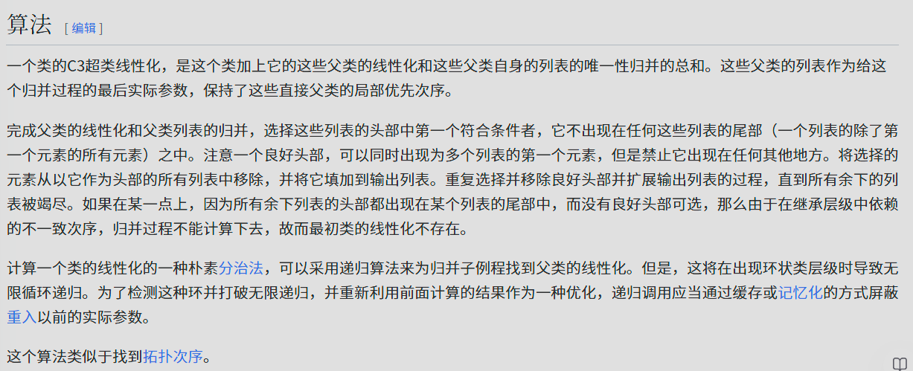
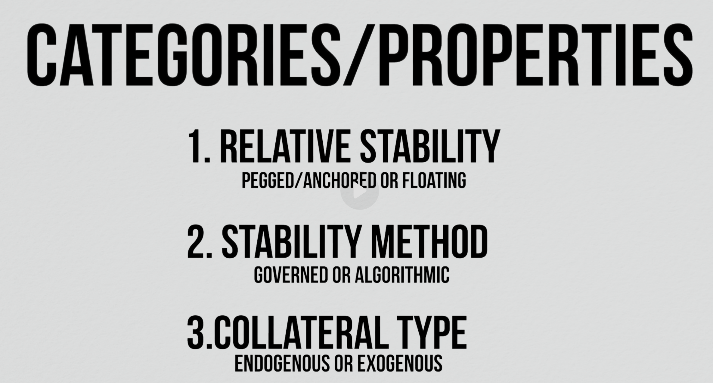
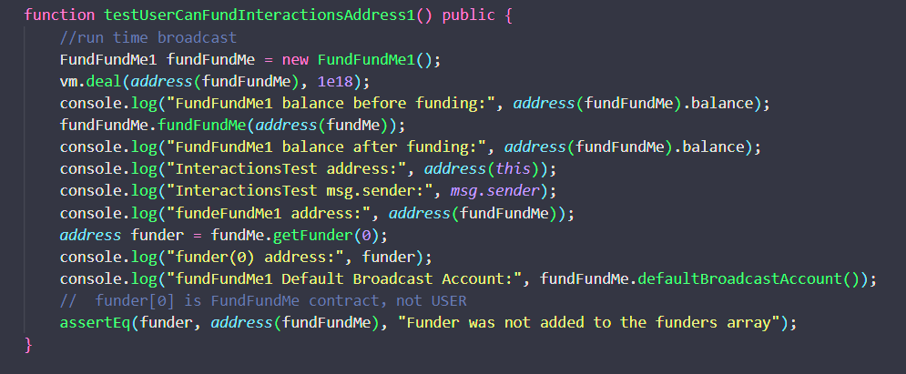
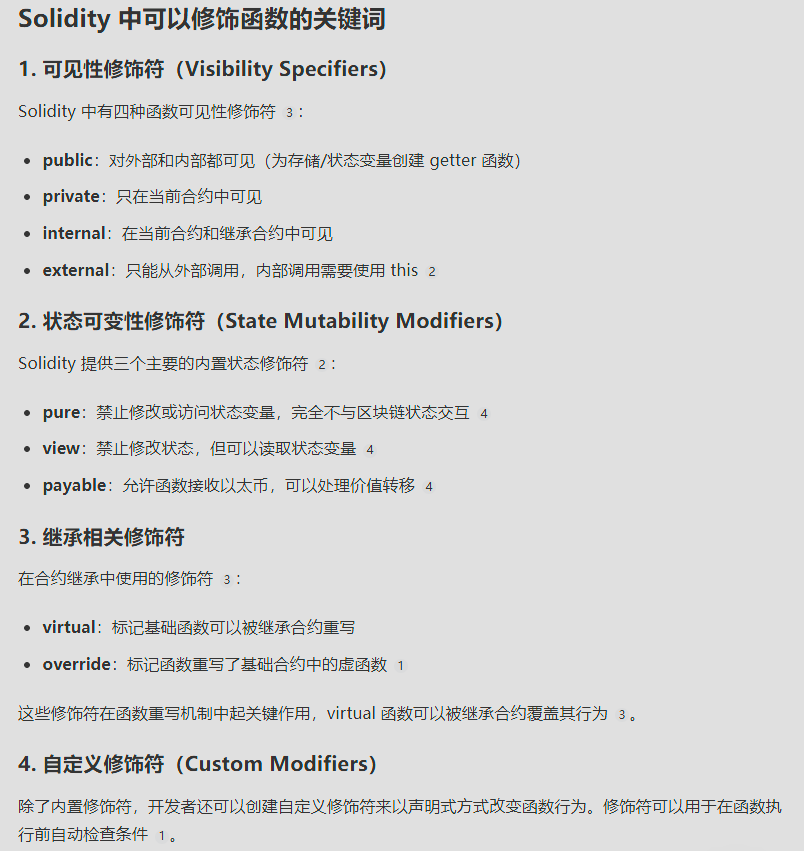
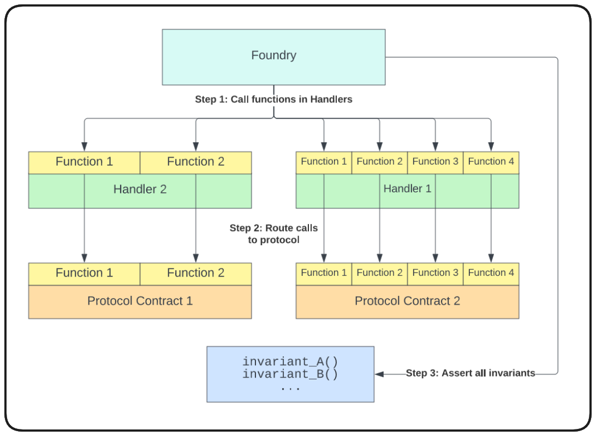

> **注意 / NOTE**: 这是一个用来记录个人学习和 debug 经验的笔记。  
> This is a notebook used to record personal learning and debugging experiences.
>
> 📋 **目录导航 / Table of Contents**: 点击右上角的目录图标 (📋) 查看完整目录  
> Click the table of contents icon (📋) in the upper right corner to view the complete directory

[TOC]

# Raffle

TEST DESIGN PATTERN

3A : ARRANGE; ACT; ASSERT

CONTRACT FUNCTION DESIGN PATTRERN

CEI: **Checks-Effects-Interactions** 可以有效防止重入 re-entrancy 攻击


私钥通常长度:

- 256 bits = 32 bytes = 64 hex 字符

公钥地址长度:

- Bitcoin: 25-62 字符 (多种格式)

- Ethereum: 42 字符 (固定格式)

- 其他链: 32-103 字符 (各有特色)

## Raffle Chlink VRF

VRF 和 KEEPER 是两个不同的服务，VRF 使用 subID 和 vrfcoordinator


## Foundry 常用指令表格总结

### Forge 指令

| 分类         | 指令                          | 功能描述         | 示例                                                |
| ------------ | ----------------------------- | ---------------- | --------------------------------------------------- |
| **项目管理** | `forge init`                  | 初始化新项目     | `forge init my-project`                             |
|              | `forge install`               | 安装依赖         | `forge install openzeppelin/openzeppelin-contracts` |
|              | `forge update`                | 更新依赖         | `forge update`                                      |
|              | `forge remove`                | 移除依赖         | `forge remove openzeppelin-contracts`               |
| **编译构建** | `forge build`                 | 编译合约         | `forge build`                                       |
|              | `forge clean`                 | 清理构建文件     | `forge clean`                                       |
|              | `forge fmt`                   | 格式化代码       | `forge fmt`                                         |
| **测试相关** | `forge test`                  | 运行测试         | `forge test -vvv`                                   |
|              | `forge test --match-test`     | 运行特定测试     | `forge test --match-test testTransfer`              |
|              | `forge test --match-contract` | 运行特定合约测试 | `forge test --match-contract TokenTest`             |
|              | `forge coverage`              | 测试覆盖率       | `forge coverage`                                    |
|              | `forge snapshot`              | 生成 gas 快照    | `forge snapshot`                                    |
| **部署脚本** | `forge script`                | 运行部署脚本     | `forge script Deploy.s.sol --broadcast`             |
|              | `forge create`                | 直接部署合约     | `forge create Token --private-key $PRIVATE_KEY`     |
| **调试工具** | `forge debug`                 | 调试交易         | `forge debug --debug $TX_HASH`                      |
|              | `forge inspect`               | 检查合约信息     | `forge inspect Token abi`                           |
| **文档生成** | `forge doc`                   | 生成文档         | `forge doc`                                         |
| **配置管理** | `forge config`                | 查看配置         | `forge config`                                      |
| **验证合约** | `forge verify-contract`       | 验证合约         | `forge verify-contract $ADDRESS Token`              |

### Cast 指令

| 分类           | 指令                  | 功能描述       | 是否需要私钥 | 示例                                                                             |
| -------------- | --------------------- | -------------- | ------------ | -------------------------------------------------------------------------------- |
| **合约调用**   | `cast call`           | 调用只读函数   | ❌           | `cast call $CONTRACT "balanceOf(address)" $USER`                                 |
|                | `cast send`           | 发送交易       | ✅           | `cast send $CONTRACT "transfer(address,uint256)" $TO $AMOUNT --private-key $KEY` |
| **区块链查询** | `cast balance`        | 查询余额       | ❌           | `cast balance $ADDRESS`                                                          |
|                | `cast block`          | 获取区块信息   | ❌           | `cast block latest`                                                              |
|                | `cast block-number`   | 获取区块号     | ❌           | `cast block-number`                                                              |
|                | `cast chain-id`       | 获取链 ID      | ❌           | `cast chain-id`                                                                  |
|                | `cast gas-price`      | 获取 gas 价格  | ❌           | `cast gas-price`                                                                 |
| **交易相关**   | `cast tx`             | 获取交易详情   | ❌           | `cast tx $TX_HASH`                                                               |
|                | `cast receipt`        | 获取交易收据   | ❌           | `cast receipt $TX_HASH`                                                          |
|                | `cast logs`           | 查询事件日志   | ❌           | `cast logs --from-block 100 --to-block 200`                                      |
| **合约信息**   | `cast code`           | 获取合约字节码 | ❌           | `cast code $CONTRACT`                                                            |
|                | `cast storage`        | 读取存储槽     | ❌           | `cast storage $CONTRACT 0`                                                       |
| **数据转换**   | `cast --to-hex`       | 转换为十六进制 | ❌           | `cast --to-hex 255`                                                              |
|                | `cast --to-dec`       | 转换为十进制   | ❌           | `cast --to-dec 0xff`                                                             |
|                | `cast --to-wei`       | 转换为 wei     | ❌           | `cast --to-wei 1 ether`                                                          |
|                | `cast --from-wei`     | 从 wei 转换    | ❌           | `cast --from-wei 1000000000000000000`                                            |
| **ABI 工具**   | `cast abi-encode`     | ABI 编码       | ❌           | `cast abi-encode "transfer(address,uint256)" $TO $AMOUNT`                        |
|                | `cast abi-decode`     | ABI 解码       | ❌           | `cast abi-decode "uint256" $DATA`                                                |
|                | `cast calldata`       | 生成调用数据   | ❌           | `cast calldata "transfer(address,uint256)" $TO $AMOUNT`                          |
|                | `cast 4byte`          | 查询函数选择器 | ❌           | `cast 4byte "transfer(address,uint256)"`                                         |
| **签名哈希**   | `cast keccak`         | 计算 Keccak256 | ❌           | `cast keccak "hello world"`                                                      |
|                | `cast hash-message`   | 计算消息哈希   | ❌           | `cast hash-message "hello"`                                                      |
| **钱包操作**   | `cast wallet new`     | 创建新钱包     | ❌           | `cast wallet new`                                                                |
|                | `cast wallet address` | 获取地址       | ❌           | `cast wallet address --private-key $KEY`                                         |
|                | `cast wallet sign`    | 签名消息       | ✅           | `cast wallet sign "message" --private-key $KEY`                                  |
|                | `cast wallet verify`  | 验证签名       | ❌           | `cast wallet verify --address $ADDR "message" $SIG`                              |

### 常用参数总结

| 参数               | 描述          | 适用指令                |
| ------------------ | ------------- | ----------------------- |
| `--rpc-url`        | RPC 节点 URL  | cast 所有网络操作       |
| `--private-key`    | 私钥          | cast send, forge script |
| `--broadcast`      | 实际广播交易  | forge script            |
| `-vvv`             | 详细输出      | forge test              |
| `--gas-limit`      | Gas 限制      | cast send               |
| `--gas-price`      | Gas 价格      | cast send               |
| `--value`          | 发送 ETH 数量 | cast send               |
| `--from`           | 发送者地址    | cast 操作               |
| `--match-test`     | 匹配测试名称  | forge test              |
| `--match-contract` | 匹配合约名称  | forge test              |

### 记忆口诀

- **Forge = 开发工具** (编译、测试、部署)
- **Cast = 区块链交互** (查询、调用、转换)
- **Call = 查询** (免费、无私钥)
- **Send = 交易** (花钱、需私钥)

### Anvil - 本地以太坊节点

| 指令                        | 功能描述          | 示例                                                 |
| --------------------------- | ----------------- | ---------------------------------------------------- |
| `anvil`                     | 启动本地测试网络  | `anvil`                                              |
| `anvil --port`              | 指定端口          | `anvil --port 8546`                                  |
| `anvil --accounts`          | 设置账户数量      | `anvil --accounts 20`                                |
| `anvil --balance`           | 设置初始余额      | `anvil --balance 1000`                               |
| `anvil --fork-url`          | 分叉主网          | `anvil --fork-url $MAINNET_RPC`                      |
| `anvil --fork-block-number` | 分叉特定区块      | `anvil --fork-url $RPC --fork-block-number 18000000` |
| `anvil --chain-id`          | 设置链 ID         | `anvil --chain-id 31337`                             |
| `anvil --gas-limit`         | 设置区块 gas 限制 | `anvil --gas-limit 30000000`                         |
| `anvil --gas-price`         | 设置 gas 价格     | `anvil --gas-price 1000000000`                       |
| `anvil --block-time`        | 设置出块时间      | `anvil --block-time 12`                              |

### Chisel - 交互式 Solidity REPL

| 指令      | 功能描述       | 示例                              |
| --------- | -------------- | --------------------------------- |
| `chisel`  | 启动交互式环境 | `chisel`                          |
| `!help`   | 显示帮助       | 在 chisel 中输入 `!help`          |
| `!quit`   | 退出 chisel    | 在 chisel 中输入 `!quit`          |
| `!clear`  | 清空会话       | 在 chisel 中输入 `!clear`         |
| `!source` | 显示当前源码   | 在 chisel 中输入 `!source`        |
| `!save`   | 保存会话       | 在 chisel 中输入 `!save filename` |
| `!load`   | 加载会话       | 在 chisel 中输入 `!load filename` |

### 完整工具生态系统

#### 核心工具对比表

| 工具       | 主要用途     | 典型使用场景                    |
| ---------- | ------------ | ------------------------------- |
| **forge**  | 智能合约开发 | 编译、测试、部署、脚本          |
| **cast**   | 区块链交互   | 调用合约、查询数据、转换格式    |
| **anvil**  | 本地测试网络 | 本地开发、测试、调试            |
| **chisel** | 交互式编程   | 快速测试代码片段、学习 Solidity |

## Foundry vm cheatcode

https://getfoundry.sh/reference/cheatcodes/overview

### 常见的 vm cheatcodes 分类

#### 1. 身份伪装类 (Identity Manipulation)

- **vm.prank(address)**: 设置下一个调用的 msg.sender，主要用于**test 环境**模拟不同用户的调用
- **vm.startPrank(address) / vm.stopPrank()**: 允许模拟同一地址的多个连续交易，避免重复调用 vm.prank，主要用于**test 环境**
- **vm.deal(address, uint256)**: 为指定地址设置 ETH 余额，用于**test 环境**准备测试数据

#### 2. 广播和部署类 (Broadcasting & Deployment)

- **vm.broadcast()**: 广播下一个交易到网络，主要用于**script 环境**进行实际部署
- **vm.startBroadcast() / vm.stopBroadcast()**: 开始和停止广播模式，用于**script 环境**批量部署合约
- **vm.broadcast(address)** / **vm.startBroadcast(address)**: 指定特定地址进行广播，用于**script 环境**多签名部署

#### 3. 时间和区块操作类 (Time & Block Manipulation)

- **vm.warp(uint256)**: 修改 block.timestamp 到指定时间，用于**test 环境**测试时间相关逻辑
- **vm.roll(uint256)**: 修改 block.number 到指定区块号，用于**test 环境**测试区块相关逻辑

#### 4. 预期验证类 (Expectation Verification)

- **vm.expectRevert()**: 验证下一个调用会回滚，主要用于**test 环境**测试错误处理
- **vm.expectEmit()**: 验证下一个调用会发出特定事件，用于**test 环境**验证事件发出

#### 5. 模糊测试和条件类 (Fuzzing & Conditions)

- **vm.assume(bool)**: 在模糊测试中过滤输入，当条件为 false 时跳过当前测试用例，主要用于**test 环境**的 property-based testing
- **vm.skip(bool)**: 跳过当前测试，用于**test 环境**条件性测试执行

#### 6. 模拟和快照类 (Mocking & Snapshots)

- **vm.mockCall()**: 模拟外部合约调用的返回值，用于**test 环境**隔离测试
- **vm.snapshot()**: 保存当前区块链状态，返回标识符，用于**test 环境**状态管理
- **vm.revertTo(uint256)**: 恢复到指定快照状态，用于**test 环境**状态回滚

#### 7. 分叉和网络类 (Fork & Network)

- **vm.createFork(string)**: 创建网络分叉，用于**test 环境**和**script 环境**测试真实网络状态
- **vm.selectFork(uint256)**: 选择特定分叉进行操作，用于**test 环境**多分叉测试
- **vm.activeFork()**: 获取当前活跃分叉 ID，用于**test 环境**分叉管理

### 使用环境详细分布

#### Test 环境 (test/)

- 身份伪装类：模拟不同用户行为
- 预期验证类：验证合约行为正确性
- 模糊测试类：property-based testing 和输入过滤
- 时间操作类：测试时间敏感逻辑
- 模拟快照类：状态管理和隔离测试

#### Script 环境 (script/)

- 广播类：实际部署合约到网络
- 分叉类：在分叉环境中测试部署脚本
- 部分身份操作：多签名部署场景

#### Src 环境 (src/)

在**src 环境**（实际合约代码）中，通常**不使用**任何 vm cheatcodes，因为这些是开发和测试专用功能

广播相关的 cheatcodes 是 Foundry 独有的强大功能，使得可以直接在 Solidity 脚本中进行合约部署，而不需要额外的 JavaScript 或 Python 脚本 。

## `forge-std/Test.sol` ，常用的测试函数。

### 1. 断言函数 (Assertions)

#### 基本断言

```
复制// 相等断言
assertTrue(bool condition)
assertFalse(bool condition)
assertEq(uint256 a, uint256 b)
assertEq(int256 a, int256 b)
assertEq(address a, address b)
assertEq(bytes32 a, bytes32 b)
assertEq(string memory a, string memory b)

// 不相等断言
assertNotEq(uint256 a, uint256 b)
assertNotEq(address a, address b)

// 大小比较
assertGt(uint256 a, uint256 b)  // a > b
assertGe(uint256 a, uint256 b)  // a >= b
assertLt(uint256 a, uint256 b)  // a < b
assertLe(uint256 a, uint256 b)  // a <= b

// 近似相等（用于处理精度问题）
assertApproxEqAbs(uint256 a, uint256 b, uint256 maxDelta)
assertApproxEqRel(uint256 a, uint256 b, uint256 maxPercentDelta)
```

### 2. VM 作弊码 (Cheatcodes)

#### 时间控制

```
复制vm.warp(uint256 timestamp)     // 设置 block.timestamp
vm.roll(uint256 blockNumber)   // 设置 block.number
skip(uint256 time)             // 快进时间
rewind(uint256 time)           // 倒退时间
```

#### 账户控制

```
复制vm.prank(address user)         // 下一个调用使用指定地址
vm.startPrank(address user)    // 开始持续使用指定地址
vm.stopPrank()                 // 停止 prank

vm.deal(address user, uint256 amount)  // 给地址设置 ETH 余额
hoax(address user, uint256 amount)     // prank + deal 的组合
```

#### 期望和模拟

```
复制// 期望事件
vm.expectEmit(bool checkTopic1, bool checkTopic2, bool checkTopic3, bool checkData)
vm.expectEmit()  // 检查所有参数

// 期望回滚
vm.expectRevert()
vm.expectRevert(bytes memory revertData)
vm.expectRevert(bytes4 selector)

// 期望调用
vm.expectCall(address callee, bytes memory data)
vm.expectCall(address callee, uint256 value, bytes memory data)

// 模拟调用
vm.mockCall(address callee, bytes memory data, bytes memory returnData)
```

#### 存储操作

```
复制vm.store(address target, bytes32 slot, bytes32 value)  // 设置存储槽
vm.load(address target, bytes32 slot)                  // 读取存储槽
```

### 3. 实用工具函数

#### 地址生成

```
复制makeAddr(string memory name)           // 生成带标签的地址
makeAddrAndKey(string memory name)     // 生成地址和私钥对
vm.addr(uint256 privateKey)            // 从私钥生成地址
```

#### 签名相关

```
复制
vm.sign(uint256 privateKey, bytes32 digest)  // 签名
```

#### 标签和追踪

```
复制vm.label(address addr, string memory label)  // 给地址添加标签
vm.assume(bool condition)                     // 模糊测试中的假设条件
```

## event&logs&emit


### 📊 **不同类型节点的存储策略**

#### **1. 全节点 (Full Node)**

```
复制# 全节点存储内容
Full Node Storage:
├── 🏠 所有区块头 (Block Headers) - 永久
├── 📝 所有交易 (Transactions) - 永久
├── 🧾 所有交易收据 (Receipts) - 永久 ✅
├── 🌳 完整状态树 (State Trie) - 当前状态
└── 📚 历史状态 (可选，通常不保存)

存储大小: ~1TB+ (以太坊主网)
```

#### **2. 轻节点 (Light Node)**

```
复制# 轻节点存储内容
Light Node Storage:
├── 🏠 所有区块头 (Block Headers) - 永久
├── 📝 部分交易 (按需下载) - 临时
├── 🧾 部分收据 (按需下载) - 临时 ❌
└── 🌳 不存储状态树

存储大小: ~几GB
```

#### **3. 归档节点 (Archive Node)**

```
复制# 归档节点存储内容
Archive Node Storage:
├── 🏠 所有区块头 - 永久
├── 📝 所有交易 - 永久
├── 🧾 所有交易收据 - 永久 ✅
├── 🌳 当前状态树 - 永久
└── 📚 所有历史状态 - 永久 ✅

存储大小: ~10TB+ (以太坊主网)
```

#### **4. 修剪节点 (Pruned Node)**

```
复制# 修剪节点存储策略
Pruned Node Storage:
├── 🏠 所有区块头 - 永久
├── 📝 所有交易 - 永久
├── 🧾 近期收据 (如最近128个区块) - 有限期 ⚠️
└── 🌳 当前状态 + 少量历史状态

存储大小: ~500GB
```

### 💡 **总结**

**关键发现**：

1. **🏠 并非所有节点都永久保存收据**
   - 全节点：保存所有收据 ✅
   - 归档节点：保存所有收据 + 历史状态 ✅
   - 修剪节点：可能删除古老收据 ⚠️
   - 轻节点：按需从网络获取 🔄
2. **📊 网络级别的冗余**
   - 75% 节点保存完整收据历史
   - 6.25% 节点保存完整历史状态
3. **💰 经济驱动的权衡**
   - 存储成本随时间增长
   - 节点运营者需要平衡成本和功能
   - 不同用例需要不同存储策略
4. **🔮 未来趋势**
   - Layer 2 减少 L1 存储压力
   - 更好的压缩和修剪算法
   - 专业化的存储服务

**实用建议**：

- 🔍 查询近期数据：任何节点都可以
- 📚 查询历史数据：使用可靠的 RPC 服务商
- 🏛️ 需要完整历史：连接归档节点
- 💾 自建节点：根据需求选择节点类型

虽然理论上是"永久存储"，但实际的**可访问性取决于网络中节点的存储策略**！🌐✨

测试中的 emit 关键字和 scr 合约中的关键字含义不一样，src 中的 emit 是真的发送。而测试中的不是发送，而是期望接下来会发送这样的 log。


## vm.deal&vm.stratBroadcast


## etherscan verify


## contract/interface/abstrct contract/library/abstrct function


## C3 线性化合约继承以及重写（Override）函数调用顺序




# NFT

## What is a NFT?

Non-fungible Tokens (NFTs) are a product of the [**ERC721 Token Standard**](https://eips.ethereum.org/EIPS/eip-721), created on Ethereum.

NFTs are:

- Non-fungible: This means they are explicitly unique from one another and one NFT cannot be interchanged with another

Fungible tokens, like ERC20s are similar to a dollar. Any single dollar can be swapped with any other and no value is lost. NFTs by contrast are unique in themselves with different properties from token to token.

### ERC721 Standard (NFTs)

NFTs, and the ERC721 Token Standard, differ from ERC20s in a few fundamental ways.

**Ownership**

ERC20s handle ownership via a simple mapping of a uint256 token balance to an address.

ERC721s, by contrast, each have a unique tokenId, these tokenIds are mapped to a user's address. In addition to a tokenId, ERC721s include a tokenUri, we'll go into more detail later, but essentially a tokenUri details the unique properties of that token, stats, images etc.

**Fungibility**

NFTs are _non-fungible_. This means each token is unique and cannot be interchanged with another. ERC20s, on the other hand, are _fungible_. Any LINK token is identical in property and value to any other LINK token.

**\*What makes an NFT unique?\***

The uniqueness of an NFT token is demonstrated by it's unique tokenId as well as it's metadata/tokenUri. This is a property of an NFT which details the attributes of that token. You can imagine a character in a game, the tokenUri would be their stats page and all the details that make them an individual.

Now, when we talk about NFT representing _Art_ that comes with some implications in the blockchain space that can be pretty impactful. In Ethereum, there's a little thing called **gas**. Gas costs on ethereum make the storage of large amounts of data (like images), on-chain, prohibitively expensive in most cases.

The solution to this was the inclusion of the tokenUri within the ERC721 Standard. This serves as a property of a token which details what the asset looks like as well as any attributes associated with it. A basic tokenUri looks something like:

```json
{
  "name": "Name",
  "description": "Description",
  "image": "ImageURI",
  "attributes": []
}
```

Even this can serve to be pretty expensive, so there's a constant discuss about on-chain vs off-chain metadata. Off-chain solutions obviously come with all the pitfalls of centralization that we would expect (including losing record of what your NFT is), but the easy and savings associated with avoiding deploying this extra data are pretty appealing.

Often a protocol will use a service like [**IPFS**](https://ipfs.tech/) to hedge their bets a little bit in a more decentralized method of storage, but it too comes with its own pros and cons.

To take this consideration even further, oftentimes marketplaces won't have a means to recognize on-chain metadata since they're _so_ used to looking for a tokenUri.

In General:

- Upload NFT Image to IPFS
- Create metadata point to that image
- Set the NFTs tokenUri to point to that metadata

## TokenURI

It's hard to believe, but once upon a time the tokenUri was once considered an optional parameter, despite being integral to how NFTs are used and consumed today.

TokenURI stands for Token Uniform Resource Identifier. At its core it serves as an endpoint that returns the metadata for a given NFT.

**Example TokenURI Metadata Schema:**

```json
{
  "title": "Asset Metadata",
  "type": "object",
  "properties": {
    "name": {
      "type": "string",
      "description": "Identifies the asset to which this NFT represents"
    },
    "description": {
      "type": "string",
      "description": "Describes the asset to which this NFT represents"
    },
    "image": {
      "type": "string",
      "description": "A URI pointing to a resource with mime type image/* representing the asset to which this NFT represents. Consider making any images at a width between 320 and 1080 pixels and aspect ratio between 1.91:1 and 4:5 inclusive."
    }
  }
}
```


## SVG onchain NFT


## Transaction/Contract Deployment data fields


## abi.encode & address(someContract).call{''}('')


```solidity
function transfer(address someAddress, uint256 amount) public {
    // Some code
    s_someAddress = someAddress;
    s_amount = amount;
}

// We can get a function selector as easy as this.
// "transfer(address,uint256)" is our function signature
// and our resulting function selector of "transfer(address,uint256)" is output from this function
// one thing to note here is that there shouldn't be any spaces in "transfer(address,uint256)"
function getSelectorOne() public pure returns (bytes4 selector) {
    selector = bytes4(keccak256(bytes("transfer(address,uint256)")));
}

function getDataToCallTransfer(address someAddress, uint256 amount) public pure returns (bytes memory) {
    return abi.encodeWithSelector(getSelectorOne(), someAddress, amount);
}

// So... How can we use the selector to call our transfer function now then?
function callTransferFunctionDirectly(address someAddress, uint256 amount) public returns (bytes4, bool) {
    (bool success, bytes memory returnData) = address(this).call(
        // getDataToCallTransfer(someAddress, amount);
        abi.encodeWithSelector(getSelectorOne(), someAddress, amount)
    );
    return (bytes4(returnData), success);
}

// Using encodeWithSignature
function callTransferFunctionDirectlyTwo(address someAddress, uint256 amount) public returns (bytes4, bool) {
    (bool success, bytes memory returnData) =
        address(this).call(abi.encodeWithSignature("transfer(address,uint256)", someAddress, amount));
    return (bytes4(returnData), success);
}
```

记住通过 abi encode 来 call 函数的方式就行了。**abi.encodeWithSignature 或者 abi.encodeWithSelector**。含参数的 error 也要通过这种方式来表达。不过这里貌似直接用了 .selector, 没有手动取哈希。


补充：

vm.expercPartialRevert 貌似不需要传入自定义 error 的参数


此外，函数的 selector 需要 this.函数名.selector 的方式，error 只需要 error 名.selector.


## 函数类型&函数名&Error 类型


自定义 error 本身就是一个 error 类型，而函数名仅仅只是一个标识符，理论上要整个函数名+函数体才能当成一个函数类型。


## 🔄 Solidity 函数重载 (Function Overloading) 详解

### 🎯 **核心概念：函数重载**

这两个函数可以同时存在是因为 **Solidity 支持函数重载 (Function Overloading)**，它们有不同的**函数签名 (Function Signature)**。

### 📝 **函数签名分析**

#### **函数 1：**

```
复制
function _checkRole(bytes32 role) internal view virtual
```

- **函数签名**: `_checkRole(bytes32)`
- **参数**: 1 个参数 (bytes32 role)

#### **函数 2：**

```
复制
function _checkRole(bytes32 role, address account) internal view virtual
```

- **函数签名**: `_checkRole(bytes32,address)`
- **参数**: 2 个参数 (bytes32 role, address account)

### 🔍 **函数签名构成要素**

Solidity 中函数签名由以下部分组成：

```
复制
函数签名 = 函数名 + 参数类型列表
```

**注意：以下内容不影响函数签名：**

- 参数名称
- 返回值类型
- 可见性修饰符 (public, internal, private)
- 状态修改修饰符 (view, pure, payable)
- 其他修饰符 (virtual, override)

### 💡 **重载示例对比**

#### **✅ 有效的函数重载：**

```
复制contract OverloadingExample {
    // 1. 不同参数数量
    function process(uint256 value) public {}
    function process(uint256 value, string memory data) public {}

    // 2. 不同参数类型
    function convert(uint256 number) public {}
    function convert(string memory text) public {}

    // 3. 不同参数类型顺序
    function execute(address user, uint256 amount) public {}
    function execute(uint256 amount, address user) public {}

    // 4. 数组 vs 非数组
    function getData(uint256 id) public {}
    function getData(uint256[] memory ids) public {}

    // 5. 不同长度的固定数组
    function hash(bytes32[1] memory data) public {}
    function hash(bytes32[2] memory data) public {}
}
```

#### **❌ 无效的函数重载：**

```
复制contract InvalidOverloading {
    // ❌ 错误：只有参数名不同
    function transfer(address to, uint256 amount) public {}
    function transfer(address recipient, uint256 value) public {} // 编译错误

    // ❌ 错误：只有返回值不同
    function getValue() public view returns (uint256) {}
    function getValue() public view returns (string memory) {} // 编译错误

    // ❌ 错误：只有可见性不同
    function calculate(uint256 x) public {}
    function calculate(uint256 x) internal {} // 编译错误

    // ❌ 错误：只有修饰符不同
    function process(uint256 data) public view {}
    function process(uint256 data) public pure {} // 编译错误
}
```

## 🔄 Solidity 函数重载 vs Override 详解

### 🎯 **核心区别概览**

| 特性         | 函数重载 (Overloading)         | 函数重写 (Override)        |
| ------------ | ------------------------------ | -------------------------- |
| **定义**     | 同一合约中相同函数名，不同参数 | 子合约重新实现父合约的函数 |
| **作用域**   | 同一合约内                     | 继承关系中                 |
| **函数签名** | 必须不同                       | 必须相同                   |
| **关键字**   | 无需特殊关键字                 | 需要 `override`            |
| **目的**     | 提供多种调用方式               | 改变继承的行为             |

### 📝 **函数重载 (Function Overloading) 详解**

#### **定义与特点：**

```
复制contract Overloading {
    // 同一合约中，函数名相同但参数不同
    function process(uint256 value) public pure returns (string memory) {
        return "Processing number";
    }

    function process(string memory text) public pure returns (string memory) {
        return "Processing text";
    }

    function process(uint256 value, bool flag) public pure returns (string memory) {
        return "Processing number with flag";
    }
}
```

#### **重载规则：**

```
复制contract OverloadingRules {
    // ✅ 有效重载：参数数量不同
    function calculate(uint256 a) public pure returns (uint256) {
        return a * 2;
    }

    function calculate(uint256 a, uint256 b) public pure returns (uint256) {
        return a + b;
    }

    // ✅ 有效重载：参数类型不同
    function convert(uint256 number) public pure returns (string memory) {
        return "number";
    }

    function convert(bytes32 hash) public pure returns (string memory) {
        return "hash";
    }

    // ❌ 无效重载：只有返回值不同
    // function getValue() public pure returns (uint256) { return 1; }
    // function getValue() public pure returns (string memory) { return "1"; }
}
```

### 🏗️ **函数重写 (Override) 详解**

#### **定义与特点：**

```
复制// 父合约
contract Parent {
    function greet() public virtual returns (string memory) {
        return "Hello from Parent";
    }

    function calculate(uint256 x) public virtual returns (uint256) {
        return x * 2;
    }
}

// 子合约
contract Child is Parent {
    // 重写父合约的函数
    function greet() public override returns (string memory) {
        return "Hello from Child";
    }

    function calculate(uint256 x) public override returns (uint256) {
        return x * 3; // 改变了计算逻辑
    }
}
```

#### **Override 规则：**

```
复制contract OverrideRules {
    // 父合约必须标记为 virtual
    function baseFunction() public virtual returns (string memory) {
        return "base";
    }

    // 抽象函数（没有实现）
    function abstractFunction() public virtual returns (string memory);
}

contract Implementation is OverrideRules {
    // 子合约必须标记为 override
    function baseFunction() public override returns (string memory) {
        return "overridden";
    }

    // 实现抽象函数
    function abstractFunction() public override returns (string memory) {
        return "implemented";
    }
}
```

## 🔍 ABI 暴露 vs 函数签名 vs 源码可见性详解

### 🎯 **核心概念区分**

#### **ABI (Application Binary Interface)**

- **定义**: 合约与外部世界交互的**标准化接口描述**
- **作用**: 告诉外部调用者如何与合约交互
- **格式**: JSON 格式的接口描述文件

#### **函数签名 (Function Signature)**

- **定义**: 函数的**唯一标识符**，用于 EVM 内部路由
- **格式**: `函数名(参数类型列表)`
- **用途**: 生成函数选择器 (4 字节)

#### **源码可见性**

- **定义**: 在区块链浏览器上能否**看到函数代码**
- **范围**: 包含所有函数（public/external/internal/private）

### 📊 **三者关系对比表**

| 函数类型 | ABI 中存在 | 有函数签名 | 源码中可见 | 外部可调用 | Etherscan 显示 |
| -------- | ---------- | ---------- | ---------- | ---------- | -------------- |
| external | ✅ 是      | ✅ 是      | ✅ 是      | ✅ 是      | 🔵 Read/Write  |
| public   | ✅ 是      | ✅ 是      | ✅ 是      | ✅ 是      | 🔵 Read/Write  |
| internal | ❌ 否      | ✅ 是      | ✅ 是      | ❌ 否      | 👁️ 仅源码      |
| private  | ❌ 否      | ✅ 是      | ✅ 是      | ❌ 否      | 👁️ 仅源码      |

### 🔬 **详细分析**

#### **1. ABI 暴露的真实含义**

##### **ABI 文件示例：**

```
复制contract Example {
    uint256 private _value;

    function setValue(uint256 newValue) external {  // ✅ 会出现在ABI
        _value = newValue;
    }

    function getValue() public view returns (uint256) {  // ✅ 会出现在ABI
        return _value;
    }

    function _internalHelper() internal pure returns (string memory) {  // ❌ 不会出现在ABI
        return "internal";
    }

    function _privateHelper() private pure returns (string memory) {  // ❌ 不会出现在ABI
        return "private";
    }
}
```

##### **生成的 ABI JSON：**

```
复制[
  {
    "inputs": [{"internalType": "uint256", "name": "newValue", "type": "uint256"}],
    "name": "setValue",
    "outputs": [],
    "stateMutability": "nonpayable",
    "type": "function"
  },
  {
    "inputs": [],
    "name": "getValue",
    "outputs": [{"internalType": "uint256", "name": "", "type": "uint256"}],
    "stateMutability": "view",
    "type": "function"
  }
  // 注意：_internalHelper 和 _privateHelper 不在这里！
]
```

#### **2. Etherscan 上的不同展示**

##### **🔵 Read/Write Contract 标签页（ABI 驱动）：**

```
复制只显示 external 和 public 函数
├── setValue(uint256)     [Write]
└── getValue()           [Read]

❌ 看不到 _internalHelper 和 _privateHelper
```

##### **👁️ Contract 源码标签页：**

```
复制// 完整源码都能看到
contract Example {
    uint256 private _value;           // ✅ 可见

    function setValue(uint256 newValue) external { ... }     // ✅ 可见
    function getValue() public view returns (uint256) { ... } // ✅ 可见
    function _internalHelper() internal pure { ... }         // ✅ 可见
    function _privateHelper() private pure { ... }           // ✅ 可见
}
```

### 🛠️ **实际演示**

#### **完整示例合约：**

```
复制// SPDX-License-Identifier: MIT
pragma solidity ^0.8.0;

contract VisibilityDemo {
    uint256 private _counter;
    mapping(address => uint256) internal _balances;

    // ✅ ABI中存在 - 外部可调用
    function increment() external {
        _counter++;
        _updateBalance(msg.sender);
    }

    // ✅ ABI中存在 - 外部可调用
    function getCounter() public view returns (uint256) {
        return _counter;
    }

    // ✅ ABI中存在 - 外部可调用
    function getBalance(address user) public view returns (uint256) {
        return _getBalanceInternal(user);
    }

    // ❌ ABI中不存在 - 外部不可调用，但源码可见
    function _updateBalance(address user) internal {
        _balances[user] = _calculateNewBalance(user);
    }

    // ❌ ABI中不存在 - 外部不可调用，但源码可见
    function _getBalanceInternal(address user) internal view returns (uint256) {
        return _balances[user];
    }

    // ❌ ABI中不存在 - 外部不可调用，但源码可见
    function _calculateNewBalance(address user) private view returns (uint256) {
        return _balances[user] + _counter;
    }
}
```

#### **函数选择器对比：**

```
复制// 所有函数都有选择器，但只有 external/public 的会被暴露
const selectors = {
    // ✅ ABI中的选择器（外部可用）
    "increment()": "0xd09de08a",
    "getCounter()": "0x8ada066e",
    "getBalance(address)": "0xf8b2cb4f",

    // ❌ ABI中没有的选择器（仅内部使用）
    "_updateBalance(address)": "0x...", // 存在但不暴露
    "_getBalanceInternal(address)": "0x...", // 存在但不暴露
    "_calculateNewBalance(address)": "0x..." // 存在但不暴露
};
```

### 💡 **关键理解点**

#### **✅ 正确理解：**

1. **ABI 暴露** = 外部世界能否**调用**这个函数
2. **源码可见** = 在区块链浏览器能否**看到**函数代码
3. **函数签名** = 所有函数都有，但只有 ABI 中的才对外暴露

#### **❌ 常见误解：**

```
复制❌ "internal函数没有函数签名"
✅ 所有函数都有签名，只是internal不在ABI中

❌ "上传源码后internal函数就能调用了"
✅ 上传源码只是让人看到代码，不改变调用权限

❌ "private函数更安全因为看不到"
✅ 源码验证后都能看到，安全性在于调用权限而非可见性
```

### 🎯 **总结**

| 概念         | 作用                   | 影响范围         |
| ------------ | ---------------------- | ---------------- |
| **ABI 暴露** | 决定外部是否能**调用** | external, public |
| **源码可见** | 决定人类是否能**阅读** | 所有函数         |
| **函数签名** | EVM 内部**路由标识**   | 所有函数         |

**记忆要点：**

- 🔵 **ABI = 调用接口**（只有 external/public）
- 👁️ **源码 = 阅读接口**（所有函数都可见）
- 🔧 **签名 = 技术标识**（所有函数都有）

在 Etherscan 上：

- **Read/Write 标签页**：只显示 ABI 中的函数
- **源码标签页**：显示所有函数代码，但不能调用 internal/private

这就是为什么说 "ABI 暴露" 是指**对外调用接口**，而不是**代码可见性**！

## check each on chian transaction


# StableCoin





## Interface 接口转换调用合约函数


## 重入攻击


## Mapping&Array


## Solidity 数组初始化方式对照表

| 初始化方式             | 语法示例                  | 数组类型 | 存储位置 | 初始状态         | 使用场景           |
| ---------------------- | ------------------------- | -------- | -------- | ---------------- | ------------------ |
| **new 关键字(空)**     | `new uint256[](0)`        | 动态数组 | memory   | 空数组(length=0) | 函数参数、临时变量 |
| **new 关键字(有长度)** | `new uint256[](5)`        | 动态数组 | memory   | 默认值填充       | 预知长度的临时数组 |
| **直接声明**           | `uint256[] memory arr;`   | 动态数组 | memory   | 空数组(length=0) | 函数内局部变量     |
| **数组字面量**         | `[uint256(1), 2, 3]`      | 定长数组 | memory   | 指定值           | 已知固定值的数组   |
| **逐个赋值**           | `arr[0] = 1; arr[1] = 2;` | 任意     | 任意     | 部分赋值         | 动态填充数组       |
| **状态变量声明**       | `uint256[] public arr;`   | 动态数组 | storage  | 空数组           | 合约状态存储       |
| **push 方法**          | `arr.push(1);`            | 动态数组 | storage  | 逐步增长         | 动态添加元素       |
| **二维数组**           | `new uint256[][](2)`      | 动态数组 | memory   | 空的子数组       | 矩阵、嵌套数据     |

### 快速选择指南

| 需求场景         | 推荐方式     | 代码示例                                              |
| ---------------- | ------------ | ----------------------------------------------------- |
| 空数组参数       | `new T[](0)` | `TokenPool(token, 18, new address[](0), rmn, router)` |
| 固定长度临时数组 | `new T[](n)` | `uint256[] memory temp = new uint256[](5);`           |
| 已知值的小数组   | 数组字面量   | `uint256[3] memory arr = [uint256(1), 2, 3];`         |
| 合约状态数组     | 状态变量     | `uint256[] public numbers;`                           |
| 动态增长数组     | push 方法    | `numbers.push(newValue);`                             |
| 条件性创建       | new + 判断   | `arr.length > 0 ? process(arr) : skip();`             |

### 注意事项速查

- ✅ **memory 数组**: 创建后长度固定，不能 push
- ✅ **storage 数组**: 可以 push/pop 动态调整
- ❌ **空数组访问**: `arr[0]`会报错，需先检查`arr.length > 0`
- ❌ **类型推断**: 字面量需显式指定类型 `[uint256(1), 2]`
- 💡 **Gas 优化**: 预分配长度比频繁 push 更省 Gas

## vm.startBroadcast

在之前的 fundme 合约中得出了以下结论：


## --broadcast 关键词


## msg.sender&EOA&tx.origin

那么进一步思考，例如 raffle 合约中（有一个 performUpkeep 和 fulfillRandomWords 函数，performUpkeep 里面调用了 s_vrfCoordinator.requestRandomWords。平时使用 chainlink 的 keeper 定期执行 performUpkeep，此外还需要为 vrfCoordinator 添加订阅和消费者来获取随机数。VRF 和 KEEPER 是两个不同的服务，VRF 使用 subID 和 vrfcoordinator）

假如公链里被部署的合约 A 中的某个函数 function testA(假设合约 A 地址为 Address A)，需要调用另一个已经被部署的合约 B 的某个函数某个函数 function testB(假设合约 B 地址为 Address B)。我作为调用者，使用个人账户 Address USER 调用合约 A 的函数 function testA，在 EVM 执行合约 A 的过程中，msg.sender 是不是 Address USER？因为合约 A 调用了合约 B 的函数，然后 EVM 执行到 function testB 的时候，合约 B 里面 function testB 被调用的时候 msg.sender 是 Address USER 还是 Address A？此外，每一次改变区块链状态的交易都会产生 gas 费用，支付 gas 费用的账户始终是最外层的交易发起方吗？msg.sender 是否等同于支付 gas 费用的账户？

### msg.sender 的变化机制

### 1. 合约 A 中的 msg.sender

当你用个人账户 `Address USER` 调用合约 A 的 `testA()` 函数时：

- **合约 A 中的 `msg.sender` = `Address USER`**

### 2. 合约 B 中的 msg.sender

当合约 A 调用合约 B 的 `testB()` 函数时：

- **合约 B 中的 `msg.sender` = `Address A`** （不是 Address USER）

这是因为 `msg.sender` 始终指向**直接调用当前合约的地址**。

### 调用链示例

```
复制
Address USER → 合约A.testA() → 合约B.testB()
```

- 在合约 A 中：`msg.sender = Address USER`
- 在合约 B 中：`msg.sender = Address A`

### Gas 费用支付机制

### Gas 费用支付者

**Gas 费用始终由最外层的交易发起方支付**，即 `Address USER`。

无论调用链多长：

```
复制
USER → 合约A → 合约B → 合约C → ...
```

所有的 gas 费用都由 `Address USER` 承担。

msg.sender ≠ Gas 支付者

**`msg.sender` 不等同于支付 gas 费用的账户**：

- **Gas 支付者**：始终是交易的原始发起者（tx.origin）
- **msg.sender**：是当前合约的直接调用者，在调用链中会发生变化

### 相关概念对比

| 概念         | 含义                 | 在调用链中是否变化             |
| ------------ | -------------------- | ------------------------------ |
| `tx.origin`  | 交易的原始发起者     | ❌ 不变（始终是 Address USER） |
| `msg.sender` | 当前合约的直接调用者 | ✅ 会变化                      |
| Gas 支付者   | 支付交易费用的账户   | ❌ 不变（始终是 Address USER） |

### Gas 费用计算

```
Gas费用支付规则：

✅ 始终由交易发起者支付
✅ 通常情况下，交易发起者 = tx.origin
⚠️ 特殊情况下，tx.origin可能不是真正的"用户"
❌ 合约无法改变谁支付gas费用
```

### 实际代码示例

```
复制// 合约A
contract A {
    function testA() external {
        // 这里 msg.sender == Address USER
        B(addressB).testB();
    }
}

// 合约B
contract B {
    function testB() external {
        // 这里 msg.sender == Address A (不是 Address USER)
        // 如果需要获取原始调用者，应该使用 tx.origin
    }
}
```

这种设计保证了合约间调用的安全性和权限控制的准确性。


所以其实在测试合约中，EOA 一直都是外部 anvil 第一个默认账户地址，但是 msg.sender 会随着合约函数调用一层层变动。而我写的大部分合约中，payable 原生币和 ERC20 转账相关函数都是考虑的 msg.sender!

- tx.origin 是原生全局变量，不是 cheatcode。
- 它给出整笔交易的初始 EOA，绝大多数业务逻辑不要用它做权限控制。
- 测试里若要模拟不同 origin，用 vm.prank(msgSender, txOrigin)；日常只改 msg.sender 即可。

## 交易发起者 = tx.origin（定义上的一致性）

### 准确的定义

- **交易发起者（Transaction Originator）**: 签名并提交交易到以太坊网络的账户
- **tx.origin**: 当前交易的原始发起者
- **这两者在定义上是完全相同的**

### 为什么会有混淆？

我之前的回答可能造成了混淆，让我澄清一下：

### 1. 概念层次不同

```
复制交易层面：
EOA(交易发起者) → 提交交易到网络

执行层面：
合约A → 合约B → 合约C
(在整个执行过程中，tx.origin始终是最初的交易发起者)
```

### 2. "用户"概念的混淆

在不同场景下，"用户"可能指：

```
复制// 账户抽象场景
EOA(Bundler) → EntryPoint → SmartWallet → DeFi

// 这里：
// - 交易发起者 = Bundler EOA = tx.origin ✅
// - 经济意义上的"用户" = SmartWallet持有者 ≠ tx.origin
// - 权限意义上的"用户" = SmartWallet ≠ tx.origin
```

### 正确的理解

#### 交易发起者恒等式

```
复制
交易发起者 ≡ tx.origin ≡ 签名交易的EOA ≡ 支付Gas的账户
```

#### 代码验证

```
复制contract VerifyTxOrigin {
    event TransactionInfo(
        address txOrigin,
        address msgSender,
        address actualSigner
    );

    function checkOrigin() external {
        // tx.origin 始终是交易的签名者
        emit TransactionInfo(
            tx.origin,    // 交易发起者
            msg.sender,   // 直接调用者
            tx.origin     // 实际签名者（相同）
        );
    }
}
```

### 各种场景下的验证

#### 1. 普通调用

```
复制
用户EOA → 合约
```

- 交易发起者 = 用户 EOA ✅
- tx.origin = 用户 EOA ✅

#### 2. 合约间调用

```
复制
用户EOA → 合约A → 合约B
```

- 交易发起者 = 用户 EOA ✅
- tx.origin = 用户 EOA ✅（在合约 B 中也是）

#### 3. 账户抽象

```
复制
Bundler EOA → EntryPoint → SmartWallet
```

- 交易发起者 = Bundler EOA ✅
- tx.origin = Bundler EOA ✅

#### 4. 元交易

```
复制
Relayer EOA → RelayContract → Target
```

- 交易发起者 = Relayer EOA ✅
- tx.origin = Relayer EOA ✅

### 关键区别：发起者 vs 受益者

```
复制contract MetaTransaction {
    function executeFor(
        address beneficiary,  // 受益用户
        address target,
        bytes calldata data,
        bytes calldata signature
    ) external {
        // 验证受益用户的签名
        require(verifySignature(beneficiary, target, data, signature));

        // tx.origin = msg.sender = 中继器（交易发起者）✅
        // beneficiary = 经济受益者（不是交易发起者）

        target.call(data);
    }
}
```

### 以太坊黄皮书的定义

根据以太坊规范：

- **Transaction originator**: 提供交易签名的账户
- **tx.origin**: 交易原始发起者的地址
- 这两者必须相同

### 总结

**✅ 正确说法**：

- 交易发起者 = tx.origin
- tx.origin = 签名交易的 EOA
- Gas 支付者 = 交易发起者 = tx.origin

**❌ 容易混淆的概念**：

- "用户" ≠ 一定是 tx.origin（在代理、抽象账户场景下）
- "受益者" ≠ 一定是 tx.origin
- "权限主体" ≠ 一定是 tx.origin

## 补充：Fundme 中的误会




最外层调用测试合约的是 foundry 默认账户，msg.sender 为默认 EOA 账户，然后 testUserCanFundInteractionsAddress1 测试函数内部，调用 fundFundMe.fundFundMe(_address_(fundMe));这行代码的是测试合约，所以下一层（FundFundMe1 合约内部）调用 FundMe(payable(mostRecentlyDeployed)).fund{value: SEND_VALUE}();这行代码的 msg.sender 是 fundFundMe 的地址，再进入下一层 FundMe 合约的内部，msg.sender 变为 address（fundFundMe1），fund 的转账是来自 address（FundFundMe）吗？为什么 founder（0）的 address 为 address（fundFundMe1）?不应该是由交易发起者 tx.origin 支付交易产生的费用吗？*FundFundMe1*合约中的 FundMe(payable(mostRecentlyDeployed)).fund{value: SEND_VALUE}();这行代码到底是将 tx.origin 的钱转给 FundMe 合约，还是将 FundFundMe1 余额的钱转给 FundMe 合约？

### 调用链分析

根据你的日志，调用链是这样的：

```
Foundry默认EOA (0x1804c8AB1F12E6bbf3894d4083f33e07309d1f38)
  ↓ 调用
InteractionsTest合约 (0x7FA9385bE102ac3EAc297483Dd6233D62b3e1496)
  ↓ 调用 fundFundMe.fundFundMe(address(fundMe))
FundFundMe1合约 (0x2e234DAe75C793f67A35089C9d99245E1C58470b)
  ↓ 调用 FundMe(payable(mostRecentlyDeployed)).fund{value: SEND_VALUE}()
FundMe合约 (0x90193C961A926261B756D1E5bb255e67ff9498A1)
```

### msg.sender 在各层的值

```
// 在 FundMe 合约的 fund() 函数中：
function fund() public payable {
    // msg.sender = 0x2e234DAe75C793f67A35089C9d99245E1C58470b (FundFundMe1合约地址)
    // tx.origin = 0x1804c8AB1F12E6bbf3894d4083f33e07309d1f38 (Foundry默认EOA)

    s_funders.push(msg.sender); // 所以记录的是 FundFundMe1 合约地址
    s_addressToAmountFunded[msg.sender] += msg.value;
}
```

### 资金流向的关键理解

#### 重要概念：`msg.value` 的传递

```
// 在 FundFundMe1 合约中
FundMe(payable(mostRecentlyDeployed)).fund{value: SEND_VALUE}();
```

**这行代码的含义是：**

- 从 **FundFundMe1 合约的余额** 中取出 `SEND_VALUE` 数量的 ETH
- 将这些 ETH 发送给 FundMe 合约
- 同时调用 FundMe 合约的 `fund()` 函数

### tx.origin 的作用

- `tx.origin` (0x1804c8AB1F12E6bbf3894d4083f33e07309d1f38) 是整个交易的发起者
- **tx.origin 只支付 gas 费用**，不支付 `{value: SEND_VALUE}` 中的 ETH
- 合约调用其他合约并发送 ETH 时，ETH 必须来自调用合约的余额

## tx.origin 支付 Gas 费用 vs 合约内部转账的详细区别

### 1. **Gas 费用支付（由 tx.origin 支付）**

```
复制// 交易执行流程
EOA账户 (tx.origin) → 合约A → 合约B → 合约C
```

**特点：**

- **谁支付**：始终由 tx.origin（EOA 外部账户）支付
- **支付给谁**：支付给矿工/验证者
- **支付什么**：Gas 费用 = Gas Used × Gas Price
- **从哪扣除**：从 tx.origin 的余额中扣除
- **自动处理**：由 EVM 自动处理，代码中不可见

```
// 示例：即使合约调用合约，gas 费始终由最初的 EOA 支付
contract A {
    function callB(B contractB) external {
        contractB.doSomething(); // gas 费由 tx.origin 支付，不是合约 A
    }
}
```

### 2. **合约内部转账（ETH value 转移）**

```
// 资金流向 只是一种情况
合约A的余额 → 合约B的余额
```

**⚠️ 重要修正：**

**特点：**

- **谁支付**：调用合约 A（B 中看到的 msg.sender），执行 `{value: amount}` 的合约自身
- **支付给谁**：被调用的地址
- **支付什么**：ETH（以 wei 为单位）
- **从哪扣除**：从执行转账的合约余额中扣除
- **显式声明**：必须在代码中明确指定 `{value: amount}`
- **转账的支付方是==执行== `{value: amount}` 调用代码的==当前地址==**，当前地址不等同于当前代码块的 msg.sender,更像是 address(this)
- 在被调用合约看来，这个地址就是它的 `msg.sender`
- 但从调用方的角度看，支付方是 `address(this)`（自己）
- ==所谓执行者，就是看传入了{value: amount}的下一层函数内部的 msg.sender,在跨合约调用的情况下通常是上一层合约的 address(this)==

**关键理解：**

- **转账的支付方**：执行 `{value: amount}` 调用的合约地址
- **在被调用合约中**：`msg.sender` 是直接调用者（转账的合约）
- **资金来源**：执行转账的合约的余额

### 3. **特殊情况：vm.prank() 的影响**


在使用 vm.prank(owner);之后，转账来源就变成了 owner。

关键点，执行 payable(_address_(vault)).call{value: amount}("");的 msg.sender 是 owner。

这种调用**确实模拟的是场景 1：EOA 直接调用**，而不是场景 2 的合约间调用

==好了好了，讲讲我的理解，这里使用 vm.prank 之后，msg.sender 变成了 user。然后调用 addRewardsToVault(balance-depositAmount)时，并没有实例化一个测试合约，所以相当于将 addRewardsToVault 内部的代码块直接挪到了下面来执行，并不涉及函数间或合约间的多层调用。等价于 vm.prank(user)之后紧跟 payable(address(vault)).call{value: amount}("") 。这就相当于 EOA 直接调用，执行 payable(address(vault)).call{value: amount}("") 是 user。==

==然后在 Fundme 的 FundFundMe1 合约（FundFundMe1 还是被测试合约调用的）中
FundMe(payable(mostRecentlyDeployed)).fund{value: SEND_VALUE}();这行代码实例化了一个合约，涉及到合约的多层调用，执行 FundMe(payable(mostRecentlyDeployed)).fund{value: SEND_VALUE}()的是 FundFundMe1 合约。所以转账来源是 FundFundMe1 合约==

#### 第一种情况：addRewardsToVault 调用

你的理解**基本正确**：

```
vm.prank(user);
addRewardsToVault(balance - depositAmount);
```

这里确实相当于：

```
vm.prank(user);
payable(address(vault)).call{value: amount}("");
```

**关键点**：

- `addRewardsToVault`是测试合约内的函数，属于**内部函数调用**
- 在 Solidity 中，内部函数调用不会改变执行上下文，`msg.sender`保持不变
- 所以执行`payable(address(vault)).call{value: amount}("")`的确实是 user
- 这是一个**外部调用**（external call），会创建实际的 EVM 消息调用
- ==payable(address(vault)).call{value: amount}("");的下一层是 address(vault)的 receive 函数，receive 函数内部的 msg.sender 在 vm.prank(user)的作用下变为 user。所以转账来源于 user==

#### 第二种情况：FundMe 合约调用

你的理解也**正确**：

```
// 在FundFundMe1合约中
FundMe(payable(mostRecentlyDeployed)).fund{value: SEND_VALUE}();
```

**关键点**：

- `FundMe(payable(mostRecentlyDeployed))`创建了一个合约实例的引用
- 调用`.fund{value: SEND_VALUE}()`是**跨合约的外部调用**
- 这会改变执行上下文，`msg.sender`变为调用合约的地址
- 所以在 FundMe 合约的 fund 函数中，`msg.sender`是 FundFundMe1 合约地址
- ETH 转账来源确实是 FundFundMe1 合约
- ==FundMe(payable(mostRecentlyDeployed)).fund{value: SEND_VALUE}();的下一层是 FundMe(payable(mostRecentlyDeployed))的 fund 函数，fund 函数内部的 msg.sender 为 address(FundFundMe1),所以转账来源于 address(FundFundMe1)==

#### 内部调用 vs 外部调用的区别

**内部调用**（第一种情况）：

- 同一合约内的函数调用
- 不创建新的 EVM 消息调用
- `msg.sender`和`msg.value`保持不变

**外部调用**（两种情况中的.call 和.fund）：

- 跨合约边界的调用
- 创建实际的 EVM 消息调用
- `msg.sender`变为调用合约的地址

#### 总结

你的理解完全正确：

1. **第一种情况**：vm.prank 后，addRewardsToVault 内部代码直接执行，user 直接调用 vault
2. **第二种情况**：涉及合约实例化和跨合约调用，FundFundMe1 合约调用 FundMe 合约

这两种模式的区别在于是否跨越了合约边界，从而影响了`msg.sender`的传递机制。


### 4. **具体对比示例**

```
contract Example {
    // 场景1：EOA 直接调用
    function scenario1() external payable {
        // msg.sender = EOA地址
        // tx.origin = EOA地址
        // Gas费：EOA支付
        // ETH转账：EOA → Example合约

        // 直接调用的代码例子：
        require(msg.value > 0, "Must send ETH");

        // 记录捐款
        donations[msg.sender] += msg.value;

        // 发出事件
        emit ReceivedETH(msg.sender, msg.value);

        // 在这种情况下：
        // - msg.sender 是发起交易的EOA地址
        // - msg.value 是EOA发送的ETH数量
        // - 资金直接从EOA转移到Example合约
    }

    // 场景2：合约调用合约
    function scenario2(address target) external {
        // 这里调用其他合约，发送 0.1 ETH
        ITarget(target).someFunction{value: 0.1 ether}();

        // msg.sender = 调用scenario2的地址
        // ITarget中msg.sender=address(Example),为转账来源
        // tx.origin = 最初的EOA地址
        // Gas费：tx.origin (EOA) 支付
        // ETH转账：Example合约余额 → target合约
    }
    // 接收ETH的函数
    receive() external payable {
        emit ReceivedETH(msg.sender, msg.value);
    }
}

// ITarget 接口
interface ITarget {
    function someFunction() external payable;
}

// Target 合约实现
contract Target is ITarget {
    event FunctionCalled(address caller, uint256 value, address origin);
    mapping(address => uint256) public receivedFromContract;

    // ITarget.someFunction 内部的代码例子
    function someFunction() external payable override {
        // 在这个函数中：
        // msg.sender = 调用这个函数的合约地址 (Example合约)
        // msg.value = 接收到的ETH数量 (0.1 ether)
        // tx.origin = 最初发起交易的EOA地址

        require(msg.value > 0, "Must receive ETH");

        // 记录从合约接收的ETH
        receivedFromContract[msg.sender] += msg.value;

        // 发出事件，记录调用信息
        emit FunctionCalled(msg.sender, msg.value, tx.origin);

        // 可以添加更多业务逻辑
        // 比如：根据调用者执行不同操作
        if (msg.sender != tx.origin) {
            // 这是合约调用，不是EOA直接调用
            // 执行特定的合约间交互逻辑
        }
    }

    // 接收ETH的函数
    receive() external payable {
        emit FunctionCalled(msg.sender, msg.value, tx.origin);
    }
}
```

| 场景                      | msg.sender       | tx.origin | 资金来源         | Gas 费支付者 |
| ------------------------- | ---------------- | --------- | ---------------- | ------------ |
| **场景 1 (EOA 直接调用)** | EOA 地址         | EOA 地址  | EOA 余额         | EOA          |
| **场景 2 (合约调用合约)** | Example 合约地址 | EOA 地址  | Example 合约余额 | EOA          |

**重点理解**：

- **场景 1**：EOA 直接与合约交互，身份和资金来源一致
- **场景 2**：合约代表 EOA 与其他合约交互，调用者身份是合约，但 gas 费仍由原始 EOA 支付

### 5. **在你的代码中的体现**

```
// InteractionsTest.t.sol
function testUserCanFundInteractionsAddress1() public {
    // 1. 创建 FundFundMe1 合约
    FundFundMe1 fundFundMe = new FundFundMe1();

    // 2. 给合约充值 1 ETH（这是合约的余额）
    vm.deal(address(fundFundMe), 1e18);

    // 3. 调用 fundFundMe
    fundFundMe.fundFundMe(address(fundMe));
}

// FundFundMe1 合约
function fundFundMe(address mostRecentlyDeployed) public {
	//msg.sender=address(InteractionsTest)
    // 这里发送 0.01 ETH
    FundMe(payable(mostRecentlyDeployed)).fund{value: SEND_VALUE}();
    //这里执行{value: SEND_VALUE}的就是address(FundFundMe1)
    // 资金流动：
    // - 0.01 ETH: FundFundMe1合约余额 → FundMe合约
    // - Gas费: tx.origin (0x1804c8AB...) 支付给矿工
}
```

### 6. **常见误解澄清**

❌ **错误理解**：

- "tx.origin 会支付合约调用中的 ETH 转账"
- "合约没有余额也能转账 ETH"
- "msg.sender 总是资金的来源"

✅ **正确理解**：

- tx.origin **只支付 gas 费**
- 合约转账 ETH 必须有足够的**合约余额**
- **调用者身份** 和 **资金来源** 可能不同（特别是在测试环境中）
- 如果合约余额不足，交易会 revert

### 7. **实际例子：资金不足的情况**

```
// 如果你没有给 FundFundMe1 充值
function testWillFail() public {
    FundFundMe1 fundFundMe = new FundFundMe1();
    // 没有 vm.deal，合约余额为 0

    // 这会失败！因为合约没有 0.01 ETH
    fundFundMe.fundFundMe(address(fundMe)); // revert
}
```

| 方面         | Gas 费用                     | 转账金额                                       |
| ------------ | ---------------------------- | ---------------------------------------------- |
| **支付者**   | 永远是 tx.origin (EOA)       | 执行 `{value: amount}` 的合约                  |
| **资金来源** | EOA 的余额                   | 执行转账的合约余额（或特殊情况下的原始调用者） |
| **用途**     | 支付计算和存储成本           | 实际的价值转移                                 |
| **扣除时机** | 交易执行过程中持续扣除       | 转账指令执行时一次性转移                       |
| **可控性**   | 由 gasLimit 和 gasPrice 控制 | 由 value 参数控制                              |
| **失败影响** | Gas 耗尽会导致交易回滚       | 余额不足会导致转账失败                         |

**关键要点**：在普通情况下，转账的资金来源是执行转账的合约自身的余额。但在测试环境中使用 `vm.prank()` 时，会有特殊的行为，资金可能来自被 prank 的地址。


此外，如果是使用 msg.value 而不是==执行== `{value: amount}` 调用的话，就相当于一个 value 中转站。

## 三种转账方式的支付方分析

### 1. **关键理解：TransferExample 只是中转站**

```
复制contract TransferExample {
    function transferMethod(address payable to) external payable {
        to.transfer(msg.value); // 转发收到的 ETH
    }
}
```

这个合约的所有方法都使用 `msg.value`，意味着它们**转发调用时收到的 ETH**，而不是使用合约自己的余额。

### 2. **两种调用场景**

#### 场景 A：EOA 直接调用

```
复制// EOA → TransferExample → 目标地址
EOA.call{value: 1 ether}(transferMethod(targetAddress))
```

**资金流动：**

- 支付方：EOA
- 1 ETH：EOA → 目标地址（经过 TransferExample 中转）
- TransferExample 的余额不变

#### 场景 B：合约调用

```
contract Caller {
    function callTransfer(TransferExample example, address target) external {
        // Caller 合约发送 1 ETH
        example.transferMethod{value: 1 ether}(payable(target));
    }
}
```

**资金流动：**

- 支付方：Caller 合约
- 1 ETH：Caller 合约 → 目标地址（经过 TransferExample 中转）
- TransferExample 的余额不变

### 3. **三种方式的对比**

| 转账方式   | 支付方               | Gas 限制 | 返回值处理         | 推荐程度  |
| ---------- | -------------------- | -------- | ------------------ | --------- |
| transfer() | 调用者（EOA 或合约） | 2300 gas | 自动 revert        | ❌ 已废弃 |
| send()     | 调用者（EOA 或合约） | 2300 gas | 返回 bool          | ⚠️ 不推荐 |
| call()     | 调用者（EOA 或合约） | 可自定义 | 返回 (bool, bytes) | ✅ 推荐   |

### 4. **重要区别：使用 msg.value vs 合约余额**

```
复制contract DifferentExample {
    // 情况1：转发收到的 ETH（不使用合约余额）
    function forward(address payable to) external payable {
        to.transfer(msg.value); // 支付方是调用 forward 的地址
    }

    // 情况2：使用合约自己的余额
    function withdraw(address payable to, uint256 amount) external {
        to.transfer(amount); // 支付方是 DifferentExample 合约
        // amount 从 DifferentExample 的余额扣除
    }
}
```

### 5. **具体示例：追踪资金流**

```
复制// 测试代码
function testTransferFlow() public {
    TransferExample example = new TransferExample();
    address target = address(0x123);

    // 初始状态
    // EOA 余额: 10 ETH
    // TransferExample 余额: 0 ETH
    // Target 余额: 0 ETH

    // EOA 调用 transferMethod，发送 1 ETH
    example.transferMethod{value: 1 ether}(payable(target));

    // 结束状态
    // EOA 余额: 9 ETH (减少 1 ETH + gas费)
    // TransferExample 余额: 0 ETH (只是中转)
    // Target 余额: 1 ETH (收到 1 ETH)
}
```

### 6. **总结**

对于你展示的 TransferExample 合约：

- **所有三种方式的支付方都是相同的**：调用这些函数的地址（EOA 或合约）
- TransferExample 合约本身**不需要有余额**，因为它只是转发 `msg.value`
- 如果没有发送 ETH（即 `msg.value = 0`），这些函数会转账 0 ETH（不会失败）

==**核心原则**：谁在调用时附带了 `{value: amount}`，谁就是支付方。==

## FundMe 原有收获：

==**此外,test 环境中，使用 cheatcode vm.startbroadcast 之后只会修改最外一层的交易发起方。**==


## payable keyword


## 可以修饰函数的四种关键词




**继承相关修饰符不互斥**


### 1. 函数可见性核心总览

| 可见性   | ABI 暴露     | 合约内直接 f()     | this.f()             | 继承子合约可见   | 可覆写 (需 virtual) | 可被 override | 典型用途                | 动态参数拷贝            | Gas/性能要点摘要                        |
| -------- | ------------ | ------------------ | -------------------- | ---------------- | ------------------- | ------------- | ----------------------- | ----------------------- | --------------------------------------- |
| external | 是           | 否                 | 是（外部 CALL）      | 是（需地址形式） | 是                  | 是            | 仅对外 API / 大数组输入 | 不复制（直接 calldata） | 内部调用昂贵（外部 CALL）；节省大参数读 |
| public   | 是           | 是                 | 是（少用）           | 是               | 是                  | 是            | 内外都需                | 复制到内存              | 通用选择；内部频繁+外部访问             |
| internal | 否           | 是                 | 否                   | 是               | 是                  | 是            | 继承共享逻辑            | N/A                     | 可内联，低开销，无 ABI                  |
| private  | 否           | 是（仅当前）       | 否                   | 否               | 否                  | 否            | 封装细节                | N/A                     | 与 internal Gas 差异极小，语义封装      |
| fallback | 是（若存在） | 否（无法直接名调） | 是（未匹配选择器）   | 不适用           | 可（可 virtual）    | 可            | 兜底调度 / 代理         | calldata 原样           | 保持轻量                                |
| receive  | 是（若存在） | 否                 | 否（仅空 data 触发） | 不适用           | 可（少见）          | 可            | 纯接收 ETH              | calldata 空             | 逻辑极简                                |

---

### 2. 状态可变性 (Mutability) 与覆写

| 严格度（最严格 → 最宽） | 读状态 | 写状态 | 接收 ETH | 允许的向下覆写方向                        |
| ----------------------- | ------ | ------ | -------- | ----------------------------------------- |
| pure                    | 否     | 否     | 否       | 只能被 pure 覆写                          |
| view                    | 读     | 否     | 否       | 可覆写为 view 或 pure                     |
| nonpayable (默认)       | 可读写 | 可     | 否       | 可覆写为 nonpayable/view/pure             |
| payable                 | 可读写 | 可     | 是       | 可覆写为任意更严格 (nonpayable/view/pure) |

说明：覆写只能向“更严格”或相同严格度移动；不可将 pure 改成 view，或 nonpayable 改成 payable 等。

---

### 3. 接口 (interface) / 抽象合约 (abstract) / 普通合约差异

| 特性             | interface                            | abstract contract    | 普通合约     |
| ---------------- | ------------------------------------ | -------------------- | ------------ |
| 函数实现         | 不可（仅声明）                       | 可部分缺失           | 必须全部实现 |
| 默认可见性       | 函数默认为 external                  | 不自动 external      | 显式声明     |
| 是否隐式 virtual | 是                                   | 否（需手动 virtual） | 否           |
| 可含状态变量     | 否                                   | 可                   | 可           |
| 允许的成员       | 函数/事件/error/类型                 | 同普通 + 未实现函数  | 全部         |
| 覆写实现可见性   | external 可实现为 external 或 public | 依父声明             | 依父声明     |

---

### 4. 多重继承与 override 规则

| 方面           | 规则概要                                     |
| -------------- | -------------------------------------------- |
| 指定父类       | 函数多来源时：override(ParentA, ParentB)     |
| 可见性放宽     | external 父可由 public 子实现；反向不行      |
| 禁止缩窄       | public 不可被 internal / private             |
| 状态可变性     | 只能更严格（payable→nonpayable→view→pure）   |
| virtual 传递   | 需要继续覆写：virtual override               |
| 线性化         | C3：右到左深度优先线性化；需显式列出冲突父类 |
| 同名 state var | 不可真正覆写，仅隐藏（避免重名）             |

---

### 5. 状态变量可见性与自动 Getter

| 可见性   | Getter 生成        | 可在接口出现 | 可被 override（需 virtual）                                 | 访问范围   | 备注                         |
| -------- | ------------------ | ------------ | ----------------------------------------------------------- | ---------- | ---------------------------- |
| public   | 是 (external view) | 可           | 是（uint public virtual x; 子用 function x() ... override） | 内/外      | Getter 可被自定义函数接管    |
| internal | 否                 | 否           | 否（变量本身不能被 override，值可在子中继承使用）           | 合约 + 子  | 不生成 ABI                   |
| private  | 否                 | 否           | 否                                                          | 仅当前合约 | 隐藏同名遮蔽不影响父存储布局 |

---

### 6. 特殊函数 (constructor / fallback / receive)

| 函数        | 可见性写法            | 必须 payable? | 触发条件                 | 可 virtual? | 典型用途 / 注意                |
| ----------- | --------------------- | ------------- | ------------------------ | ----------- | ------------------------------ |
| constructor | 不写可见性            | 否（自定义）  | 部署时一次               | 否          | 初始化状态；勿用 this 内部回调 |
| fallback    | external (可 payable) | 否            | 未匹配函数选择器         | 可（少用）  | 代理转发 / 事件记录，保持轻量  |
| receive     | external payable      | 是（若存在）  | msg.data 为空的 ETH 转入 | 可（少用）  | 纯接 ETH；逻辑极简             |

---

### 7. this. 调用与上下文

| 方式     | Gas 相对                  | msg.sender 变化 | 可捕获错误 (try/catch) | 适用场景                      | 不适合            |
| -------- | ------------------------- | --------------- | ---------------------- | ----------------------------- | ----------------- |
| 直接 f() | 低                        | 调用者原值      | 否                     | 内部高频逻辑                  | 需要 try/catch    |
| this.f() | 高（外部 CALL 编码+开销） | 变为本合约地址  | 是                     | 测试重入、权限分支、try/catch | 循环/频繁内部调用 |

---

### 8. 库 (library) 函数可见性

| 可见性          | 部署形式     | 调用方式     | msg.sender / storage 语义 | 优点                 | 权衡                         |
| --------------- | ------------ | ------------ | ------------------------- | -------------------- | ---------------------------- |
| internal        | 内联进使用者 | JUMP / 内联  | 与调用合约一致            | 调用便宜             | 增字节码                     |
| public/external | 独立部署     | DELEGATECALL | 与调用合约一致            | 代码复用减少重复部署 | 每次调用有 delegatecall 开销 |

---

### 9. 函数类型 (Function Type)

| 类型                               | 表示         | 存储内容    | 调用成本        | 适用              |
| ---------------------------------- | ------------ | ----------- | --------------- | ----------------- |
| internal function(uint) returns(T) | 内部函数指针 | PC 跳转位置 | 低              | 内部策略表/回调   |
| external function(uint) returns(T) | 外部函数指针 | 地址+选择器 | 高（外部 CALL） | 动态调度 / 插件化 |

转换：需显式包装，不能直接互赋。

---

### 10. 升级 / 代理模式与可见性

| 场景               | 推荐可见性                  | 说明                  |
| ------------------ | --------------------------- | --------------------- |
| 初始化 (可升级)    | external initializer        | 防重复调用 (modifier) |
| 初始化 (不可升级)  | constructor + internal 钩子 | 一次部署结束          |
| 升级后新逻辑钩子   | internal virtual            | 便于覆盖扩展          |
| Facade 外部入口    | external/public             | 收敛攻击面            |
| 敏感核心           | internal/private + 修饰器   | 集中访问控制          |
| 代理内部 self-call | 避免 this 重入风险          | this 调用仍经代理层   |

---

### 11. Modifier 设计与分层

| 层级                       | 内容        | 理由          |
| -------------------------- | ----------- | ------------- |
| 外部入口 (public/external) | 校验 + 事件 | 明确信任边界  |
| 内部逻辑 (internal)        | 纯业务      | 易审计 / 复用 |
| 底层私有 (private)         | 细粒度操作  | 最少暴露      |

---

### 12. 典型选择模式速查

| 需求               | 建议                       |
| ------------------ | -------------------------- |
| 仅对外             | external                   |
| 外部 + 内部频繁    | public                     |
| 仅继承复用         | internal                   |
| 完全封装           | private                    |
| 大型只读动态参数   | external                   |
| 高频内部纯逻辑     | internal/private           |
| 可扩展钩子         | internal virtual           |
| 对外统一门面       | public/external + 内部拆分 |
| 代理初始化         | external initializer       |
| 代码复用（大体积） | external library           |
| 代码复用（小高频） | internal library           |

---

### 13. 常见误区澄清

| 误区                        | 纠正                                              |
| --------------------------- | ------------------------------------------------- |
| external 永远更省 gas       | 仅对大动态参数只读场景明显                        |
| private 很安全              | 仅隐藏；权限仍需访问控制                          |
| view/pure 不耗 gas          | 交易中照样耗；eth_call 才免                       |
| public 变量不是函数         | 自动生成 external view getter                     |
| override 一定写 virtual     | 父需 virtual，子是否继续开放再加 virtual override |
| this.f() 等价内部调用       | 实际外部 CALL，昂贵且 msg.sender 变化             |
| nonpayable 可覆写为 payable | 不可；只能更严格                                  |

---

### 14. 汇总对照（紧凑复合表）

| 维度 \ 可见性         | external       | public     | internal | private      |
| --------------------- | -------------- | ---------- | -------- | ------------ |
| ABI 暴露              | 是             | 是         | 否       | 否           |
| 合约内直接调用        | 否             | 是         | 是       | 是（仅自身） |
| this 调用             | 是             | 是（少用） | 否       | 否           |
| 子合约可见            | 是（外部方式） | 是         | 是       | 否           |
| 可 virtual / override | 是             | 是         | 是       | 否           |
| 常见用途              | 对外 API       | 通用入口   | 继承逻辑 | 封装细节     |
| 大参数效率            | 读取高         | 中         | N/A      | N/A          |
| 内部高频效率          | 差             | 好         | 优       | 优           |

---

### 15. 记忆助句

| 场景       | 助记                 |
| ---------- | -------------------- |
| 只外部     | “出不进” external    |
| 内外都要   | “双向门” public      |
| 继承共享   | “家族内” internal    |
| 自己私有   | “自留仓” private     |
| 大数组入参 | “少拷贝” external    |
| 高频内部   | internal / private   |
| 可扩展点   | internal virtual     |
| 代理初始化 | external initializer |
| 重入测试   | this.externalFn()    |

### 16. fallback&receive function

| 维度                 | receive                                         | fallback                                                                  | 摘要记忆                                    |
| -------------------- | ----------------------------------------------- | ------------------------------------------------------------------------- | ------------------------------------------- |
| 触发核心             | 空 calldata 且函数已定义                        | 未匹配函数选择器；或空 calldata 但无 receive                              | 空 → 先找 receive，找不到 →fallback         |
| 签名形式             | receive() external payable                      | fallback() external [payable] 或 fallback(bytes calldata) returns (bytes) | receive 固定；fallback 可选 bytes/返回值    |
| ETH 接收             | 必然 payable（语法强制）                        | 需显式 payable，否则接 ETH revert                                         | “能收钱”不代表 fallback 默认可收            |
| 触发优先级（空数据） | 优先（若存在）                                  | 兜底                                                                      | 优先级：receive > fallback                  |
| 典型用途             | 单纯接 ETH / 记录收款                           | 代理 delegatecall / 路由 / 拒绝或记录未知调用                             | 收款 vs 路由兜底                            |
| 推荐复杂度           | 极简（事件+统计）                               | 精简（代理只做转发与冒泡）                                                | 两者都应保持最小化                          |
| 安全关注             | 误写业务逻辑 → 可重入面增大                     | delegatecall 存储风险 / 重入 / 吞错                                       | fallback 风险面更广                         |
| 不想被调用策略       | 不写 receive（让空数据落到 fallback 再 revert） | 声明非 payable 并直接 revert                                              | 双层防护更清晰                              |
| 版本演进             | 0.6.0 起从旧 fallback 拆出                      | 旧 fallback 角色被分拆后专注“未匹配”                                      | 新语义更精细                                |
| 常见误区             | 认为必须写                                      | 认为默认可接 ETH                                                          | 记口诀：receive=空且存在；fallback=其它兜底 |

## Solidity 数据位置修饰符 (Data Location)

### 1. 三种数据位置核心对比

| 位置     | 生命周期           | 可变性 | 成本特征 (读/写)                           | 典型适用                            | 是否拷贝           | 可否声明 mapping | 备注                                   |
| -------- | ------------------ | ------ | ------------------------------------------ | ----------------------------------- | ------------------ | ---------------- | -------------------------------------- |
| storage  | 永久（链上状态）   | 可读写 | 读贵 / 改贵；写新槽 ≈20k gas；改已用槽 ≈5k | 状态变量；需要持久修改              | 引用（指针语义）   | 只能在 storage   | 改即落链；受 EVM 暖/冷访问规则影响     |
| memory   | 临时（函数执行期） | 可读写 | 分配线性增长；纯计算便宜                   | 临时计算、中间结果、返回值构造      | 拷贝（值拷贝）     | 不可             | 函数结束释放；大数组复制昂贵           |
| calldata | 外部调用输入区域   | 只读   | 最便宜（零拷贝读取）                       | external 函数的入参（大数组/bytes） | 零拷贝（直接引用） | 不可             | 不能修改长度 / 元素；最省 gas 只读载体 |

> mapping 只能存在于 storage（不能 memory / calldata 单独声明）。

### 二、哪些场合“必须 / 需要 / 不能 / 可省略”指定数据位置

| 场景                                            | 是否必须显式写       | 可写的选项                                                 | 不能写                          | 说明                                                                                                         |
| ----------------------------------------------- | -------------------- | ---------------------------------------------------------- | ------------------------------- | ------------------------------------------------------------------------------------------------------------ |
| 状态变量（合约级）                              | 否（隐式 storage）   | （无）                                                     | memory / calldata               | 所有合约级引用类型天生在 storage                                                                             |
| 函数形参（external）引用类型                    | 必须                 | calldata（最常用）、memory（少见）                         | storage                         | external 不允许 storage 参数；calldata 最省                                                                  |
| 函数形参（public / internal / private）引用类型 | 必须                 | memory；（internal/private 可用 storage 引用、calldata\*） | （无）                          | internal/private 可接收 storage 引用：`func(T storage t)`；calldata 在较新版本可用于内部函数（编译器支持时） |
| 返回参数（public/external）引用类型             | 必须                 | memory                                                     | storage / calldata              | 返回时会拷贝编码；不能返回 storage 指针                                                                      |
| 返回参数（internal/private）引用类型            | 必须                 | memory 或 storage（返回 storage 引用仅内部用）             | calldata                        | `returns (T storage r)` 仅供内部再传递，不可对外 ABI                                                         |
| 函数内局部变量（引用类型）                      | 必须                 | memory / storage /（external ctx 下可 calldata 引用参数）  | （无）                          | `T storage ref = arr[i];` 或 `T memory tmp = arr[i];`                                                        |
| 内部函数参数（做库式抽象）想直接改调用方状态    | 必须                 | `T storage`                                                | memory / calldata（若需原地改） | 把 storage 引用下传实现原地修改                                                                              |
| mapping 声明                                    | 仅 storage 可行      | storage                                                    | memory / calldata               | 不能声明 memory / calldata mapping                                                                           |
| struct / array 成员自身                         | 不直接写（随“外层”） | （继承外层）                                               | （无）                          | 外层是 storage 则成员在 storage；外层在 memory 则成员在 memory                                               |
| 事件参数 / error 参数                           | 不适用               | （无）                                                     | （无）                          | 数据位置概念仅限运行期引用类型变量                                                                           |
| inline assembly 管理的字节数组                  | 需手动理解           | （依托原变量）                                             | （无）                          | 避免破坏内存/存储布局                                                                                        |

### 三、判断口诀（速记）

1. “函数签名 / 返回 / 局部”见到 array/struct/string/bytes 就问：位置写了吗？
2. 只有状态变量可以不写（=storage）。
3. external 引用类型参数默认选 calldata。
4. 想改链上状态 → storage；怕误改或仅临时用 → memory；大只读输入 → calldata。
5. 不能创建 memory / calldata mapping，也不能返回 storage 给外部。

### 四、典型正误对照（类型 + 位置 + 是否合规）

| 写法                                                                | 位置分析                | 是否合规               | 解释                                                   |
| ------------------------------------------------------------------- | ----------------------- | ---------------------- | ------------------------------------------------------ |
| `uint x;` (状态变量)                                                | 值类型 + 状态           | 合规                   | 值类型无需位置                                         |
| `bytes data;` (状态变量)                                            | 引用 + 状态             | 合规                   | 状态变量默认 storage                                   |
| `function f(bytes data) external {}`                                | 引用 + external 形参    | 不合规                 | 必须写：`bytes calldata data`                          |
| `function f(bytes32 data) external {}`                              | 值类型                  | 合规                   | bytes32 是值类型                                       |
| `function f(uint[] memory a) public {}`                             | 引用 + public           | 合规                   | 必须写 memory/calıldata（public 通常 memory）          |
| `function f(uint[] a) public {}`                                    | 引用 + public           | 不合规                 | 缺失位置                                               |
| `function f(string calldata s) external returns (bytes memory out)` | 引用参数 + 返回引用     | 合规                   | 参数用 calldata，返回必须 memory                       |
| `function f() internal returns (User storage u)`                    | 返回 storage 引用       | 合规（仅内部）         | 不能对外                                               |
| `mapping(address=>uint) balances;`                                  | 状态 mapping            | 合规                   | 只能 storage                                           |
| `function g() external returns (mapping(address=>uint) storage m)`  | 返回 mapping            | 不合规                 | 不能返回 mapping                                       |
| `function h(mapping(address=>uint) storage m)` external             | storage 参数 + external | 不合规                 | external 不允许 storage 引用形参                       |
| `function h(mapping(address=>uint) storage m)` internal             | storage 参数 + internal | 合规                   | 可传引用（通常来自 struct 成员）                       |
| `function test(bytes calldata x) public`                            | public + calldata       | 可能不支持（取决版本） | 较老版本 public 不允许 calldata；新版本仍通常用 memory |

## foundry 测试环境


## Stablecoin 的借贷/清算原理&HF 指数


简单的清算规则，当 LIQUIDATION_THRESHOLD 是 50，collateralAdjustedForThreshold 就是 collateralValueInUsd 的一半（50/100=1/2）。此时的清算线 collateralValueInUsd 是 totalDscMinted 的两倍，即 1/2 的倒数。

假设另一个清算线要求 collateralValueInUsd 是 totalDscMinted 的 1.5 倍（3/2）。那么此时的 collateralAdjustedForThreshold 就是 collateralValueInUsd 的 2/3，而 LIQUIDATION_THRESHOLD 便是 67（67/100=2/3）。

总之，**LIQUIDATION_THRESHOLD**和**抵押借出比**（over-collateralization ratio）呈现倒数的关系。


简单理解为，自己主动还钱，欠多少还多少。被清算时，有额外惩罚。主要是理解**抵押物价值肯定是大于债务的**。

正常情况下，右边负债是一比一跟左边资产抵消。清算情况下，右边负债先变大再跟左边资产抵消，也就是净资产计算时扣得更多。而由于 over-collateralization，左边资产肯定比右边负债多的。

抵押品-债务肯定是正值，结清债务（先还钱再赎回抵押品，即-债务+抵押品=正值）就能获得这部分正值的收益。

**将还债这个行为视为事件的话，这个事件对 Free Assets 带来的收益一定是正向的，没有理由不做。主动还债的正值收益更大，被动清算的正值收益就更小**

**手里的钱才是真的钱，还债行为一定会增加可自由支配资产的数量。**

不过还债后，债务清零，抵押物归还，此时 Free Assets = Net Assets=Total Holdings

**从净资产的角度来讲，主动偿还债务能够维持净资产不变，可支配资产变多，被动清算会导致净资产变少**

**净资产也是个重要的指标**，只从净资产的角度来看更方便记忆。只考虑净资产指标能够更加快速得做判断！


在我的 DSC 项目中，s_DSCMinted 更像是记录债务（因为别人清算的时候，被清算人实际持有的 DSC balance 保持不变，但是记录的 s_DSCMinted 变成小，清算一部分债务就是变小，清算全部债务就是变成 0），而不是记录 DSC 铸币量或者 DSC 余额。Maybe 改成 DSCDebt 更合适。

burnDSC 就像是还债。先还债了之后，HF 值变高，就可以更好地赎回。


在计算 Healthfactor 的时候，也是直接用的 totalDscMinted=s_DSCMinted 来作为分母。可见 s_DSCMinted 就是用户的债务。

## Foundry 测试类型对比表格

| 测试类型                    | 函数前缀     | 执行特点             | 状态管理       | 适用场景          | 示例函数名                             |
| --------------------------- | ------------ | -------------------- | -------------- | ----------------- | -------------------------------------- |
| **普通测试**                | `test`       | 确定性输入，单次执行 | 每次重置       | 验证特定功能      | `function testBasicFunction()`         |
| **Stateless Fuzz**          | `test`       | 随机输入，多次执行   | 每次重置       | 测试边界条件      | `function testFuzzFunction(uint256 x)` |
| **Stateful/Invariant Fuzz** | `invariant_` | 多交易序列，随机调用 | 跨交易保持状态 | 测试系统不变量    | `function invariant_BalancePositive()` |
| **无正确前缀的函数**        | 其他         | **不会被执行**       | N/A            | 辅助函数/工具函数 | `function helperFunction()`            |

### 关键要点

#### 前缀要求的重要性

- Foundry 通过函数名前缀来识别测试类型
- **必须使用正确的前缀**，否则函数不会被测试框架执行
- 标准测试和无状态模糊测试都使用`test`前缀
- 不变量测试必须使用`invariant_`前缀

#### 无正确前缀的后果

- **函数会被忽略**：没有`test`或`invariant_`前缀的函数不会被 Forge 执行
- **静默跳过**：系统不会报错，但这些函数不参与测试
- **常见用途**：通常用作辅助函数、设置函数或工具函数

#### 特殊情况

- 可以使用`skip`关键字在函数名中跳过特定测试
- `testFail*`前缀已被弃用，建议使用`vm.expectRevert()`替代

#### 最佳实践

- 确保所有测试函数都有正确的前缀
- 使用描述性的函数名来说明测试目的
- 将辅助函数命名为不以`test`或`invariant_`开头，避免意外执行

这种严格的命名约定确保了 Foundry 能够正确识别和执行不同类型的测试，同时避免意外执行非测试函数

## fuzz test


### Stateful/Invariant Fuzz

| 方面     | Invariant Test             | 第一性原理 First Principles Thinking |
| -------- | -------------------------- | ------------------------------------ |
| **目标** | 将复杂系统简化为核心不变量 | 将复杂问题简化为基本原理             |
| **方法** | 识别关键属性，忽略实现细节 | 剥离假设，回归本质                   |
| **结果** | 可靠的系统验证             | 创新的解决方案                       |

#### 📊 对比总结 / Comparison Summary

| 方面                 | Stateless Fuzz                    | Stateful/Invariant Fuzz                    |
| -------------------- | --------------------------------- | ------------------------------------------ |
| **状态管理**         | 无状态，每次重置                  | 有状态，持续保持                           |
| **State Management** | Stateless, resets each time       | Stateful, persistent                       |
| **测试复杂度**       | 简单，单一函数                    | 复杂，多函数交互                           |
| **Test Complexity**  | Simple, single function           | Complex, multi-function interaction        |
| **执行速度**         | 快速                              | 相对较慢                                   |
| **Execution Speed**  | Fast                              | Relatively slow                            |
| **发现问题类型**     | 输入验证，边界条件                | 状态不一致，不变量违反                     |
| **Bug Types Found**  | Input validation, edge cases      | State inconsistency, invariant violations  |
| **适用场景**         | 纯函数，数学计算                  | 复杂业务逻辑，系统集成                     |
| **Use Cases**        | Pure functions, math calculations | Complex business logic, system integration |

#### 🎯 关键区别 / Key Differences

| 方面                | Stateless Fuzz            | Stateful Fuzz                    |
| ------------------- | ------------------------- | -------------------------------- |
| **setUp 执行**      | 每个测试函数前都执行      | 只在开始时执行一次               |
| **setUp Execution** | Before each test function | Only once at the beginning       |
| **状态重置**        | 每次测试后重置            | 状态持续累积                     |
| **State Reset**     | Reset after each test     | State accumulates continuously   |
| **测试序列**        | 单个函数调用              | 多个函数调用序列                 |
| **Test Sequence**   | Single function call      | Multiple function call sequences |

**Stateful Fuzz 的本质是**：

1. ✅ **setUp()只执行一次** / setUp() runs only once
2. ✅ **状态在测试间保持** / State persists between tests
3. ✅ **模拟连续的用户交互** / Simulates continuous user interactions
4. ✅ **测试系统在复杂状态下的不变量** / Tests invariants under complex states

**但更准确的说法是**：Stateful Fuzz 通过**连续的函数调用序列**来累积状态，而不仅仅是"不重置"这么简单。

**More accurately**: Stateful Fuzz accumulates state through **continuous function call sequences**, not just "not resetting" - it's more sophisticated than that.

| 参数           | 精炼定义                                                  | 主要带来的价值                                               | 何时调高                                                 | 何时调低                                      | 典型参考区间                           | 风险 / 常见误区                                         | 辅助策略                                                         | 记忆助词                         |
| -------------- | --------------------------------------------------------- | ------------------------------------------------------------ | -------------------------------------------------------- | --------------------------------------------- | -------------------------------------- | ------------------------------------------------------- | ---------------------------------------------------------------- | -------------------------------- |
| runs           | 每个 invariant 目标执行的随机调用序列次数（横向试验条数） | 增加不同调用序列组合与初始/中间状态覆盖面                    | 序列多样性不足；覆盖曲线仍上升；统计波动大               | 单次序列已很长且新增覆盖趋缓；总耗时过高      | 开发 16–32；回归 64–256；深度安全 512+ | 只加 runs 不加 depth，反复在浅层打转                    | 调整 handler 函数权重 / 参数域；引入字典；监控覆盖斜率           | runs=横向铺面                    |
| depth          | 单个序列中最多的调用步数（纵向探索深度）                  | 触达需多步累积才显现的复杂/延迟状态与跨函数交互              | 触发条件“差几步”；需要长链（清算、累计利息、限额耗尽等） | 序列后半段幂等/无新状态；shrinking 过慢       | 简单 32–64；复杂 64–128；特殊长链 128+ | 盲目加深 → 后半程空跑浪费时间                           | 预检条件减少必然 revert；提高关键稀有操作权重；插入时间推进 warp | depth=纵向挖深                   |
| fail_on_revert | 是否将任意步骤的 revert 立即视为 run 失败（默认 false）   | true：快速暴露意外 revert；false：允许防护性 revert 持续探索 | 期望几乎无正常 revert；强调可组合性/鲁棒性               | 设计上存在大量“应挡住”的 revert；假阳性噪音大 | 布尔：默认 false；与场景配合双配置     | 误把安全网 revert 当漏洞；true 使深层状态难达（早截断） | false 模式统计并分类 revert；为易失败操作做前置检查              | fail_on_revert=态度（宽松/苛刻） |

#### 一、先用一句话概括

传统单元测试：我手写一条调用序列，然后断言最终状态。 Invariant（不变量）测试：框架自动随机生成“很多条调用序列”，在每条序列执行完（或每步）后，统一检查我声明的“永远应该成立的性质（invariant\_前缀函数）”。如果出现一个能让性质失败的调用序列，测试就失败并尝试 Shrink（缩短）出最小反例。

#### 二、targetContract(address(dsce)) 是什么？

StdInvariant 提供了一套注册“可被随机调用”的目标函数集的接口。你调用: targetContract(address(dsce)); 其含义：

1. 告诉 Foundry：请把这个合约（DSCEngine）的“可变状态的外部/公共函数”（public/external 且非 view/pure）收集起来，作为今后随机生成调用序列时的候选。
2. 如果你没自己定义 handler（动作包装器），那么 Foundry 就直接对这个合约做 fuzz：随机挑选其中一个函数，再随机 fuzz 其每个参数的值。
3. 调用的 msg.sender（默认）是测试合约（InvariantsTest）的地址；除非你再调用 targetSender(...) 等扩展或通过 handler 自己改变上下文。
4. 可以多次调用 targetContract / targetContracts 添加多个协议组件；也可以用 targetSelector 精细控制函数级别；excludeContract 排除。

简单理解：targetContract = “把这个合约加入待测的状态机动作集合”。它不是在运行时动态反射 Solidity，而是**依赖“编译阶段生成的 ABI 元数据 + 测试时记录的地址”**。链上没有直接储存 ABI；只能拿到 runtime code。识别的思路都是：**获取代码 → 生成指纹/解析 metadata → 去“外部知识库”或“本地编译产物”匹配 → 得到 ABI**。

##### 发生了什么：调用 targetContract(address(dsce)) 的执行路径

1. 你写的测试合约继承 forge-std 的 InvariantTest（或使用 vm.cheatcode）。
2. 编译时（forge build）会为每个合约产出：
   - runtime bytecode
   - ABI JSON （列出函数名、参数类型、stateMutability 等）
   - 合约到 artifact 的映射（含 keccak 的 metadata 指纹）
3. 测试运行开始（forge test --ffi... 或 invariant 模式）时：
   - setUp() 里你部署 dsce → 得到一个运行时地址 A
   - 调用 targetContract(A) → 这条 cheatcode 把地址 A 标记为“目标地址”
4. Invariant 引擎准备一次 run 时：
   - 遍历所有目标地址列表
   - 对每个地址，通过 foundry 测试本地模拟链上面的合约地址处字节码找到它对应的 artifact（通常通过你项目内的已编译信息：如果是你刚部署的合约，框架知道它是哪份字节码）
   - 解析 ABI：抽取所有 functions，筛掉 stateMutability in {view, pure}
   - 为剩余每个函数记录：
     - 4-byte selector
     - 参数类型列表（用于之后生成 fuzz 参数）
5. “候选池”组装完成。之后每一步生成调用序列时，就从这些记录里任选一个 selector，再按 ABI 类型生成随机参数，编码成 calldata，设置随机 msg.sender 与 msg.value（如果 payable），然后执行 call。

#### 三、一个 invariant 测试的大体工作流（Foundry 默认）

以一次完整运行 (forge test --match-test InvariantsTest) 为例：

1. 解析配置
   - 读取 foundry.toml 中的 invariant.runs、invariant.depth、invariant.fail_on_revert 等参数；若未配置走默认值（比如 runs=256，depth=15 等版本差异可查文档）。
2. 部署 & setUp
   - 执行 InvariantsTest.setUp()：部署 DSC、Engine、配置 price feed，调用 targetContract(address(dsce)) 注册目标。
   - 框架对当前链状态做一个 snapshot（S0）。
3. 进行第 1 次“run”
   - revert 到 snapshot S0（第一轮本身就是 S0）。
   - 初始化一个空的调用序列 seq。
   - 在 depth 限制下（比如 15 步）重复： a) 随机从已注册目标中选一个函数 f（DSCEngine 的某个非 view 函数：depositCollateral、mintDsc、redeemCollateral、depositCollateralAndMintDsc、redeemCollateralForDsc、burnDsc、liquidate...） b) 为 f 的每个参数生成随机值（遵循 ABI 类型范围）。 c) 用默认 sender（这里就是 InvariantsTest 合约地址）去调用 f。如果 revert： - 若 fail_on_revert = true => 立即把这次序列当失败（Foundry 认为出现“意外”），进入 shrink。 - 若 fail_on_revert = false（默认）=> 记录一次失败调用，但继续下一步（因为很多 revert 在 DeFi 中是防御性的 & 可接受）。 d) 把成功或 revert 的尝试都算入序列步数（一般仍前进步数，除非内部策略调整）。
   - 这条序列结束（达到 depth 或没有可再调用的函数）后，执行所有 invariant\_ 前缀函数： invariant_protocolMustHaveMoreValueThanTotalSupply() 若其中 assert 失败或函数本身 revert => 整个 run 失败 -> Shrink。 若全部通过 => run 成功。
4. 进行第 2 次 run
   - revert 到 snapshot S0（确保每一条序列都是从统一的初始干净状态开始，而不是延续上一 run 的终态）。
   - 重复步骤 2。
5. 重复直到达到 runs 次数或中途失败。
   - 全部 runs 都没破坏不变量 => 测试通过。
   - 任一 run 失败 => Foundry 会对那条出问题的调用序列做 Shrink（试图最小化步数和参数）以便输出最小反例，再标记测试失败。

(注：也可配置调用后每一步都检查 invariant；旧版本默认是每个“序列”结束后检查。)

#### 四、你的这个具体 invariant 是怎样被检查的？

函数：

```solidity
    function invariant_protocolMustHaveMoreValueThanTotalSupply() public view {
        uint256 totalSupply = dsc.totalSupply();
        uint256 totalWethDeposited = IERC20(weth).balanceOf(address(dsce));
        uint256 totalWbtcDeposited = IERC20(wbtc).balanceOf(address(dsce));
        uint256 wethValue = dsce.getUsdValue(weth, totalWethDeposited);
        uint256 wbtcValue = dsce.getUsdValue(wbtc, totalWbtcDeposited);
        assert(wethValue + wbtcValue >= totalSupply);
    }
```

检查逻辑：协议（DSCEngine 合约地址）当前实际持有的 WETH+WBTC 折算美元价值 >= 已发行的稳定币总量（dsc.totalSupply）。

执行节奏：

- 每条随机调用序列结束后，框架调用该函数一次。
- 如果任何一条生成的函数调用序列（比如 depositCollateral → mintDsc → redeemCollateral ... 随机参数）导致出现“协议内抵押价值 < DSC 总供应”，assert 触发，测试失败。
- 失败后 Foundry 尝试缩短序列，输出最小反例（如：只需两步就造成破坏）。

#### 五、哪里体现了“stateful fuzz”与“不变量”的理念？

理念的关键点：

1. 不变量（Invariant）：与“只对某次单一调用结果断言”不同，它宣称“无论我们做了什么合法操作序列，这个性质永远成立”。所以不变量函数里不关心“调用了哪个函数”，而直接从全局（或某账户）读状态做最终判定。
2. Stateful fuzz：不再是“对某函数一次调用的输入参数 fuzz”（stateless fuzz），而是“对一串调用序列”进行探索。序列中的早期动作改变状态，为后续动作创造复杂上下文，联动引出隐藏 bug。
3. 自动探索空间：你只写“性质”，不必手写所有调用顺序组合；框架去生成大量“函数选择 + 参数取值 + 顺序”。
4. 反例最小化（Shrink）：一旦发现违反性质的序列，自动回溯砍掉冗余步骤，方便定位根因。
5. 可组合性防错：很多真实漏洞非单函数调用显露，而是多函数顺序、跨模块交错后才出现。Stateful fuzz 正是模拟这种“脚本化利用”过程。

在你的案例中：

- 你未编写任何传统“test_XXX()”去手动模拟超额抵押 → 铸币 → 赎回 → 重入等组合；而是交给框架生成序列。
- 你只抽象出宏观安全性：抵押总价值 >= 稳定币总供应。
  这本身就是 invariant 思维：声明一种必须始终维持的经济安全关系。

#### 六、当前测试的局限（帮助你更好理解原理）

1. 单账户问题：因为没用 targetSender 或 handler，你的 DSCEngine 被调用时的 msg.sender 总是 InvariantsTest 合约地址自身。没有模拟“多个用户交互 + 清算者”的复杂博弈场景，很多潜在路径探索不到。
2. 函数可达性受限：
   - depositCollateral 需要提前有 token 并 approve 给 DSCEngine；如果 setUp 没给 InvariantsTest 地址足够 WETH/WBTC + 批准，则很多随机调用直接 revert（被忽略），导致状态空间非常浅。
   - liquidate 需要另一个坏账账户；当前只有一个账户，很难生成可清算对象。
3. Invariant 只关注“全局资产 >= 供应”，没检查“单用户健康因子”“sum(userMinted) == totalSupply”等其他重要经济不变量。
4. revert 大量出现但被忽略（fail_on_revert = false），所以多数序列可能几乎没真正改变状态 → 形成“假安全”。

#### 七、把全部流程再用一个具体“假想序列”串起来

假设 runs=3，depth=5（示例），Foundry 可能做：

Run 1（初始 snapshot）： Step1: 调用 mintDsc(随机大数) → 因没有足够抵押，\_revertIfHealthFactorIsBroken revert（允许，继续）。 Step2: depositCollateral(weth, 987654321...) → 可能 revert（没有 token 或未 approve） Step3: depositCollateralAndMintDsc(wbtc, smallAmount, mediumMint) → 也可能 revert Step4: burnDsc(x) → 没有余额，revert Step5: redeemCollateral(weth, y) → 余额不足，revert 序列结束 → 调 invariant： totalSupply 仍为 0（因为都没成功）； 协议持有抵押为 0； assert(0 >= 0) 成立。 Run 1 通过。

Run 2 revert 回初始。 再随机 5 步…… 可能有一两步成功（如果 setUp 给了代币 + approve） 结束后再检查 invariant，仍成立。

Run 3 同理。 所有 runs 结束 → 测试通过。
你得到“绿色”结果，但本质上探索很浅。

#### 八、改进：让理念真正发挥

1. 引入 Handler 封装“可行动作”并管理多账户与前置准备：
   - 给随机 actor 铸造 mock WETH/WBTC
   - approve DSCEngine
   - 控制参数边界（避免全是巨大无意义值）
   - 记录哪些地址已经开仓，以便选择清算对象
2. 在测试里： handler = new Handler(dsce, dsc, weth, wbtc); targetContract(address(handler)); 改为 fuzz handler 的方法，而不是直接 fuzz DSCEngine。
3. 扩展 invariants：
   - invariant_systemSolvent: sum(collateralValue) >= dsc.totalSupply()
   - invariant_individualHealth: 对所有已开仓用户 healthFactor >= 1 或可被成功 liquidate
   - invariant_supplyMatches: sum(userMinted) == dsc.totalSupply()
4. 调整 foundry.toml [invariant] runs = 500 depth = 50 fail_on_revert = false （或根据速度调优）

#### 九、快速对照：普通单元测试 vs Invariant 测试（核心差异）

- 编写重心：单测写“具体输入/步骤”，Invariant 写“始终成立的性质”。
- 覆盖能力：单测覆盖你想到的场景；Invariant 通过随机序列覆盖你没想到的组合。
- 失败信息：单测失败直接指向那条测试；Invariant 失败给出“最小导致破坏的调用序列”。
- 适用点：状态机 / 金融安全关系 / 复杂多步骤交互。

#### 十、总结一句

targetContract(address(dsce)) 把 DSCEngine 的状态改变函数集合注册进“随机状态机动作池”，Foundry 在每个 run 中随机生成函数调用序列并在序列后执行以 invariant\_ 开头的函数，验证你声明的经济安全性质是否在所有已探索到的状态路径上保持不变；这就是 Invariant 测试相对传统单测的核心理念。

#### 十一. 什么是 snapshot S0？

在 Foundry 测试环境里可以用 cheatcode vm.snapshot() 对当前链状态做一个“状态快照”，返回一个 id。这个快照包括：

- 所有合约的存储（storage）
- 所有账户/合约的余额、nonce
- 已部署的代码
- 事件日志不会“保存”（只是链状态保存）

在 invariant 测试里，框架会在你执行 setUp() 完毕后，自动做第一次快照。我们通常把这个初始快照称为 S0。它代表“每一条随机调用序列开始时的干净初始世界”。

直观类比：S0 就像游戏开始时的存档点。

#### 十二. revert 到 snapshot S0 是什么意思？

“revert 到 snapshot”是调用 vm.revertTo(snapshotId)（内部实现而非链上 opcode revert）的测试框架行为，效果是：

- 把 EVM 状态整体恢复到当时 snapshot 记录的内容
- 相当于撤销自快照以来所做过的所有后续交易/调用产生的状态修改
- 与 solidity 代码里 require()/revert 触发的“事务内回滚”不同，它是“跨多个已完成调用的整体回滚”

因此，在 invariant 的每个 run（一次随机序列尝试）开始前，框架先 revertTo(S0)，让本次 run 从完全相同的初始条件出发，保证各 run 之间互不污染，便于：

- 统计性质：每条序列独立
- 复现失败： failing 序列可重新跑
- Shrink 时快速多次尝试缩短也依赖这个“可回到起点”的能力

(注意：你自己没手写 vm.snapshot() 也没关系，StdInvariant 内部帮你做了。)

#### 十三. 什么是 shrink（收缩 / 最小化）？

Shrink（缩减、最小化反例）是“性质测试 / property-based testing”里的标准步骤。当发现一条调用序列破坏某个 invariant 后，框架不会直接把那条（可能很长、参数很乱）的序列原样输出，而是：

- 反复尝试删除其中的某些调用
- 或将参数简化（比如把 938475938475 改成 0、1、边界值）
- 直到再也无法进一步简化而仍然触发同样的失败

结果：得到一个“最小反例”（minimal counterexample）。
意义：大幅降低你人工调试难度，让你直接看到最核心导致失败的步骤组合。

简单示例（概念）： 原始失败序列（长度 8）： 1 depositCollateral(500) 2 mintDsc(200) 3 depositCollateral(300) 4 redeemCollateral(700) 5 mintDsc(10) 6 burnDsc(5) 7 redeemCollateral(100) 8 mintDsc(1) 假设 shrink 后可能变成： 1 depositCollateral(500) 2 mintDsc(200) 3 redeemCollateral(700) // 直接触发全局抵押不足 长度更短、参数更小，更易定位逻辑漏洞。

只有当 invariant 真的被破坏时才会触发 shrink。若所有序列都未失败，就没有 shrink 过程。

#### 十四. 每一次 run 会不会再次调用 setUp()？

不会。关键点：

- 在普通单元测试里：Foundry 会对每个 test\_ 前缀函数调用前运行一次 setUp()（也就是“每个测试用例一个全新环境”）。
- 在 invariant 模式里：setUp() 只在“整套 invariant 运行开始”时执行一次，用来建立初始环境。随后创建快照 S0。
- 每个 run（即一次随机调用序列）开始之前不是再执行 setUp，而是 revertTo(S0)。
- 如果你有多个 invariant\_ 函数，它们会在每个 run 的序列结束后“全部”被依次调用检查。（它们共享同一条序列执行结果）

所以：

- 想让“每条随机序列都有的初始准备”→ 放 setUp()（因为我们总是回到 setUp 完成后的状态）。
- 想让“只在某些 run 内部逐步积累的状态”→ 必须由随机调用的函数（或 handler 的动作）自己去做，因为 setUp 不会重复跑。

#### 补充：三类“回滚”对比

1. Solidity 内部 revert / require 失败：
   - 当前交易（或外部调用栈）内的状态改动丢弃
   - 不影响之前已经成功完成的交易
2. vm.snapshot / vm.revertTo：
   - 测试框架层面，跨交易的整体状态恢复
3. 你在命令行重复 forge test：
   - 整个进程重新启动，所有部署重新来过

#### 补充：为什么需要 snapshot 而不是每 run 重新执行 setUp？

性能 + 正确性：

- 如果每 run 都重新部署所有合约，速度慢很多。
- snapshot 恢复是内存级快速拷贝（或差分结构），比重复部署快。
- Shrink 时可能需要几十/上百次“回放”序列。如果不用 snapshot，就要不断重跑 setUp，耗时加倍。

### depth 的作用与交互

1. depth = 每条 run 最多尝试的顶层调用次数（上限）。
2. 实际序列长度可能 < depth：提前失败（invariant violation / revert+fail_on_revert），或所有状态到达你自己终止条件（若你代码里 revert）。
3. 增加 depth 的收益
   - 单 run 能探索更长的多阶段状态转换链。
   - 增加同一函数多次调用的机会，探出累积 / 循环 / overflows / 阶段切换。
4. 增加 depth 的代价
   - 单 run 时长线性增加。
   - Shrink 复杂度上升（长反例归约更慢）。
5. 与 k（候选池中有 k 个函数） 的平衡
   - 如果 depth << k：很多函数在一条 run 中都无法出现，依赖多次连续调用才能暴露的 bug 可能被延迟。
   - 如果 depth 远大于 k：会出现大量重复；若多数函数副作用浅，边际收益下降。Foundry 的 invariant 序列选择是“有放回、参数再随机”的顶层调用调度；同一函数可出现任意次（包括连续），除非你在逻辑上人为约束。

### 📊 **核心答案：`depth` 只计算 Handler 函数调用次数**

#### **✅ 正确理解：**

```
复制depth = 32 意味着：
- Handler 中的函数调用 32 次
- Invariant 函数调用 1 次（不计入 depth）
- 总执行 = 32 次 Handler 函数 + 1 次 Invariant 检查
```

### Handler based methodology




### Invariant Test 的 msg.sender 规则


#### 1. ==Handler 函数中的 msg.sender==

```
复制function depositCollateral(uint256 collateralSeed, uint256 amountCollateral) public {
    // 这里的msg.sender是Foundry随机生成的用户地址
    console2.log("Collateral deposited by: ", msg.sender);
    // 每次调用都可能是不同的随机地址
}
```

**特点：**

- ✅ **随机生成**：每次调用都可能是不同的地址
- ✅ **模拟真实用户**：模拟多用户 DeFi 环境
- ✅ **地址格式多样**：有些是完整地址，有些是简化地址
- ✅ **无状态持续性**：同一个地址不保证会被重复使用

#### 2. **Invariant 函数中的 msg.sender**

```
复制function invariant_protocolMustHaveMoreValueThanTotalSupply() public view {
    // 这里的msg.sender是Foundry测试运行器的内部地址
    console2.log("Invariant msg.sender: ", msg.sender);
    console2.log("Invariant test address: ", address(this));
    // msg.sender ≠ address(this) ❗
}
```

**特点：**

- ✅ **固定地址**：始终是 Foundry 测试运行器的内部地址
- ✅ **框架控制**：由 Foundry 框架自动调用
- ✅ **独立身份**：与测试合约地址不同
- ✅ **系统级权限**：具有测试框架的权限

#### 3. **测试合约地址 (address(this))**

```
复制function invariant_protocolMustHaveMoreValueThanTotalSupply() public view {
    // address(this) 是测试合约本身的地址
    console2.log("Invariant test address: ", address(this));
    // 这是InvariantsTest合约的部署地址
}
```

**特点：**

- ✅ **合约身份**：测试合约在区块链上的唯一标识
- ✅ **状态存储**：存储测试合约的状态和变量
- ✅ **权限基础**：合约权限和访问控制的基础

#### 🎭 三者的本质区别

| 方面       | Handler 的 msg.sender | Invariant 的 msg.sender | address(this) |
| ---------- | --------------------- | ----------------------- | ------------- |
| **身份**   | 随机用户地址          | Foundry 测试运行器      | 测试合约地址  |
| **数量**   | 多个不同地址          | 单一固定地址            | 单一固定地址  |
| **目的**   | 模拟用户行为          | 执行不变性检查          | 合约身份标识  |
| **控制者** | Foundry Fuzzer        | Foundry Framework       | 测试合约本身  |
| **持续性** | 无状态持续性          | 状态持续                | 永久固定      |

==**疑问：我的 depth= 32，可是输出日志不足 32 条，可见调用的函数序列长度（已注册目标函数序列长度+invariant 测试函数个数）小于 32，为什么？为何 Invariant 只输出了一次 console.log 信息，不应该输出[runs]=32 次吗？**==

### 疑问一：关于 depth 参数和输出日志数量

从输出 `(runs: 32, calls: 1024, reverts: 0)` 可以看出：

- 总调用次数 = 1024 = 32 (runs) × 32 (depth)

**depth=32** 表示每次 run 中会调用 32 次 Handler 中的函数。但输出日志少于 32 条的原因：

1. **日志被合并/截断**：Foundry 在 `-vv` 详细程度下可能不会显示所有日志

2. 某些函数调用提前返回

   注意你的代码中有多处 return

   语句：

   ```

   if (usersWithCollateralDeposited.length == 0) {
       return; // 不会有日志输出
   }
   ```

### 🎯 **疑问 2：为什么 invariant 函数只输出一次？**

**Foundry Invariant 测试的实际工作流程：**

```
复制📊 实际工作流程：
┌─────────────────────────────────────────────────────────────┐
│  runs = 32 (执行 32 个独立的测试序列)                        │
│  ┌─────────────────────────────────────────────────────────┐ │
│  │  Run 1: depth=32 次随机函数调用 → 1次 invariant 检查    │ │
│  │  Run 2: depth=32 次随机函数调用 → 1次 invariant 检查    │ │
│  │  Run 3: depth=32 次随机函数调用 → 1次 invariant 检查    │ │
│  │  ...                                                    │ │
│  │  Run 32: depth=32 次随机函数调用 → 1次 invariant 检查   │ │
│  └─────────────────────────────────────────────────────────┘ │
└─────────────────────────────────────────────────────────────┘
```

#### **关键理解：**

1. **`runs = 32`**：执行 32 个独立的测试序列
2. **`depth = 32`**：每个序列最多调用 32 次随机函数
3. **每个 run 结束时**：执行一次 invariant 检查
4. **但是**：所有 runs 的日志会**合并显示**

#### 原因分析

在 Foundry 的不变量测试中，**"runs" 和 "calls" 有不同的含义**：

- **Runs (32)**: 表示测试运行的序列数量，每个序列包含多个随机函数调用
- **Calls (1024)**: 表示在所有序列中总共执行的函数调用次数

**不变量函数只在每个序列结束后执行一次**，而不是在每次函数调用后都执行。这意味着您的 `invariant_protocolMustHaveMoreValueThanTotalSupply()` 函数实际上被调用了 32 次（对应 32 个 runs），但由于某些技术原因，console.log 的输出可能被合并或只显示最后一次的结果 。

**🔍 为什么只看到一次 invariant 日志？**

```
复制function invariant_protocolMustHaveMoreValueThanTotalSupply() public view {
    // 这些日志在每个 run 结束时都会执行
    console2.log("timesMintIsCalled: ", handler.timesMintIsCalled());
    console2.log("Total Supply: ", totalSupply);
    console2.log("Invariant msg.sender: ", msg.sender);
    console2.log("Invariant test address: ", address(this));
    // ...
}
```

**可能的原因：**

1. **日志合并**：Foundry 可能将相同的日志合并显示
2. **状态重置**：每个 run 之间状态可能被重置
3. **最终状态显示**：只显示最后一个 run 的状态

### 日志输出行为分析

您的问题非常准确！是的，日志输出通常只显示最后一次 run 的信息。让我基于搜索到的资料来详细解释：

#### 1. 状态重置机制确认

根据 Foundry 的不变量测试机制，每次 run 之间确实会进行状态重置。在 GitHub issue #5799 中，开发者遇到了类似的困惑："Invariant function gets called after every handler function. This is a bit confusing is bc im not sure what the distinction between a run and..." 这表明状态管理在不变量测试中确实存在复杂性。

#### 2. 不变量测试的运行模式

根据 horsefacts 的详细分析，"During an invariant test run, the fuzzer goes ham, running against all functions in all contracts" ，这说明每个 run 都是独立的模糊测试会话，会在结束后重置状态。

#### 3. 控制台日志的局限性

从 RareSkills 的教程中可以了解到，不变量测试的复杂性在于其状态管理 。由于每次 run 后都会恢复到初始快照，所以：

- **console.log 输出**：只会显示当前 run 的状态
- **累积统计**：无法跨 run 保持
- **最终显示**：通常是最后一次 run 的结果

#### 4. 实际验证方法

基于 Foundry 官方文档的最佳实践 ，推荐的统计方法是：

```
复制function invariant_protocolMustHaveMoreValueThanTotalSupply() public {
    // 这里的日志只显示当前 run 的状态
    console2.log("Current run - Handler calls:", handler.timesMintIsCalled());
    console2.log("Test contract calls:", invariantCallCount); // 总是 1

    uint256 totalSupply = dsc.totalSupply();
    uint256 totalWethDeposited = IERC20(weth).balanceOf(address(dsce));
    uint256 totalBtcDeposited = IERC20(wbtc).balanceOf(address(dsce));

    uint256 wethValue = dsce.getUsdValue(weth, totalWethDeposited);
    uint256 wbtcValue = dsce.getUsdValue(wbtc, totalBtcDeposited);

    console2.log("Total Supply: ", totalSupply);
    console2.log("Total Value: ", wethValue + wbtcValue);

    assert(wethValue + wbtcValue >= totalSupply);
}
```

#### 结论

**是的，您的理解完全正确**：

1. 日志输出只显示最后一次（或当前）run 的信息
2. `invariantCallCount` 始终为 1，因为每次 run 都从新状态开始
3. 真正的统计信息需要依赖 Handler 合约内部的计数器
4. Foundry 的 `runs: 32, calls: 1024` 是框架级别的统计，不受状态重置影响

这就是为什么在不变量测试中，我们通常依赖 Handler 模式来进行状态追踪，而不是在测试合约中维护计数器。

### bound

核心速览：库函数 bound(...)（来自 import {Test} from "forge-std/Test.sol";）

1. 调用方式
   继承 Test 后，直接用：
   amount = bound(amount, min, max);
   无需 vm. 前缀，它是 Test 合同里提供的 internal 函数。
2. 签名（uint 版）
   function bound(uint256 val, uint256 min, uint256 max) internal pure returns (uint256);
   要求 max >= min，否则 revert。
3. 作用
   把任意 val 映射进闭区间 [min, max]：

- 若 val 已在范围内，原样返回
- 否则执行 (val % (max - min + 1)) + min 得到落点
  本质是“改写值”而不是“验证”。

### 👻 Ghost Variables 精简总结

#### 🎯 核心概念

**Ghost Variables** = Foundry fuzz testing 中用于**跨函数调用跟踪状态**的变量

#### 📝 基本用法

```solidity
contract Handler {
    // Ghost Variables - 以 ghost_ 前缀命名
    uint256 public ghost_totalDeposits;
    uint256 public ghost_callCount;

    function deposit(uint256 amount) public {
        // 执行操作
        vault.deposit(amount);

        // 更新 Ghost Variables
        ghost_totalDeposits += amount;
        ghost_callCount++;
    }
}
```

#### ✨ 主要特点

- **持久性**: 在多次函数调用间保持状态
- **累积性**: 可以统计总数、计数等
- **验证性**: 用于不变量检查

#### 🔍 典型应用

```solidity
// 不变量测试
function invariant_balanceCorrect() public {
    assertEq(vault.totalBalance(), ghost_totalDeposits);
}
```

#### 💡 一句话总结

**Ghost Variables 是 Handler 合约中的"记账本"，记录所有操作的累积状态，用于验证系统不变量。**

### mark：console.log 不起作用


#### 结论先给

---

1. console 与 console2 本质上调用的是同一个 cheatcode（hevm/forge 的调试地址），只是“包装函数的集合不同”。
2. 你看到“换成 console2 就打印”并不是因为 console2 拥有“更强的打印能力”，而是当前 Foundry 版本里对 invariant + 低 verbosity 的抑制策略（或一个版本差异 / bug）对 console 和 console2 的处理行为不完全一致（或者你之前使用 console 时刚好触发了静态调用 + 抑制路径）。
3. 严格来说，不应该依赖 “console2 在 view invariant 下 -vv 就能打印” 这一偶发现象；最稳的仍是：去掉 view 或提升到 -vvvv，或在 Handler/非 view 中采样打印。
4. 这类问题在社区里是有人反映过“invariant 里 console.log 不出 / 只有失败才出 / 要到 -vvvv 才出”，也有人表示“console2 可以看到”。通常会被归类为 Foundry 的输出过滤细节或小 bug。

---

#### console.sol 与 console2.sol 的真正区别

---

查看 forge-std 源码（lib/forge-std/src）可以看到：

- 两个文件都定义了一组 internal view 函数，最终都是对同一个 Vm (cheatcode) 地址发起调用。
- console.sol 追求“Hardhat 兼容”，提供了大量 Hardhat 风格的重载：log, logInt, logUint, logBytes, logBytes32, logString, logAddress, logBool, log (带 1~N 参数的各种组合)、log*named*\* 系列等。
- console2.sol 是一个“更精简/更 gas 友好”的版本（重载组合更少，删去部分 Hardhat 兼容接口；历史上最初是为了减少字节码膨胀和降低调试开销）。
- 两者都不是“事件”，也不是写入链上，只是调用 cheatcode，测试环境捕获后渲染到 stdout。

因此功能本质：
console ＝ 兼容 + 全量多重载
console2 ＝ 精简 + 微优化（更少函数 -> 更少字节码 size / 编译时间 / 可能更低调用开销）

没有“权限”或“能不能在 staticcall 下输出”的正式区别设计。

---

#### 为什么会出现你当前的差异表现

---

可归纳几个叠加因素（任选一个就可能触发）：

A. Invariant + view + verbosity（详细程度） 抑制
Foundry 在跑 invariant 时，会对 view/pure 的 invariant 用 staticcall 包装；内部有一层“除非失败，否则少打印”逻辑。不同版本中，这层逻辑对于哪些函数签名/调用 pattern 触发输出有差异。
某些版本中，console（那批众多重载）可能被一并“降噪”到较高 verbosity 才统一 flush，而 console2 那套较少的接口没有被列在同一个过滤表里，于是提前显示。
（注意：这是基于一些用户反馈与源码阅读推导的行为差异，而不是官方“特性”。）

B. 编译/缓存切换导致你误判
有时候第一次运行因为缓存+verbosity 没刷新，你看到“空 Logs”；改 import 触发一次完整重编译，verbosity flush 行为不同，恰好出现日志，让你以为“换 console2 起作用”。（你的终端里确实出现多次“Compiling 1 files”——重编译会改变上下文，偶尔影响调试输出顺序。）

C. grep / 过滤的副作用
你使用 grep -v "Bound Result" 过滤。若之前 console 的输出里恰好与 Bound/某些行混杂且被进一步管道处理，有极小可能性被过滤掉（不过你给的日志显示是完全空，说明更可能是 A。）

D. Foundry 具体版本差异
某些 commit 之后调整过 invariant 日志策略。升级/切换版本时行为会变。很多人在升级后突然看到“之前不出的 log 出来了”或相反。

---

#### 社区/他人是否遇到

---

典型的问法（英文）：

- invariant console.log not showing
- foundry invariant no logs until failure
- console2 vs console difference output
  这些在 GitHub Issues / Discord（Foundry 或 Solidity 中文群）里有人讨论：核心症状就是 invariant 通过时不显示 console 日志，或只有 -vvvv 才显示。也有人提到换 console2 后出现，但官方并没有宣传“用 console2 解决 invariant 不打印”的特性；更像副作用或版本差异。

（如果你想自行验证：把 forge 升到最新 nightly 和一个较旧 release，跑同一份最小复现：一个 view invariant 内部各自调用 console.log 与 console2.log，看对比。）

#### Stateless Fuzz test 中 console 和 console2 都无输出

github issue 链接：https://github.com/foundry-rs/foundry/issues/11039


#### 用最高 verbosity -vvvv 其实可以看到。

你的 console 调用已经执行了

---

在 -vvvv 的输出里有： console::log("User balance:2", 0) [staticcall]

这说明合约里对 console.log/console2.log 的静态调用成功执行。Foundry 在最高冗长度（verbosity=4）默认进入“调用追踪（trace）视图”，把每一次 external/staticcall 都列成一行，所以你看到的是 trace 里的函数调用，而不是单独的“Logs:”聚合块。

为什么没有单独的“Logs:”文本块

---

Foundry 不同冗长度显示不同内容（简化版）：

- -v 只显示测试结果（通过用例不显示 console 输出）
- -vv 显示“测试结果 + Logs”（即传统的 console 输出块）
- -vvvv 显示“完整调用 Trace”（此时不再重复单独列出 Logs，console 调用以 trace 节点形式出现） （有些版本会在 -vvvv 同时保留 Logs，但你的版本显然选择只显示 trace）

所以你错把 -vvvv 当成“更详细=含日志”，实际上它切到了另一种视图。

### grep -v 用法总结（Markdown 精简版）

#### 1. 核心概念

```bash
grep -v PATTERN`：反向匹配（invert match），输出所有“不包含 PATTERN”的整行。
 等价：`grep --invert-match PATTERN
```

#### 2. 基本示例

```bash
复制grep 'apple' log.txt      # 仅含 apple 的行
grep -v 'apple' log.txt   # 排除含 apple 的行
```

#### 3. 常用选项组合

| 选项    | 作用                                 |
| ------- | ------------------------------------ |
| -v      | 反选（排除匹配行）                   |
| -E      | 扩展正则 (ERE)                       |
| -i      | 忽略大小写                           |
| -w      | 按“整词”匹配（配合 -v 避免误删子串） |
| -n      | 显示行号                             |
| -H      | 显示文件名（多文件）                 |
| -R / -r | 递归目录                             |
| -c      | 只输出匹配（或反选后的）行数         |
| -f file | 从文件读取多个模式                   |
| -F      | 按字面字符串匹配（禁用正则）         |

#### 4. 多模式排除写法

```bash
复制# 多次 -e
grep -v -e foo -e bar file

# 扩展正则一次写完
grep -Ev 'foo|bar' file

# 从模式文件读取（每行一个）
grep -v -f patterns.txt file
```

#### 5. 正则与精确控制

```bash
复制grep -v '^$' file              # 去空行
grep -Ev '^(#|$)' file         # 去注释 (# 开头) + 空行
grep -vi 'error' log           # 排除大小写任意形式的 error
grep -vw 'cat' file            # 仅排除独立单词 cat
grep -v 'a\.b' file            # 排除字面 a.b（记得转义 .）
```

#### 6. 日志 / 输出“排噪”常见场景

```bash
复制forge test -vvvv | grep -v 'Bound Result'
forge test -vvvv | grep -Ev 'Bound Result|TRACE|DEBUG'
forge test -vvvv | grep -Ev '(^$|Bound Result|Failed)'
```

进一步筛选某目标：

```bash
复制forge test -vvvv \
| grep -Ev 'Bound Result|TRACE|DEBUG' \
| grep 'timesMintIsCalled'
```

统计筛后次数：

```bash
复制
... | grep -v 'DEBUG' | grep 'timesMintIsCalled' | wc -l
```

#### 7. 事件 / 关键输出定位

```bash
复制cmd | grep -v 'noise' | grep --color=always 'target'
# 结合 less 保留色彩
cmd | grep -v 'noise' | grep --color=always 'target' | less -R
```

# Cross Chain Rebase Token


Cross-Chain Interoperability Protocol (CCIP)


## **"dust" problem**

tiny, fractional amounts of tokens (often from interest) that might accrue between the moment a user initiates a transaction (like a full withdrawal) and the time it's actually executed on the blockchain due to network latency or block confirmation times.

## Security Considerations and Design Rationale

- **Centralization Risk with `Ownable` and Role Granting:** In our current implementation, the `owner` (established by `Ownable`) has the power to call `grantMintAndBurnRole`. This means the owner can grant the powerful `MINT_AND_BURN_ROLE` to any address, including their own. This gives the owner significant control over the token supply, which could be a point of centralization and potential misuse.
- **Mitigation:** This level of control must be clearly documented. Users and auditors interacting with this contract need to understand the trust assumptions placed on the owner.
- **Circular Dependency Avoidance:** As mentioned, ==**granting roles _after_ deployment (rather than in the constructor)**== helps avoid deployment complexities, especially when integrating with other contracts like a Vault that might need the token's address during its own deployment.
- **Cross-Chain Considerations:** This design also facilitates scenarios where certain functionalities (like minting/burning via a vault) might only exist on a "source" chain, justifying the separation of deployment and role assignment.

## Key features of an interface:

- It uses the `interface` keyword instead of `contract`.

- Function definitions only include the signature（函数签名 = 函数名 + 参数类型列表）, ending with a semicolon `;` (no function body `{}`).

- All functions declared in an interface are implicitly `external`.

- ​ // Note: We only include functions that the Vault contract will call.

  ​ // Other functions from the actual RebaseToken.sol are not needed here.

  合理，因为 external, public, fallback, recieve 才会 ABI 暴露。

测试合约余额很大：


## 🔍 **深度解析：为什么转账失败但没有 revert**

### 🎯 **核心问题分析**

**关键理解：`call` vs `transfer/send` 的区别**

```
复制// 在 setUp() 中使用的是 call
(bool success,) = payable(address(vault)).call{value: 1 ether}("");
console2.log("Transfer 1 ether to Vault:", success); // 输出: false
```

### 🔬 **Solidity 转账方法对比**

#### **1. `call` 方法 - 不会自动 revert**

```
复制// ✅ call 方法：失败时返回 false，但不会 revert
(bool success,) = payable(target).call{value: amount}("");
if (!success) {
    // 需要手动检查和处理失败
    revert("Transfer failed");
}
```

#### **2. `transfer` 方法 - 会自动 revert**

```
复制// ❌ transfer 方法：失败时会自动 revert
payable(target).transfer(amount); // 如果失败，整个交易回滚
```

#### **3. `send` 方法 - 不会自动 revert**

```
复制// ✅ send 方法：失败时返回 false，但不会 revert
bool success = payable(target).send(amount);
if (!success) {
    revert("Transfer failed");
}
```

#### 📊 **详细对比表**

| 方法       | 失败时行为   | Gas 限制      | 返回值          | 推荐使用  |
| ---------- | ------------ | ------------- | --------------- | --------- |
| `call`     | 返回 `false` | 转发所有 gas  | `(bool, bytes)` | ✅ 推荐   |
| `transfer` | 自动 revert  | 固定 2300 gas | 无              | ❌ 不推荐 |
| `send`     | 返回 `false` | 固定 2300 gas | `bool`          | ❌ 不推荐 |

## Unpacking Bridge Mechanics: How Assets Move Cross-Chain

Blockchain bridges employ various mechanisms to facilitate the transfer of assets. The choice of mechanism often depends on the type of asset being bridged and the bridge's design. Here are four common approaches:

**1. Burn-and-Mint:**
This mechanism is often used for tokens that can be controlled by the bridge protocol on both chains.

- **Process:** The user sends tokens to a smart contract managed by the bridge on the source chain. These tokens are then _burned_ (destroyed or permanently removed from circulation) on the source chain. A cross-chain message is relayed to the destination chain, instructing a corresponding smart contract to _mint_ (create) an equivalent amount of the same token. These newly minted tokens are then delivered to the user's address on the destination chain.
- **Key Feature:** This method ensures that the _total supply_ of the token remains constant across all integrated chains.

**2. Lock-and-Unlock:**
This approach is common when the bridge doesn't have minting control over the token or deals with pre-existing token supplies on the destination chain.

- **Process:** The user deposits tokens into a smart contract (often a liquidity pool or vault) on the source chain, where they are _locked_. A cross-chain message signals the destination chain. On the destination chain, an equivalent amount of pre-existing tokens, typically supplied by liquidity providers (LPs), is _unlocked_ from a corresponding pool/vault and sent to the user.
- **Challenge:** This model relies on sufficient liquidity being available on the destination chain, which can lead to _fragmented liquidity_ (liquidity split across many pools on different chains). It also necessitates LPs who expect to be compensated.

**3. Lock-and-Mint:**
This mechanism is frequently used when bridging native tokens (like ETH) or tokens that the bridge cannot burn on the source chain, to a destination chain where a representation of that asset is needed.

- **Process:** The user sends their native tokens to a bridge contract on the source chain, where the tokens are _locked_ in a vault. A cross-chain message is then sent. On the destination chain, a _new, wrapped version_ of the token is _minted_ and delivered to the user.
- **Example:** USDC.e is a common example. This represents USDC that has been locked on Ethereum (its native chain), with a corresponding wrapped version (USDC.e) minted on other chains like Arbitrum, Linea, or zkSync to enable its use in those ecosystems.
- **Concept:** These wrapped tokens act as an _IOU_ (I Owe You) for the underlying asset locked on the source chain. They are redeemable for the original asset by reversing the process.

**4. Burn-and-Unlock:**
This is essentially the reverse of the Lock-and-Mint mechanism, used when returning a wrapped asset to its native chain or redeeming it for the original.

- **Process:** The user sends the _wrapped_ tokens to the bridge contract on the chain where they hold the wrapped version (this is the source chain for this specific transaction, though it might have been the destination chain in the initial Lock-and-Mint operation). These wrapped tokens are _burned_ on this chain. A cross-chain message is relayed to the original, native chain of the asset (now the destination chain for this transaction). The equivalent amount of the _original, native_ token is then _unlocked_ from the vault where it was initially secured and sent to the user.

## CCIP(Cross-Chain Interoperability Protocol)


### Understanding Chainlink CCIP: The Internet of Contracts

Chainlink CCIP, which stands for Cross-Chain Interoperability Protocol, is a powerful standard for enabling seamless communication, data transfer, and token movements between different blockchain networks. It serves as a universal messaging layer, allowing smart contracts to send tokens, arbitrary data, or a combination of both across previously siloed blockchain ecosystems. The ultimate goal of CCIP is to foster an "internet of contracts," where different blockchains can interoperate securely and reliably. At its core, CCIP is a decentralized framework meticulously designed for secure cross-chain messaging.

### The Architecture of Chainlink CCIP: A Step-by-Step Guide

Chainlink CCIP employs a sophisticated, multi-component architecture to ensure secure and reliable cross-chain transactions. Here's a breakdown of how it operates:

1. **Initiation on the Source Blockchain:**
   An end-user or an automated process triggers a cross-chain transaction by interacting with their smart contract (the "Sender") on the source blockchain.

2. **Interaction with the Source Chain Router Contract:**
   The Sender contract makes a call to the CCIP Router contract deployed on the source chain. This Router contract is the primary entry point for all CCIP interactions on that specific blockchain. It's responsible for initiating the cross-chain transaction and routing the message appropriately. Notably, there is one unique Router contract per CCIP-supported blockchain.

   - **Token Approval:** If the transaction involves transferring tokens, the user's contract must first approve the Router contract to spend the required amount of tokens. This is a standard ERC-20 token approval pattern, often implemented with code similar to:

     IERC20(tokenToSendAddress).approve(routerAddress, amountToSend);

3. **Processing by the OnRamp Contract (Source Chain):**
   The Router contract then routes the instructions to a specific OnRamp contract on the source chain. OnRamp contracts are responsible for performing initial validation checks. They also interact with Token Pools on the source chain, either locking the tokens (for Lock/Unlock transfers) or burning them (for Burn/Mint transfers), depending on the token's specific cross-chain transfer mechanism.

4. **Relay via the Off-Chain Network (Chainlink DONs):**
   Once the OnRamp contract processes the transaction, the message is passed to Chainlink's Decentralized Oracle Networks (DONs). This off-chain network plays a crucial role:

   - **Committing DON:** This network monitors events emitted by OnRamp contracts on the source chain. It bundles these transactions, waits for a sufficient number of block confirmations on the source chain to ensure finality, and then cryptographically signs the Merkle root of these bundled messages. This signed Merkle root is then posted to the destination blockchain.
   - **Executing DON:** This network monitors the destination chain for Merkle roots committed by the Committing DON. Once a Merkle root is posted and validated by the Risk Management Network (RMN), the Executing DON executes the individual messages contained within that bundle on the destination chain.
   - **Risk Management Network (RMN):** Operating as an independent verification layer, the RMN continuously monitors the cross-chain operations conducted by the Committing DON. This is a vital component of CCIP's "Defense-in-Depth" security model, which we'll explore further.

5. **Processing by the OffRamp Contract (Destination Chain):**
   The Executing DON submits the validated message to the designated OffRamp contract on the destination blockchain. Similar to their OnRamp counterparts, OffRamp contracts perform validation checks. They then interact with Token Pools on the destination chain to either unlock the previously locked tokens or mint new tokens, completing the token transfer process.

6. **Interaction with the Destination Chain Router Contract:**
   The OffRamp contract, after processing the message and tokens, calls the Router contract on the destination chain.

7. **Delivery to the Receiver:**
   Finally, the Router contract on the destination chain delivers the tokens and/or the arbitrary data payload to the specified receiver address (which can be a smart contract or an Externally Owned Account) on the destination blockchain, completing the cross-chain transaction.

### CCIP Security: A Multi-Layered Defense-in-Depth Approach

Security is paramount in cross-chain communication, and Chainlink CCIP is engineered with a robust, multi-layered "Defense-in-Depth" security model. This approach aims to provide a highly resilient and trust-minimized framework for cross-chain interactions.

- **Powered by Chainlink Oracles:** CCIP leverages the proven security, reliability, and extensive track record of Chainlink's industry-standard Decentralized Oracle Networks (DONs). These networks are already trusted to secure billions of dollars across DeFi and other Web3 applications.
- **Decentralization as a Core Principle:** The system relies on decentralized networks of independent, Sybil-resistant node operators. This eliminates single points of failure and ensures that the misbehavior of one or a few nodes does not compromise the entire system, as honest nodes can reach consensus and potentially penalize malicious actors.
- **The Risk Management Network (RMN):**
  A cornerstone of CCIP's security is the Risk Management Network. The RMN is a _secondary_, independent network of nodes that vigilantly monitors the primary Committing DON. Key characteristics of the RMN include:
  - **Independent Verification:** It runs _different_ client software and has distinct node operators from the primary DON. This diversity protects against potential bugs or exploits that might affect the primary DON's codebase.
  - **Dual Validation Process:** The RMN provides a critical second layer of validation for all cross-chain messages.
  - **Off-Chain RMN Node Operations:**
    - **Blessing:** RMN nodes cross-verify messages. They check if the messages committed on the destination chain (via Merkle roots posted by the Committing DON) accurately match the messages that originated from the source chain. They monitor all messages and commit to their own Merkle roots, representing batches of these verified messages.
    - **Cursing:** The RMN is designed to detect anomalies. If it identifies issues such as finality violations (e.g., deep chain reorganizations on the source chain after a message has been processed) or execution safety violations (e.g., attempts at double execution of a message, or execution of a message without proper confirmation from the source chain), the RMN "curses" the system. This action blocks the specific affected communication lane (the pathway between the two chains involved in the faulty transaction) to prevent further issues.
  - **On-Chain RMN Contract:** Each blockchain integrated with CCIP has a dedicated On-Chain RMN Contract. This contract maintains the authorized list of RMN nodes that are permitted to participate in the "Blessing" and "Cursing" processes, ensuring only legitimate RMN nodes contribute to the security oversight.
- **Contrast with Centralized Bridge Vulnerabilities:** Historically, many cross-chain systems, particularly centralized bridges, have been significant targets for hackers, resulting in substantial losses (e.g., Ronin, Wormhole, BNB Bridge hacks). These systems often rely on trusting a small, centralized group of validators or a single entity. CCIP's decentralized DONs and the additional RMN layer offer a fundamentally more secure and trust-minimized alternative.
- **Rate Limiting in Token Pools:**
  As an additional security measure, Token Pools within CCIP implement rate limiting. This feature controls the flow of tokens to mitigate the potential impact of unforeseen exploits or economic attacks.
  - **Token Rate Limit Capacity:** This defines the maximum amount of a specific token that can be transferred out of a particular Token Pool over a defined period.
  - **Refill Rate:** This determines the speed at which the token pool's transfer capacity is replenished after tokens have been transferred out.
    These limits are configured on both source and destination chain token pools, acting like a 'bucket' that empties as tokens are transferred and gradually refills over time.

### Core CCIP Concepts and Terminology Explained

To fully grasp Chainlink CCIP, it's essential to understand its key concepts and terminology:

- **Cross-Chain Interoperability:** The fundamental ability for distinct and independent blockchain networks to communicate, exchange value (tokens), and transfer data with each other.
- **DON (Decentralized Oracle Network):** The core infrastructure of Chainlink, consisting of independent oracle node operators. In CCIP, DONs are responsible for monitoring, validating, and relaying messages between chains.
- **Router Contract:** The primary smart contract that users and applications interact with on each blockchain to initiate and receive CCIP messages and token transfers.
- **OnRamp Contract:** A smart contract on the source chain that validates outgoing messages, manages token locking/burning, and interacts with the Committing DON.
- **OffRamp Contract:** A smart contract on the destination chain that validates incoming messages, manages token unlocking/minting, and is called by the Executing DON.
- **Token Pools:** Smart contracts associated with specific tokens on each chain. They handle the logic for cross-chain token transfers (e.g., Lock/Unlock for existing tokens, Burn/Mint for tokens with native cross-chain capabilities) and enforce rate limits.
- **Lane:** A specific, _unidirectional_ communication pathway between a source blockchain and a destination blockchain. For example, Ethereum Sepolia to Arbitrum Sepolia is one lane, and Arbitrum Sepolia to Ethereum Sepolia is a separate, distinct lane.
- **Chain Selector:** A unique numerical identifier assigned to each blockchain network supported by CCIP. This allows contracts and off-chain systems to unambiguously refer to specific chains.
- **Message ID:** A unique identifier generated for every CCIP message, allowing for precise tracking and identification of individual cross-chain transactions.
- **CCT (Cross Chain Token Standard):** Introduced in CCIP v1.5, CCT (specifically ERC-7281) allows developers to register their existing tokens for transfer via CCIP and create "Self-Managed" token pools. This offers more flexibility compared to relying solely on "CCIP-Managed" token pools for a limited set of widely-used tokens.
- **Receiver Types:**
  - **Smart Contract:** Can receive both tokens _and_ an arbitrary data payload. This enables developers to design sophisticated cross-chain applications where, for example, a receiving contract automatically executes a function (like staking the received tokens) upon message arrival.
  - **EOA (Externally Owned Account):** A standard user wallet address. EOAs can _only_ receive tokens via CCIP; they cannot process arbitrary data payloads directly.

### The Value Proposition: Benefits of Cross-Chain Interoperability with CCIP

Interoperability protocols like Chainlink CCIP unlock significant advantages for developers, users, and the broader Web3 ecosystem:

- **Seamless Asset and Data Transfer:** Securely move tokens and arbitrary data between different blockchain networks, enabling liquidity to flow more freely and information to be shared where it's needed.
- **Leveraging Multi-Chain Strengths:** Build applications that capitalize on the unique features, performance characteristics, and lower transaction costs of various blockchains without being confined to a single network.
- **Enhanced Developer Collaboration:** Facilitate cooperation between development teams working across different blockchain ecosystems, leading to more innovative and comprehensive solutions.
- **Unified Cross-Chain Applications:** Create dApps that offer a unified user experience, abstracting away the underlying multi-chain complexity, thereby reaching a wider user base and providing richer, more versatile features.

## CCT(Cross-Chain Token)


### Unlocking Advanced Use Cases with Programmable Token Transfers

The CCT Standard facilitates **programmable token transfers**, a powerful feature that goes beyond simple asset bridging. It allows developers to specify custom actions to be executed automatically when tokens arrive on the destination chain.

This is achieved by enabling the simultaneous transmission of a **token transfer and an accompanying message (data or instructions)** within a single, atomic cross-chain transaction. This programmability opens the door to complex and innovative use cases, such as native cross-chain support for:

- **Rebase tokens:** Tokens whose supply adjusts algorithmically.
- **Fee-on-transfer tokens:** Tokens that apply a fee for each transaction.

Developers can now design sophisticated cross-chain interactions tailored to their token's unique mechanics.

### Understanding the CCT Standard Architecture

The CCT Standard introduces an architecture that moves away from traditional bridge-provider-managed, fragmented liquidity pools. Instead, the **token developer deploys and controls their own token pools** on each chain where their token will exist.

**Mechanism: Lock/Burn and Mint/Unlock**
These developer-controlled token pools operate using a Lock/Burn mechanism on the source chain and a corresponding Mint/Unlock mechanism on the destination chain:

- **Source Chain Pool:** For native tokens, this pool locks the tokens being transferred. For tokens that are "foreign" representations, this pool can burn them.
- **Destination Chain Pool:** Correspondingly, this pool unlocks tokens (if they were locked on another chain) or mints new tokens.

This architecture allows existing ERC20 tokens to be extended to support CCT functionality. The core components involved are:

1. **Token Contract:**
   - This is your standard token contract (e.g., ERC20, ERC677).
   - It must be deployed on every chain where you want your token to be accessible via CCT.
   - It contains the core logic of your token, such as `transfer`, `balanceOf`, etc.
2. **Token Pool Contract:**
   - This contract is also deployed on every chain, and it's linked to the Token Contract on that specific chain.
   - It houses the cross-chain logic (Lock/Unlock or Burn/Mint mechanisms).
   - Crucially, your Token Pool Contract must inherit from Chainlink's base `TokenPool.sol` contract.
   - Chainlink provides standard, audited implementations like `BurnMintTokenPool.sol` (for tokens where you can mint/burn supply across chains) and `LockReleaseTokenPool.sol` (for tokens with a fixed supply that are locked/released) that developers can deploy directly.
   - This contract is responsible for executing the cross-chain transfers and managing the burn/lock/mint/unlock operations.
3. **Token Admin Registry:**
   - A central contract deployed by Chainlink on each CCIP-supported chain.
   - It serves as a registry mapping token addresses to their respective administrators (the addresses authorized to manage the token's pool configurations).
   - This registry enables developers to **self-register** their tokens and associate them with their deployed token pools.
4. **Registry Module Owner Custom:**
   - A contract that facilitates the assignment of token administrators within the Token Admin Registry.
   - It allows the deployer or designated owner of a token contract to authorize an address (typically their own or a multi-sig) as the admin for that specific token in the registry. This is a key component enabling the permissionless management aspect of the CCT Standard.

### Token Admin Registry 与 Registry Module Owner Custom（精简版）

#### 1. 核心概念

| 项目     | Token Admin Registry        | Registry Module Owner Custom     |
| -------- | --------------------------- | -------------------------------- |
| 作用     | 统一存储 token → admin 映射 | 验证 token 所有权并写入 Registry |
| 部署     | Chainlink 官方每链一个      | 多个第三方/官方可并存            |
| 关注点   | 数据权威、被动查询          | 写入适配、身份证明               |
| 使用频率 | 高频被查询                  | 偶尔注册/轮换时调用              |
| 可替换性 | 基础设施（低变动）          | 可扩展不同权限模型适配           |

#### 2. 关系一句话

Registry = 权限“单一真源”；Module = 把“我是谁”翻译成 Registry 可接受写入的适配层。

- Registry 是“权威存储 + 查询入口”；模块是“写入适配器”之一。
- Registry 不直接理解每个代币内部的权限结构；它只存结果（token → admin）。
- Owner Custom 模块理解“如何证明我是该 token 合法拥有者”，并在通过验证后调用 Registry 完成登记。
- 其它类型的模块（可能支持不同风格：例如使用 AccessControl、代理 Admin、治理合约等）也可以存在，它们都服务于向 Registry 写入统一格式的数据。
- Registry 存的那个地址，语义是：该 Token 在 CCIP / Token Pool 配置层的“被认可管理主体”。
- Module 里的权限校验主体通常是：Token 的 on-chain 所有权（token.owner()）或等价治理；它只是“证明者/执行者”，并不等同最终要登记的管理员。
- Module 函数里传入要写进 Registry 的那个地址，是“待登记（或新）Token 管理地址”。
- 把“admin”拆成：tokenAdmin（Registry 权限结果）、newTokenAdmin（注册目标）、tokenOwner（证明权限的调用者）、moduleOwner（模块自身控制），即可彻底消除语义歧义。

#### 3. 交互流程（ERC20 Ownable 示例）

1. 部署 Token
2. 部署 Token Pool
3. 选定多签管理员 (如 0xMultiSig)
4. 调用模块 register(token, 0xMultiSig)（模块校验 token.owner()）
5. 模块写入 Registry (token → admin)
6. 后续 Pool 校验调用者时查询 Registry
7. 需要时通过模块更新管理员（轮换 / 紧急）

#### 4. 为什么不用各自 Pool 存管理员（要点）

- 去重：多池/多链共享
- 快速轮换：改一次全体生效
- 可插拔：支持不同权限结构（Ownable / AccessControl / 治理）
- 降低迁移与治理升级成本

#### 5. 安全要点

| 维度       | 要点                                  |
| ---------- | ------------------------------------- |
| 模块验证   | 严格确认 token.owner() 或等价控制权   |
| 管理员地址 | 建议多签 +（可选）Timelock            |
| 事件审计   | 监听 TokenAdminSet(token, old, new)   |
| 轮换策略   | 预定义 SOP：提案 → 延迟 → 执行 → 公告 |
| 防滥用     | 速率限制 + 监控工具（风控告警）       |

#### 6. 常见场景

- 初次接入 CCIP 自助登记
- 管理员多签轮换 / 升级为治理合约
- 紧急替换泄露风险地址
- 冻结（设成零地址或冻结合约，视实现支持）

#### 7. 风险与缓解

| 风险               | 影响             | 缓解                                 |
| ------------------ | ---------------- | ------------------------------------ |
| 模块校验漏洞       | 非授权地址登记   | 审计 / 最小化逻辑 / 单元测试         |
| token.owner() 被盗 | 攻击者改写管理员 | Token 所有权多签化 / 监控 owner 变更 |
| 管理员私钥泄露     | 篡改跨链参数     | 多签 + 限额 + 监控（阈值告警）       |
| Registry 升级被劫  | 大规模权限错配   | 升级权限多签 + Timelock              |
| owner 过早放弃     | 失去自助登记能力 | 先登记再选择是否 renounce            |
| 未监控事件         | 变更未被发现     | 监听事件 + 差异快照对比              |

#### 8. 最佳实践（精要）

- “先登记，后运营”——部署完马上写入管理员
- 管理员用多签（≥2-of-3）+ 需要时加延迟执行
- 全程事件监控 + 轮换演练
- 文档/前端同步展示当前管理员地址
- 定期评估是否迁移到治理/Timelock 模型

#### 9. 简易对照表（速览）

| 主题       | Registry         | Owner Custom Module |
| ---------- | ---------------- | ------------------- |
| 角色       | 权限真源         | 写入入口（适配器）  |
| 逻辑复杂度 | 低（存取映射）   | 中（校验 + 调用）   |
| 可扩展性   | 通过新增模块扩展 | 可新增多类模块      |
| 透明度     | 事件全局可读     | 侧重写入行为        |
| 升级频率   | 极低             | 可能迭代            |

#### 10. 摘要（一句话）

Token Admin Registry 提供跨链 Token 权限统一可信映射；Registry Module Owner Custom 负责把 Token 合法控制方以自助、无许可方式登记进去，从而实现可审计、可轮换、低摩擦的跨链配置管理。

### Step-by-Step Deployment and Configuration

You will need your deployer address and keystore name (if using `forge` with a local keystore, otherwise ensure `PRIVATE_KEY` is set in `.env` for scripts to use). The following `forge script` commands will perform the deployment and configuration. Replace `<your-keystore-name>` and `<your-address>` where applicable if not using private key from `.env`.


**1. Deploy Token Contracts:**
Deploy your custom token contract (e.g., `MyCrossChainToken.sol` which inherits from `ERC20Burnable`, `ERC20Mintable`, `Ownable`) on both Sepolia and Arbitrum Sepolia. The `DeployToken.s.sol` script handles this, grants initial mint/burn roles to the deployer, and saves the deployed token addresses to output JSON files (e.g., `./script/output/deployedToken_ethereumSepolia.json`).

- On Sepolia:

  forge script script/DeployToken.s.sol --rpc-url $SEPOLIA_RPC_URL --broadcast --sender <your-address> -vvvv

- On Arbitrum Sepolia:

  forge script script/DeployToken.s.sol --rpc-url $ARBITRUM_SEPOLIA_RPC_URL --broadcast --sender <your-address> -vvvv

**2. Deploy Token Pools:**
Deploy the `BurnMintTokenPool` contract on both chains. This script associates the pool with the token deployed in step 1 and, importantly, grants mint/burn roles _to the token pool contract_ on the respective token contracts. This allows the pool to mint tokens on the destination chain and burn them on the source chain during a transfer.

- On Sepolia:

  forge script script/DeployBurnMintTokenPool.s.sol --rpc-url $SEPOLIA_RPC_URL --broadcast --sender <your-address> -vvvv

- On Arbitrum Sepolia:

  forge script script/DeployBurnMintTokenPool.s.sol --rpc-url $ARBITRUM_SEPOLIA_RPC_URL --broadcast --sender <your-address> -vvvv

**3. Claim CCIP Admin Role (via Owner):**
Since `withGetCCIPAdmin` was `false` in `config.json`, we use the owner method. This step involves calling the `registerAdminViaOwner` function on the `RegistryModuleOwnerCustom` contract. This function allows the owner of the token contract (the deployer in this case) to register an address (typically itself or a management contract) as the administrator for that token in the `TokenAdminRegistry`.

- On Sepolia:

  forge script script/ClaimAdmin.s.sol --rpc-url $SEPOLIA_RPC_URL --broadcast --sender <your-address> -vvvv

- On Arbitrum Sepolia:

  forge script script/ClaimAdmin.s.sol --rpc-url $ARBITRUM_SEPOLIA_RPC_URL --broadcast --sender <your-address> -vvvv

**4. Accept CCIP Admin Role:**
The address designated as admin in the previous step must now explicitly accept this role by calling the `acceptAdminRole` function on the `TokenAdminRegistry` contract for the specific token.

- On Sepolia:

  forge script script/AcceptAdminRole.s.sol --rpc-url $SEPOLIA_RPC_URL --broadcast --sender <your-address> -vvvv

- On Arbitrum Sepolia:

  forge script script/AcceptAdminRole.s.sol --rpc-url $ARBITRUM_SEPOLIA_RPC_URL --broadcast --sender <your-address> -vvvv

**5. Set Pools (Link Token to Pool):**
As the registered admin, you now associate your deployed token contract address with its corresponding deployed token pool address in the `TokenAdminRegistry`. This is done by calling the `setPool` function on the `TokenAdminRegistry`.

- On Sepolia:

  forge script script/SetPool.s.sol --rpc-url $SEPOLIA_RPC_URL --broadcast --sender <your-address> -vvvv

- On Arbitrum Sepolia:

  forge script script/SetPool.s.sol --rpc-url $ARBITRUM_SEPOLIA_RPC_URL --broadcast --sender <your-address> -vvvv

**6. Add Remote Chain to Pools:**
To enable cross-chain transfers _between_ your deployed pools, you must register each pool with its counterpart on the other chain. The `ApplyChainUpdates.s.sol` script achieves this by constructing a `TokenPool.ChainUpdate` struct. This struct contains information about the remote chain, including its CCIP chain selector, the remote token pool address, the remote token address, and the developer-defined rate limits for transfers _to_ that remote chain. This struct is then passed to the `applyChainUpdates` function on the _local_ token pool contract.

- On Sepolia (to link to Arbitrum Sepolia pool):

  forge script script/ApplyChainUpdates.s.sol --rpc-url $SEPOLIA_RPC_URL --broadcast --sender <your-address> -vvvv

- On Arbitrum Sepolia (to link to Sepolia pool):

  forge script script/ApplyChainUpdates.s.sol --rpc-url $ARBITRUM_SEPOLIA_RPC_URL --broadcast --sender <your-address> -vvvv

With these steps completed, your token and its associated pools are fully configured for cross-chain transfers between Sepolia and Arbitrum Sepolia.

### Executing and Verifying a Cross-Chain Transfer

Now, let's perform a test transfer.

**1. Mint Tokens (Optional but necessary for testing):**
If your deployer address doesn't yet have tokens on the source chain (Sepolia), mint some. The `MintTokens.s.sol` script calls the `mint` function on your deployed token contract.

- On Sepolia:

  forge script script/MintTokens.s.sol --rpc-url $SEPOLIA_RPC_URL --broadcast --sender <your-address> -vvvv

**2. Transfer Tokens Cross-Chain:**
Initiate a cross-chain transfer from Sepolia to Arbitrum Sepolia. The `TransferTokens.s.sol` script handles this. Internally, it: \* Constructs a `Client.EVM2AnyMessage` struct. This struct includes details like the receiver address on the destination chain, the amount of tokens to transfer, the fee token to use (LINK or native), and any extra data for programmable transfers. \* Approves the CCIP Router contract to spend the required amount of your tokens (and fee tokens, if using LINK). \* Calls the `ccipSend` function on the CCIP Router contract on the source chain (Sepolia).

- On Sepolia (sending to an address on Arbitrum Sepolia):

  forge script script/TransferTokens.s.sol --rpc-url $SEPOLIA_RPC_URL --broadcast --sender <your-address> -vvvv

  The script will output the source transaction hash.

**3. Verify the Transfer:** \* Copy the source transaction hash from your terminal. \* Navigate to the Chainlink CCIP Explorer: `https://ccip.chain.link/`. \* Paste the transaction hash into the search bar. \* The explorer will display the transaction details: Message ID, Source Transaction Hash, Status (e.g., "Waiting for finality," then "Processing," then "Success"), Source Chain, Destination Chain, From/To addresses, and the token transferred. \* Refresh the explorer page until the status shows "Success". This confirms that the tokens were burned on Sepolia and subsequently minted on Arbitrum Sepolia to the recipient address.

### Conclusion: Simplifying Cross-Chain Tokenization

The Cross-Chain Token (CCT) Standard, enabled by CCIP v1.5, significantly simplifies the process of creating and managing cross-chain tokens. It provides developers with unprecedented autonomy, control, and security, underpinned by Chainlink's robust infrastructure. By offering permissionless integration, developer-owned token pools, configurable rate limits, and support for programmable transfers, the CCT Standard empowers developers to build truly interoperable applications and seamlessly extend their token's reach across the multi-chain landscape. We encourage you to explore the official Chainlink documentation and experiment with the CCT Standard to unlock new possibilities for your projects.

## CCTP(Circle's Cross-Chain Transfer Protocol )


### CCTP: A Native Solution with Burn-and-Mint

Circle's Cross-Chain Transfer Protocol (CCTP) offers a fundamentally different approach to moving USDC across blockchains, utilizing a "burn-and-mint" mechanism.

**Mechanism:** Instead of locking USDC and minting a wrapped IOU, CCTP facilitates the _burning_ (destruction) of native USDC on the source chain. Once this burn event is verified and finalized, an equivalent amount of _native_ USDC is _minted_ (created) directly on the destination chain.

**Advantages of CCTP:**

1. **Native Assets, No Wrapped Tokens:** Users always interact with and hold native USDC, issued by Circle, on all supported chains. This completely eliminates the risks associated with wrapped tokens and their underlying collateral.
2. **Unified Liquidity:** By ensuring only native USDC exists across chains, CCTP prevents liquidity fragmentation, leading to deeper and more efficient markets.
3. **Enhanced Security:** CCTP relies on Circle's robust Attestation Service to authorize minting, rather than potentially vulnerable bridge contracts holding vast sums of locked funds.
4. **Permissionless Integration:** Anyone can build applications and services on top of CCTP, fostering innovation in the cross-chain space.

### Core Components of CCTP

Several key components work together to enable CCTP's secure and efficient operation:

1. **Circle's Attestation Service:** This is a critical off-chain service operated by Circle. It acts like a secure, decentralized notary. The Attestation Service monitors supported blockchains for USDC burn events initiated via CCTP. After a burn event occurs and reaches the required level of finality on the source chain, the service issues a cryptographically signed message, known as an attestation. This attestation serves as a verifiable authorization for the minting of an equivalent amount of USDC on the specified destination chain.
2. **Finality (Hard vs. Soft):**
   - **Hard Finality:** This refers to the point at which a transaction on a blockchain is considered practically irreversible. Once hard finality is achieved (e.g., after a certain number of block confirmations, which can be around 13 minutes for some EVM chains), the likelihood of the transaction being undone by a chain reorganization (reorg) is negligible. Standard CCTP transfers wait for hard finality.
   - **Soft Finality:** This is a state reached much faster than hard finality, where a transaction is highly likely to be included in the canonical chain but is not yet guaranteed to be irreversible. Fast CCTP transfers (available in CCTP V2) leverage soft finality.
3. **Fast Transfer Allowance (CCTP V2):** This feature, part of CCTP V2, is an over-collateralized reserve buffer of USDC managed by Circle. When a Fast Transfer is initiated, the minting on the destination chain can occur after only soft finality on the source chain. During the period between soft and hard finality, the transferred amount is temporarily "backed" or debited from this Fast Transfer Allowance. Once hard finality is achieved for the burn event on the source chain, the allowance is replenished (credited back). This mechanism allows for significantly faster transfers while mitigating the risk of chain reorgs, though it incurs an additional fee.
4. **Message Passing:** CCTP incorporates sophisticated and secure protocols for passing messages between chains. These messages include details of the burn event and, crucially, the attestation from Circle's Attestation Service that authorizes the minting on the destination chain.

### CCTP Transfer Processes: Standard vs. Fast

CCTP offers two primary methods for transferring USDC, catering to different needs for speed and cost.

**1. Standard Transfer (V1 & V2 - Uses Hard Finality)**

This method prioritizes the highest level of security by waiting for hard finality on the source chain.

- **Step 1: Initiation:** A user interacts with a CCTP-enabled application (e.g., Chainlink Transporter). They specify the amount of USDC to transfer, the destination blockchain, and the recipient's address on that chain. The user must first approve the CCTP TokenMessenger contract on the source chain to spend the specified amount of their USDC.
- **Step 2: Burn Event:** The user's specified USDC amount is burned (destroyed) on the source chain by the TokenMessenger contract.
- **Step 3: Attestation (Hard Finality):** Circle's Attestation Service observes the burn event. It waits until _hard finality_ is reached for that transaction on the source chain. Once confirmed, the Attestation Service issues a signed attestation.
- **Step 4: Mint Event:** The application (or potentially the user, depending on the implementation) fetches the signed attestation from Circle's Attestation API. This attestation is then submitted to the MessageTransmitter contract on the destination chain.
- **Step 5: Completion:** The MessageTransmitter contract on the destination chain verifies the authenticity and validity of the attestation. Upon successful verification, it mints the equivalent amount of native USDC directly to the specified recipient address on the destination chain.

_When to Use Standard Transfer:_ Ideal when reliability and security are paramount, and waiting approximately 13+ minutes for hard finality is acceptable. This method generally incurs lower fees compared to Fast Transfers.

**2. Fast Transfer (V2 - Uses Soft Finality)**

This method, available in CCTP V2, prioritizes speed by leveraging soft finality and the Fast Transfer Allowance.

- **Step 1: Initiation:** Similar to the Standard Transfer, the user interacts with a CCTP V2-enabled application, specifies transfer details, and approves the TokenMessenger contract.
- **Step 2: Burn Event:** The specified USDC amount is burned on the source chain.
- **Step 3: Instant Attestation (Soft Finality):** Circle's Attestation Service observes the burn event and issues a signed attestation much sooner, _after only soft finality_ is reached on the source chain.
- **Step 4: Fast Transfer Allowance Backing:** While awaiting hard finality for the burn event on the source chain, the amount of the transfer is temporarily debited from Circle's Fast Transfer Allowance. This service incurs an additional fee, which is collected on-chain during the minting process.
- **Step 5: Mint Event:** The application fetches the (sooner available) attestation and submits it to the MessageTransmitter contract on the destination chain. The fee for the fast transfer is collected at this stage.
- **Step 6: Fast Transfer Allowance Replenishment:** Once _hard finality is eventually reached_ for the original burn transaction on the source chain, Circle's Fast Transfer Allowance is credited back or replenished.
- **Step 7: Completion:** The recipient receives native USDC on the destination chain much faster, typically within seconds.

_When to Use Fast Transfer:_ Best suited for use cases where speed is critical and the user/application cannot wait for hard finality. Note that this method incurs an additional fee for leveraging the Fast Transfer Allowance. (As of the video's recording, CCTP V2 and Fast Transfers were primarily available on testnet).

### Implementing CCTP: A Practical Ethers.js Example (Standard Transfer)

The following JavaScript code snippets, using the Ethers.js library, illustrate the key steps involved in performing a Standard CCTP transfer from Ethereum to Base. This example assumes you have set up your providers, signers, and contract instances for USDC, TokenMessenger (source), and MessageTransmitter (destination).

**1. Approve USDC Spending**

Before CCTP can burn your USDC, you must grant permission to the Token Messenger contract to access the required amount.

This is a standard ERC20 approval, a necessary prerequisite for the CCTP contract to interact with your USDC.

**2. Burn USDC on the Source Chain**

Call the `depositForBurn` function on the source chain's Token Messenger contract. This initiates the CCTP process by burning your USDC.

This transaction effectively destroys the USDC on the source chain and emits an event containing the details of this action. Note that the `destinationAddressInBytes32` needs to be the recipient's address padded to 32 bytes.

**3. Retrieve Message Bytes from the Burn Transaction**

After the burn transaction is confirmed, you need to extract the `messageBytes` from the logs. These bytes uniquely identify the transfer and are required to fetch the attestation.

The `messageHash` is crucial for querying Circle's Attestation Service.

**4. Fetch Attestation Signature from Circle's API**

Poll Circle's Attestation API using the `messageHash` obtained in the previous step. You'll need to repeatedly query the API until the status of the attestation is "complete". This indicates that Circle has observed the burn, waited for finality (hard finality in this standard flow), and generated the signed authorization.

The `attestationSignature` is the cryptographic proof from Circle authorizing the mint on the destination chain.

**5. Receive Funds on the Destination Chain**

Finally, call the `receiveMessage` function on the destination chain's Message Transmitter contract. This function requires the `messageBytes` (from Step 3) and the `attestationSignature` (from Step 4).

Upon successful execution of this transaction, the specified amount of native USDC will be minted to the recipient's address on the Base network, completing the cross-chain transfer.

### Key Considerations and Best Practices

When working with CCTP, keep the following points in mind:

- **Native USDC Only:** CCTP is exclusively for transferring native USDC issued by Circle. It does not support wrapped versions or other stablecoins.
- **Standard vs. Fast Trade-offs:**
  - Standard Transfers are generally cheaper but require waiting for hard finality (e.g., ~13+ minutes on EVM chains).
  - Fast Transfers (CCTP V2) are significantly quicker (seconds, based on soft finality) but incur an additional fee due to the reliance on the Fast Transfer Allowance mechanism.
- **CCTP V2 Availability:** At the time of the original video, CCTP V2 (and thus Fast Transfer capabilities) was primarily available on testnets. Always check Circle's official documentation (developers.circle.com/stablecoins/docs/cctp) for the latest supported networks and features.
- **Developer Responsibility for Polling:** Applications integrating CCTP need to implement the logic for polling Circle's Attestation API to retrieve the signature.
- **Recipient Address Formatting:** The recipient address provided in the `depositForBurn` function must be converted to a `bytes32` format.
- **Destination Domains:** Each supported blockchain has a unique "destination domain" ID defined by Circle, which must be correctly specified in the `depositForBurn` call.
- **GitHub Resources:** For practical examples and further exploration, resources like the `cctp-v1-ethers` repository (github.com/ciaranightingale/cctp-v1-ethers) can be very helpful.

### Exploring CCTP Use Cases

CCTP's ability to move native USDC securely and efficiently opens up a wide range of powerful use cases:

1. **Fast and Secure Cross-Chain Rebalancing:** Market makers, exchanges, and DeFi protocols can use CCTP to rapidly move USDC liquidity between different chains to optimize capital efficiency, arbitrage opportunities, or respond to changing market conditions.
2. **Composable Cross-Chain Swaps:** CCTP can be a foundational layer for complex cross-chain interactions. For example, a user could swap Token A on Chain 1 for Token B on Chain 2 in a more streamlined manner:
   - Swap Token A for USDC on Chain 1.
   - Transfer USDC from Chain 1 to Chain 2 via CCTP.
   - Swap USDC for Token B on Chain 2.
     This can be abstracted away from the user for a smoother experience.
3. **Programmable Cross-Chain Purchases:** Imagine buying an NFT on an L2 like Base using USDC held on Ethereum. CCTP V2's `depositForBurnWithHook` functionality (not detailed in the Ethers.js example but a feature of V2) could enable such transactions to occur almost atomically from the user's perspective.
4. **Simplified Cross-Chain User Experience (UX):** CCTP allows developers to build applications where users can interact with dApps on various chains using their USDC from a single source chain, without needing to manually bridge assets, manage wrapped tokens, or configure multiple wallets for different networks. This drastically improves the user journey in a multi-chain world.

### Conclusion: The Future of Native USDC Interoperability

Circle's Cross-Chain Transfer Protocol represents a significant advancement in enabling true interoperability for native USDC across the burgeoning multi-chain landscape. By moving away from the risks and inefficiencies of wrapped assets and traditional bridges, CCTP provides a secure, efficient, and developer-friendly foundation for a new generation of cross-chain applications. Its burn-and-mint mechanism, backed by Circle's robust Attestation Service, ensures that users are always dealing with genuine, native USDC, thereby fostering greater trust and liquidity in the Web3 ecosystem. As CCTP adoption grows and its features (like Fast Transfers) become more widespread, it will undoubtedly play a pivotal role in unifying liquidity and simplifying user experiences across diverse blockchain networks.


## Forge Install 版本指定方式总结表格

| 方式             | 语法格式                 | 示例                                                | 用途             | 说明                       |
| ---------------- | ------------------------ | --------------------------------------------------- | ---------------- | -------------------------- |
| **精确标签匹配** | `<repo>@tag=<tag>`       | `openzeppelin/openzeppelin-contracts@tag=v4.8.0`    | 精确匹配特定标签 | 新增的精确匹配语法         |
| **精确分支匹配** | `<repo>@branch=<branch>` | `openzeppelin/openzeppelin-contracts@branch=master` | 精确匹配特定分支 | 避免标签和分支名冲突       |
| **精确提交匹配** | `<repo>@rev=<commit>`    | `openzeppelin/openzeppelin-contracts@rev=8e8128`    | 精确匹配特定提交 | 明确指定为提交哈希         |
| **别名安装**     | `<alias>=<repo>@<ref>`   | `oz=openzeppelin/openzeppelin-contracts@v4.8.0`     | 自定义安装目录名 | 依赖将安装到 `lib/<alias>` |
| **传统方式**     | `<repo>@<ref>`           | `openzeppelin/openzeppelin-contracts@v4.8.0`        | 自动识别引用类型 | 兼容旧版本语法             |

### 版本控制最佳实践

| 场景           | 推荐做法                       | 原因                             |
| -------------- | ------------------------------ | -------------------------------- |
| **生产环境**   | 使用 `@tag=<version>`          | 精确匹配，避免标签名与分支名冲突 |
| **多依赖项目** | 使用别名 `<alias>=<repo>`      | 便于管理和识别不同依赖           |
| **大型团队**   | 使用 `--commit`                | 自动提交依赖变更，便于版本控制   |
| **性能敏感**   | 组合 `--shallow --no-git -j 0` | 最大化安装速度                   |

### 常用选项参数（最新版本）

| 选项                  | 功能              | 示例                                       | 说明                                         |
| --------------------- | ----------------- | ------------------------------------------ | -------------------------------------------- |
| `--shallow`           | 浅克隆            | `forge install --shallow <repo>@<ref>`     | 提高性能，减少磁盘使用，但无法切换分支或标签 |
| `--no-git`            | 不使用 git 子模块 | `forge install --no-git <repo>@<ref>`      | 安装时不将依赖添加为 git 子模块              |
| `--commit`            | 自动提交          | `forge install --commit <repo>@<ref>`      | 安装依赖后自动创建 git 提交                  |
| `--root <PATH>`       | 指定项目根目录    | `forge install --root ./my-project <repo>` | 指定项目的根路径，默认为 git 仓库根目录      |
| `-j, --threads <NUM>` | 指定线程数        | `forge install -j 4 <repo>`                | 指定使用的线程数量，0 表示使用逻辑核心数     |

### 性能优化组合（更新版）

| 场景                 | 推荐命令                                                | 说明                               |
| -------------------- | ------------------------------------------------------- | ---------------------------------- |
| **大型仓库快速安装** | `forge install --shallow --no-git <repo>@tag=<tag>`     | 浅克隆且不使用子模块，最快安装方式 |
| **CI/CD 环境**       | `forge install --shallow -j 0 <repo>@tag=<tag>`         | 使用所有可用核心并行安装           |
| **本地开发**         | `forge install --commit <alias>=<repo>@branch=<branch>` | 自动提交并使用别名，便于管理       |
| **精确版本控制**     | `forge install <repo>@rev=<commit>`                     | 使用精确提交匹配，避免歧义         |

### `--no-commit` 参数（已弃用）

`--no-commit` 参数主要用于解决 Git 工作区状态问题。当你的项目是一个 Git 仓库且工作区不干净时，`forge install` 命令会要求清洁的工作区和暂存区（包括没有未跟踪的文件）。使用 `--no-commit` 选项可以绕过这个要求，允许在工作区有未提交更改的情况下安装依赖 。

这个参数的作用是：

- 跳过对 Git 工作区清洁状态的检查
- 允许在有未提交更改时进行依赖安装
- 仍然会将依赖添加为 Git 子模块，但不会自动提交这些更改

### `--no-git` 参数

`--no-git` 参数的作用更加根本性。根据 Foundry 官方文档，这个参数会"安装时不将依赖添加为子模块"。这意味着：

- 完全跳过 Git 子模块机制
- 直接将依赖代码复制到项目中，而不是作为子模块引用
- 提高性能并减少磁盘使用，但会阻止切换分支或标签

### 主要区别

1. **Git 集成程度**：
   - `--no-commit`：仍使用 Git 子模块，只是跳过提交步骤
   - `--no-git`：完全不使用 Git 子模块机制
2. **使用场景**：
   - `--no-commit`：当工作区有未提交更改但仍想使用子模块时
   - `--no-git`：当不想使用子模块管理依赖时
3. **后续管理**：
   - `--no-commit`：依赖仍可通过 Git 子模块命令管理
   - `--no-git`：依赖成为项目的直接文件，无法通过子模块管理

Forge 默认使用 Git 子模块管理依赖 ，这两个参数提供了不同程度的替代方案来处理特定情况下的需求。

## Forking cheatcode

| Cheatcode        | 主要作用                     | 关键点             |
| ---------------- | ---------------------------- | ------------------ |
| createFork       | 创建 fork（不激活）          | 可指定区块高度     |
| selectFork       | 激活已创建 fork              | 影响后续执行上下文 |
| createSelectFork | 创建并激活                   | 语法糖             |
| activeFork       | 查询当前活动 fork            | 调试 / 恢复        |
| rollFork         | 推进指定或当前 fork 高度     | 时间/高度相关逻辑  |
| makePersistent   | 共享地址状态跨 fork          | 需谨慎控制范围     |
| revokePersistent | 撤销共享                     | 清理环境           |
| isPersistent     | 查询共享状态标志             | 断言配置           |
| allowCheatcodes  | 授权其它合约使用 cheatcodes  | 模块化测试         |
| transact         | 针对特定 fork 执行一次性交易 | 并行 / 对比调用    |

## [CCIPLocalSimulator](https://docs.chain.link/chainlink-local/api-reference/v0.2.3/ccip-local-simulator#cciplocalsimulator)


A contract that simulates local CCIP (Cross-Chain Interoperability Protocol) operations for testing and development purposes.

### [configuration](https://docs.chain.link/chainlink-local/api-reference/v0.2.3/ccip-local-simulator#configuration)

Returns the configuration details for pre-deployed contracts and services needed for local CCIP simulations.

```solidity
function configuration() public view returns (uint64 chainSelector_, IRouterClient sourceRouter_, IRouterClient destinationRouter_, WETH9 wrappedNative_, LinkToken linkToken_, BurnMintERC677Helper ccipBnM_, BurnMintERC677Helper ccipLnM_)
```

#### [Returns](https://docs.chain.link/chainlink-local/api-reference/v0.2.3/ccip-local-simulator#returns)

|      Parameter      |          Type          |                       Description                        |
| :-----------------: | :--------------------: | :------------------------------------------------------: |
|   chainSelector\_   |        `uint64`        |              The unique CCIP Chain Selector              |
|   sourceRouter\_    |    `IRouterClient`     |             The source chain Router contract             |
| destinationRouter\_ |    `IRouterClient`     |          The destination chain Router contract           |
|   wrappedNative\_   |        `WETH9`         | The wrapped native token which can be used for CCIP fees |
|     linkToken\_     |      `LinkToken`       |                      The LINK token                      |
|      ccipBnM\_      | `BurnMintERC677Helper` |                    The ccipBnM token                     |
|      ccipLnM\_      | `BurnMintERC677Helper` |                    The ccipLnM token                     |

## 1. 真实 Chainlink CCIP 架构快速回顾


真实 CCIP（简化视角）涉及组件：

- Router：用户/合约交互入口，负责 ccipSend、消息组装。
- OnRamp：源链侧，负责手续费计算、消息序列化、打包到 CommitStore。
- CommitStore：维护消息批次（batches）与 Merkle/根摘要，供 OffRamp 验证。
- OffRamp：目标链侧，接收经 Chainlink 网络提交的批次证明并执行消息。
- Token Pools：处理跨链 Token 的锁定(Lock)/铸造(Mint)/销毁(Burn)/释放(Release) 等模式。
- Fee/Price oracles：决定手续费（LINK / 原生币 / Gas \* 汇率）。
- 风险/速率限制（Rate Limiter）、重播保护（Nonce / Sequence）、执行 Gas 限制等。
- Chainlink 节点网络：离线完成路径发现、报价、消息中继、证明提交。

真实环境是“两个或更多链 + 一个独立的去中心化预言机网络”协同运行。

---

## 2. CCIPLocalSimulatorFork 的目标

在本地多 fork 环境（Foundry 多条测试链的镜像）中：

- 不可能真的启动 Chainlink 节点网络。
- 不想搭建真实 Router/OnRamp/OffRamp 全套部署（复杂度与合约间角色可能变动）。
- 希望“在一份测试中”，模拟从链 A 发消息到链 B，并验证：
  - 消息数据 payload 正确传递；
  - Token 转移（如 ERC20 或 Rebase Token）数量/模式正确；
  - 费用逻辑至少形式上可计算；
  - 执行顺序、事件、失败/重试行为可以测试。

因此，该模拟器往往：

- 把多个原本分离的 CCIP 组件收敛为一个“全能协调器”合约。
- 使用内存/存储队列保存待投递消息。
- 提供显式函数让测试者手动“推进”跨链流程（因为没有节点自动中继）。
- 简化或跳过密码学证明（直接信任自己）。
- 可选地对费用与速率做“伪逻辑”或直接返回零费用。

## Shell 脚本(.sh)执行指令总结表


### 基础执行指令表格

| 执行方式          | 命令格式               | 是否需要执行权限 | 适用场景       | 说明                 |
| ----------------- | ---------------------- | ---------------- | -------------- | -------------------- |
| **相对路径执行**  | `./script.sh`          | ✅ 需要          | 脚本在当前目录 | 最常用的执行方式     |
| **绝对路径执行**  | `/full/path/script.sh` | ✅ 需要          | 脚本在其他目录 | 指定完整路径执行     |
| **bash 直接执行** | `bash script.sh`       | ❌ 不需要        | 无执行权限时   | 通过 bash 解释器执行 |
| **sh 直接执行**   | `sh script.sh`         | ❌ 不需要        | 兼容性执行     | 使用 sh 解释器执行   |
| **source 执行**   | `source script.sh`     | ❌ 不需要        | 在当前环境执行 | 脚本变量影响当前会话 |
| **点号执行**      | `. script.sh`          | ❌ 不需要        | source 的简写  | 等同于 source 命令   |

### 权限设置指令表格

| 权限操作         | 命令格式              | 作用                       | 示例                         |
| ---------------- | --------------------- | -------------------------- | ---------------------------- |
| **添加执行权限** | `chmod +x script.sh`  | 给所有用户添加执行权限     | `chmod +x bridgeToZKsync.sh` |
| **用户执行权限** | `chmod u+x script.sh` | 只给文件所有者添加执行权限 | `chmod u+x script.sh`        |
| **数字权限设置** | `chmod 755 script.sh` | 设置完整权限（rwxr-xr-x）  | `chmod 755 script.sh`        |
| **查看权限**     | `ls -l script.sh`     | 检查文件当前权限状态       | `ls -l *.sh`                 |

### 完整执行流程表格

| 步骤                | 命令                                | 说明               | 必要性           |
| ------------------- | ----------------------------------- | ------------------ | ---------------- |
| **1. 创建脚本**     | `nano script.sh` 或 `vim script.sh` | 创建并编辑脚本文件 | 必需             |
| **2. 添加 Shebang** | `#!/bin/bash` 或 `#!/bin/sh`        | 指定脚本解释器     | 推荐             |
| **3. 设置权限**     | `chmod +x script.sh`                | 添加执行权限       | 必需（某些方式） |
| **4. 执行脚本**     | `./script.sh`                       | 运行脚本           | 必需             |

### 高级执行选项表格

| 执行选项     | 命令格式                       | 功能             | 使用场景         |
| ------------ | ------------------------------ | ---------------- | ---------------- |
| **后台执行** | `./script.sh &`                | 脚本在后台运行   | 长时间运行的脚本 |
| **静默执行** | `./script.sh > /dev/null 2>&1` | 隐藏所有输出     | 定时任务执行     |
| **调试模式** | `bash -x script.sh`            | 显示执行过程     | 脚本调试         |
| **语法检查** | `bash -n script.sh`            | 只检查语法不执行 | 脚本验证         |

### 常见错误和解决方案表格

| 错误信息                      | 原因             | 解决命令             | 说明           |
| ----------------------------- | ---------------- | -------------------- | -------------- |
| **Permission denied**         | 缺少执行权限     | `chmod +x script.sh` | 最常见错误     |
| **No such file or directory** | 文件路径错误     | `ls -la` 检查文件    | 确认文件存在   |
| **bad interpreter**           | Shebang 路径错误 | 修正第一行解释器路径 | 检查解释器位置 |
| **command not found**         | PATH 问题        | 使用 `./script.sh`   | 指定相对路径   |

# Airdrop and Signatures

## Merkle Tree


### The Structure of a Merkle Tree

A Merkle tree is a hierarchical structure built from hashed data. Imagine it as an inverted tree:

- **Leaf Nodes:** At the very bottom of the tree are the leaf nodes. Each leaf node represents a hash of an individual piece of data. For example, if we have four pieces of data, we would first hash each one separately to create "Hash 1", "Hash 2", "Hash 3", and "Hash 4".
- **Intermediate Nodes:** Moving up the tree, adjacent nodes are combined and hashed together to form parent nodes.
  - "Hash 1" and "Hash 2" would be concatenated and then hashed to create a parent node, say "Hash 1-2".
  - Similarly, "Hash 3" and "Hash 4" would be combined and hashed to form "Hash 3-4".
- **Root Hash:** This process of pairing and hashing continues up the levels of the tree. In our example, "Hash 1-2" and "Hash 3-4" would then be combined and hashed to produce the final, single hash at the top of the tree: the **Root Hash**.

The Root Hash is a critical component. It acts as a cryptographic summary, or fingerprint, of all the data contained in the leaf nodes. A key property is that if any single piece of data in any leaf node changes, the Root Hash will also change. This makes Merkle trees highly effective for verifying data integrity.

### What is a Merkle Proof?

A Merkle proof provides an efficient method for verifying that a specific piece of data (a leaf) is indeed part of a Merkle tree, given only the Root Hash of that tree. Instead of requiring access to the entire dataset within the tree, a Merkle proof allows this verification using only a small, select subset of hashes from the tree. This efficiency is paramount in resource-constrained environments like blockchains.

### Unpacking a Merkle Proof: A Club Membership Example

Let's illustrate how a Merkle proof works with a practical scenario. Imagine a club with various membership tiers, each potentially associated with a unique identifier or password. We want to prove that a specific member's identifier (which, when hashed, becomes a leaf node) is part of the club's official Merkle tree.

Suppose we want to prove that "Hash 1" (derived from our specific membership data) is part of a tree whose Root Hash is known. To do this, the prover needs to supply:

1. `Hash 2`: This is the sibling hash to "Hash 1".
2. `Hash 3-4`: This is the sibling hash to the node "Hash 1-2" (which is the parent of "Hash 1" and "Hash 2").

The Merkle proof, in this case, would be an array containing these necessary sibling hashes: `[Hash 2, Hash 3-4]`.

The verification process, performed by someone who knows the legitimate Root Hash, proceeds as follows:

1. The prover submits their original data (which the verifier hashes to confirm it yields "Hash 1") and the proof array `[Hash 2, Hash 3-4]`.
2. The verifier takes the derived "Hash 1" and the first element of the proof, `Hash 2`. They combine and hash these: `Hash(Hash 1 + Hash 2)` to calculate `Hash 1-2`.
3. Next, the verifier takes this calculated `Hash 1-2` and the next element of the proof, `Hash 3-4`. They combine and hash these: `Hash(Hash 1-2 + Hash 3-4)` to arrive at a `Computed Root Hash`.
4. Finally, the verifier compares this `Computed Root Hash` with the known, expected Root Hash. If they match, the proof is valid, confirming that the original data (which produced "Hash 1") is part of the Merkle tree.

==Crucially, a valid Merkle proof must include all sibling nodes along the branch from the target leaf node up to the Root Hash.==

### Security and Immutability in Merkle Trees

The security of Merkle trees hinges on the properties of the cryptographic hash functions used, such as Keccak256 (commonly used in Ethereum). These functions are designed to be:

- **One-way:** Easy to compute a hash from an input, but computationally infeasible to reverse the process (i.e., find the input given the hash).
- **Collision-resistant:** It is practically impossible to find two different inputs that produce the same hash output.

Given these properties, if a computed root hash (derived from a leaf and its proof) matches the expected root hash, there's an extremely high degree of confidence that the provided leaf data was genuinely part of the original dataset used to construct that Merkle tree. Any tampering with the leaf data or the proof elements would result in a mismatched root hash.

### Common Use Cases for Merkle Trees and Proofs

Merkle trees and proofs find diverse applications in the Web3 space due to their efficiency and security characteristics:

1. **Proving Smart Contract State:** They can be used to verify data that is stored or referenced by smart contracts without needing to load all the data on-chain.
2. **Blockchain Rollups:** Layer 2 scaling solutions like Arbitrum and Optimism utilize Merkle trees (or variations like Patricia Merkle Tries) to prove state changes committed from Layer 2 back to Layer 1. They can also help verify the order of transactions processed on Layer 2.
3. **Efficient Airdrops:** Merkle proofs are instrumental in managing airdrops of tokens. Instead of storing a potentially massive list of eligible addresses directly in a smart contract, only the Root Hash of a Merkle tree (where each leaf is a hash of an eligible address) is stored. Claimants then provide their address and a Merkle proof to demonstrate their eligibility, allowing for selective and gas-efficient claims.

## Merkle Proof


standard：需要在 Merkle proof 中进行二次 hash 避免结果冲撞(collisons)

| 参数                    | 提供方          | 来源           | 作用               |
| ----------------------- | --------------- | -------------- | ------------------ |
| `address account`       | **用户/前端**   | 用户钱包地址   | 标识领取者身份     |
| `uint256 amount`        | **用户/前端**   | 预设的空投数量 | 用户应得的代币数量 |
| `bytes32[] merkleProof` | **前端/服务端** | 链下计算生成   | 证明用户在白名单中 |

### `bytes.concat` 在 Merkle 证明中的作用分析

#### 代码分解表格

| 组件             | 代码                                     | 作用                         |
| ---------------- | ---------------------------------------- | ---------------------------- |
| **内层哈希**     | `keccak256(abi.encode(account, amount))` | 对用户数据进行第一次哈希     |
| **bytes.concat** | `bytes.concat(...)`                      | 将字节数据连接起来           |
| **外层哈希**     | `keccak256(bytes.concat(...))`           | 对连接后的数据进行第二次哈希 |

### `bytes.concat` 的含义和作用

1. **基本含义**

```
// bytes.concat 将多个 bytes 类型数据连接成一个
bytes32 hash1 = keccak256(abi.encode(account, amount));
bytes memory concatenated = bytes.concat(hash1);
bytes32 finalLeaf = keccak256(concatenated);
```

2. **在此场景中的作用表格**

| 作用类型       | 说明                        | 示例                   |
| -------------- | --------------------------- | ---------------------- |
| **类型转换**   | 将 `bytes32` 转换为 `bytes` | `bytes32` → `bytes`    |
| **数据准备**   | 为第二次哈希准备输入数据    | 确保数据格式正确       |
| **标准化处理** | 统一数据处理流程            | 保持与链下生成的一致性 |

## Second Pre-image Attack

### 什么是 Second Pre-image Attack

#### 🎯 **攻击定义表格**

| 攻击类型                    | 定义                                               | 目标         | 难度  |
| --------------------------- | -------------------------------------------------- | ------------ | ----- |
| **Pre-image Attack**        | 给定哈希值 h，找到任意 x 使得 hash(x) = h          | 找到原像     | 2^256 |
| **Second Pre-image Attack** | 给定消息 x，找到不同的 x' 使得 hash(x) = hash(x')  | 找到第二原像 | 2^256 |
| **Collision Attack**        | 找到任意两个不同消息 x, x' 使得 hash(x) = hash(x') | 找到碰撞     | 2^128 |

### Merkle Tree 中的 Second Pre-image Attack 场景

#### 📊 **攻击场景分析表格**

| 场景             | 攻击目标     | 攻击方式                             | 潜在危害     |
| ---------------- | ------------ | ------------------------------------ | ------------ |
| **叶子节点攻击** | 伪造用户数据 | 找到相同哈希的不同 (address, amount) | 冒充他人领取 |
| **中间节点攻击** | 伪造分支证明 | 构造相同哈希的不同子树               | 绕过验证逻辑 |
| **根节点攻击**   | 伪造整个树   | 构造相同根哈希的不同树结构           | 完全控制空投 |

## Openzzeplin MerkleProof 计算剖析


### 1. 参数提供方分析

#### 📊 **参数来源表格**

| 参数                    | 提供方          | 来源           | 作用               |
| ----------------------- | --------------- | -------------- | ------------------ |
| `address account`       | **用户/前端**   | 用户钱包地址   | 标识领取者身份     |
| `uint256 amount`        | **用户/前端**   | 预设的空投数量 | 用户应得的代币数量 |
| `bytes32[] merkleProof` | **前端/服务端** | 链下计算生成   | 证明用户在白名单中 |

### 2. OpenZeppelin MerkleProof 计算规则


如果要证明 **Hash 3**，让我们分析计算过程：

#### 📋 **Hash 3 证明所需的 Proof**

| 步骤        | 需要的兄弟节点 | 计算过程                   | 结果        |
| ----------- | -------------- | -------------------------- | ----------- |
| **第 1 步** | `Hash 4`       | `hash(Hash 3, Hash 4)`     | `Hash 3-4`  |
| **第 2 步** | `Hash 1-2`     | `hash(Hash 1-2, Hash 3-4)` | `Root Hash` |

**因此，证明 Hash 3 的 proof 数组为：`[Hash 4, Hash 1-2]`**

#### 💻 **OpenZeppelin 内部计算逻辑**

```solidity
// OpenZeppelin MerkleProof.verify 的简化逻辑
function verify(bytes32[] memory proof, bytes32 root, bytes32 leaf) internal pure returns (bool) {
    bytes32 computedHash = leaf; // 从叶子节点开始

    for (uint256 i = 0; i < proof.length; i++) {
        bytes32 proofElement = proof[i];

        // 关键：OpenZeppelin 使用排序规则确定哈希顺序
        if (computedHash <= proofElement) {
            // 如果当前哈希 <= proof元素，当前哈希在左
            computedHash = keccak256(abi.encodePacked(computedHash, proofElement));
        } else {
            // 否则，proof元素在左
            computedHash = keccak256(abi.encodePacked(proofElement, computedHash));
        }
    }

    return computedHash == root;
}
```

### 3. 具体计算示例

#### 🎯 **证明 Hash 3 的完整过程**

```solidity
// 假设的哈希值（实际是 bytes32）
bytes32 hash3 = 0x3333...;
bytes32 hash4 = 0x4444...;
bytes32 hash1_2 = 0x1122...;
bytes32 rootHash = 0xRRRR...;

// Proof 数组
bytes32[] memory proof = [hash4, hash1_2];

// 验证过程
function verifyHash3Example() {
    bytes32 computedHash = hash3; // 起始：Hash 3

    // 第1轮：与 Hash 4 组合
    if (hash3 <= hash4) {
        computedHash = keccak256(abi.encodePacked(hash3, hash4)); // Hash 3-4
    } else {
        computedHash = keccak256(abi.encodePacked(hash4, hash3)); // Hash 4-3
    }

    // 第2轮：与 Hash 1-2 组合
    if (computedHash <= hash1_2) {
        computedHash = keccak256(abi.encodePacked(computedHash, hash1_2));
    } else {
        computedHash = keccak256(abi.encodePacked(hash1_2, computedHash));
    }

    // 最终比较
    return computedHash == rootHash;
}
```

### 4. 排序规则的重要性

#### ⚠️ **OpenZeppelin 排序规则表格**

| 比较结果 | 哈希顺序     | 代码表示                            |
| -------- | ------------ | ----------------------------------- |
| `a <= b` | `hash(a, b)` | `keccak256(abi.encodePacked(a, b))` |
| `a > b`  | `hash(b, a)` | `keccak256(abi.encodePacked(b, a))` |

#### 🔄 **为什么需要排序？**

```solidity
// 链下生成 Merkle Tree 时也必须使用相同排序规则
function hashPair(a, b) {
    return a <= b ?
        keccak256(solidityPack(['bytes32', 'bytes32'], [a, b])) :
        keccak256(solidityPack(['bytes32', 'bytes32'], [b, a]));
}
```

#### ✅ **关键要点**

1. **参数来源**：
   - `account`: 用户钱包提供
   - `amount`: 预设数据，通常由服务端提供
   - `proof`: 链下计算生成，由服务端或前端提供
2. **OpenZeppelin 计算规则**：
   - 使用字典序排序确定哈希顺序
   - 从叶子节点开始，逐层向上计算
   - 最终与根哈希比较验证
3. **证明 Hash 3 需要**：`[Hash 4, Hash 1-2]`
4. **关键是保持链上链下一致性**：排序规则、编码方式、哈希算法都必须完全相同

### 扩展场景：6 个叶子节点的 Merkle Tree 分析

#### 1. 6 叶子节点树结构图

```
                    Root Hash
                   /         \
            Hash 1-4                Hash 5-6
           /        \              /        \
      Hash 1-2    Hash 3-4    Hash 5    Hash 6
     /      \    /      \
  Hash 1  Hash 2  Hash 3  Hash 4
```

#### 2. 证明 Hash 3 的计算过程分析

📋 **Hash 3 在 6 节点树中的证明路径**

| 步骤        | 当前节点   | 需要的兄弟节点 | 计算过程                   | 结果        |
| ----------- | ---------- | -------------- | -------------------------- | ----------- |
| **第 1 步** | `Hash 3`   | `Hash 4`       | `hash(Hash 3, Hash 4)`     | `Hash 3-4`  |
| **第 2 步** | `Hash 3-4` | `Hash 1-2`     | `hash(Hash 1-2, Hash 3-4)` | `Hash 1-4`  |
| **第 3 步** | `Hash 1-4` | `Hash 5-6`     | `hash(Hash 1-4, Hash 5-6)` | `Root Hash` |

**因此，证明 Hash 3 的 proof 数组为：`[Hash 4, Hash 1-2, Hash 5-6]`**

### 扩展场景：12 个叶子节点的 Merkle Tree 分析

#### 1. 12 叶子节点树结构图

```
                                Root Hash
                          /                 \
                   Hash 1-8                     Hash 9-12
                  /        \                    /             \
            Hash 1-4         Hash 5-8           Hash 9-10     Hash 11-12
           /      \         /        \             /      \      /       \
      Hash 1-2  Hash 3-4  Hash 5-6  Hash 7-8  Hash 9  Hash 10  Hash 11  Hash 12
     /    \    /      \      /    \    /    \
  Hash1 Hash2 Hash3 Hash4 Hash5 Hash6 Hash7 Hash8
```

#### 2. 证明 Hash 5 的计算过程分析

📋 **Hash 5 在 12 节点树中的证明路径**

| 步骤        | 当前节点   | 需要的兄弟节点 | 计算过程                    | 结果        |
| ----------- | ---------- | -------------- | --------------------------- | ----------- |
| **第 1 步** | `Hash 5`   | `Hash 6`       | `hash(Hash 5, Hash 6)`      | `Hash 5-6`  |
| **第 2 步** | `Hash 5-6` | `Hash 7-8`     | `hash(Hash 5-6, Hash 7-8)`  | `Hash 5-8`  |
| **第 3 步** | `Hash 5-8` | `Hash 1-4`     | `hash(Hash 1-4, Hash 5-8)`  | `Hash 1-8`  |
| **第 4 步** | `Hash 1-8` | `Hash 9-12`    | `hash(Hash 1-8, Hash 9-12)` | `Root Hash` |

**因此，证明 Hash 5 的 proof 数组为：`[Hash 6, Hash 7-8, Hash 1-4, Hash 9-12]`**

## 使用 mapping(address => bool) s_hasRightToClaim 验证与使用 MerkleProof 验证的区别与优劣对比

问题：
“如果我用 `mapping(address => bool) s_hasRightToClaim` 预先把允许领取的地址都写进去，`bool=true` 就说明它可以 claim，这样不也能验证吗？那和现在用 MerkleProof 有什么差异？哪个更好？”

答案：两种方式都能实现“地址是否在白名单/空投名单中”的校验，但它们在 数据上链成本、扩展性、可变性、透明度、信任假设、批量规模、隐私特征 等方面差异很大。下面系统比较。

---

### 1. 两种方案的基本形态

#### A. 纯 mapping 白名单方案

```
复制mapping(address => uint256) public alloc;   // 记录可领取额度
mapping(address => bool) public claimed;    // 是否已领取

function setAlloc(address[] calldata users, uint256[] calldata amounts) external onlyOwner {
    for (uint256 i; i < users.length; ++i) {
        alloc[users[i]] = amounts[i]; // 初次写入：每个地址一次 SSTORE (≈20k gas)
    }
}

function claim() external {
    uint256 amount = alloc[msg.sender];
    require(amount > 0, "Not eligible");
    require(!claimed[msg.sender], "Already");
    claimed[msg.sender] = true;  // 第一次写 true 又是一次 SSTORE
    token.transfer(msg.sender, amount);
}
```

特点：

- 校验 = O(1) 读映射
- 不需要用户提交 proof
- 所有数据（地址+金额）全部上链

#### B. Merkle 树方案（你的当前版本）

```
复制bytes32 public merkleRoot;
mapping(address => bool) public claimed;

function claim(uint256 amount, bytes32[] calldata proof) external {
    require(!claimed[msg.sender], "Already");
    bytes32 leaf = keccak256(abi.encode(msg.sender, amount)); // 或你的双重哈希变体
    require(MerkleProof.verify(proof, merkleRoot, leaf), "Invalid");
    claimed[msg.sender] = true;
    token.transfer(msg.sender, amount);
}
```

特点：

- 合约只存一个 `bytes32`（根）+ 领取位图/映射
- 用户调用时需提交 `proof`（O(log N) 个兄弟节点）
- 叶子全集不在链上（链下文件 / 前端 / GitHub 公布）

---

### 2. 核心差异维度对比

| 维度                     | mapping 白名单                                      | Merkle 树                                             |
| ------------------------ | --------------------------------------------------- | ----------------------------------------------------- |
| 上链初始化成本（N 地址） | 约 N \* 20,000 gas（每个新 SSTORE）                 | 约 20,000 gas（仅存 root 一次）                       |
| 可支持地址规模           | 受 gas & 交易数限制，大规模极贵                     | 轻松支持十万 / 百万级（只影响 proof 长度）            |
| 用户 claim 时 gas        | 仅几次 SLOAD + 1 次 SSTORE（约 30k~45k 总体含转账） | SLOAD + 若干 keccak（≈ 多 5k~15k），总体仍 40k~60k 级 |
| 数据透明度               | 全名单上链，可直接链上枚举                          | root 不泄露全部名单；但通常名单公开在链下             |
| 隐私（极有限层面）       | 0（所有地址/额度裸露）                              | “未公布名单”时 root 只是一份承诺（commitment）        |
| 更新/增量添加            | 可随时单独 set（灵活）                              | 需重算整棵树并换 root（或维持多个 root）              |
| 多版本快照               | 需保留旧 mapping 或额外字段                         | root 版本数组即可：roots.push(newRoot)                |
| 防篡改感知               | 若 owner 可继续写入，用户需信任其不乱改             | root 固化即不可改（或明确版本化）；链下文件 hash 对比 |
| 用户调用复杂度           | 不需要额外数据                                      | 需携带 proof（前端生成）                              |
| 前端/链下需要            | 几乎不需要辅助                                      | 需要构建、分发 Merkle proof                           |
| 适用场景                 | 小规模、动态增删、频繁调整                          | 大规模空投、一次性快照、气体成本敏感                  |
| 对开发者复杂度           | 简单                                                | 需要脚本生成树 & proof                                |
| 安全失误常见坑           | 忘记设置 claimed 导致可重复领                       | 叶子构造不一致 / 错误 proof 生成                      |
| 批量发放（无需用户交互） | 可以写循环（但昂贵）                                | 依然昂贵（批量 claim 不推荐）                         |
| 与 off-chain 对账        | 直接 on-chain 读取                                  | 需对照链下公布的 CSV 与 root 计算                     |

---

### 3. 成本举例（粗略估算）

假设：

- 每个新地址写入映射 = 一次从 0 到非 0 的 SSTORE ≈ 20,000 gas
- Gas 价格 20 gwei；1 ETH = 1e9 gwei

| 人数    | mapping 初始化 gas ≈            | ETH 成本 ≈ | Merkle 初始化          |
| ------- | ------------------------------- | ---------- | ---------------------- |
| 1,000   | 20,000,000                      | ~0.4 ETH   | 只写 root：~0.0004 ETH |
| 10,000  | 200,000,000                     | ~4 ETH     | 同上                   |
| 100,000 | 2,000,000,000（不可在单块完成） | ~40 ETH    | 同上                   |

> 说明：Merkle 方案把成本推迟到分发阶段（每个用户多付一点点 keccak 验证 gas），mapping 把成本前置并集中由部署方承担。

---

### 4. 领取（claim）阶段的差异

| 项       | mapping                      | Merkle                             |
| -------- | ---------------------------- | ---------------------------------- |
| 读取资格 | 直接 SLOAD（确定）           | 通过 proof 验证                    |
| 重入风险 | 两者类似（都要先标记再转）   | 同                                 |
| 防重复领 | 需 `claimed[address]`        | 同                                 |
| 出错面   | 漏掉地址则需补写（再花 gas） | root 里漏了需重算 root（新版本）   |
| 用户体验 | 简单（签一笔）               | 需要前端自动附加 proof（仍可无感） |

---

### 5. 安全与信任对比

| 方面                     | mapping                                        | Merkle                                          |
| ------------------------ | ---------------------------------------------- | ----------------------------------------------- |
| 是否依赖“外部构建器”诚实 | 较低（直接看链）                               | 需要相信公布的名单文件确实对应已存 root         |
| 是否能审计完整名单       | 直接扫描链上状态                               | 需拿链下 CSV + 代码重新计算 root 校验           |
| 被动防“后门修改”         | 必须写死 / 冻结 set 函数，否则 owner 可加/换额 | root 变量设 immutable 或写一次后不允许再改      |
| 欺诈空间                 | 若 owner 动态加自己地址、或改别人额度          | 若 root 多次更新可做“滑动”修改，需事件/版本记录 |

---

### 6. 何时选择 mapping 的合理场景

选择 mapping 更合适的典型条件：

1. 白名单规模很小（< 200）；
2. 需要“频繁增删”资格（例如持续添加合格节点）；
3. 想要“链上直接可枚举/审计”而无需发布额外文件；
4. 愿意一次性承担初始化 gas；
5. 希望用户交互最简单，不想写前端 proof 逻辑。

优化手段：

- 用 `mapping(address => uint256)` 存额度，默认 0 = 不在名单；
- 用 `mapping(address => uint256)` 取代两个 bool（可把 claimed 标记为 0/已清零 vs 分离）；
- 或使用 BitMap（OpenZeppelin BitMaps）存 claimed 减少存储开销；
- 如果地址不多（几十个），可以直接在 constructor 里写死数组并循环设置。

---

### 7. 何时应坚持使用 Merkle

1. 地址数量大（> 500 或上千以上）；
2. 一次性快照，不希望后续再改；
3. 想最小化部署方前期资金压力；
4. 允许离线构建树（分发同时作为“公开承诺”）；
5. 想避免链上暴露完整名单（至少在未公开列表前）；
6. 多次空投轮次，使用 root 数组 versioning，结构清晰。

扩展：

- 可存 `bytes32[] public merkleRoots;` 支持多轮；
- 每轮单独 claimed 位图：`mapping(uint256 => mapping(address => bool))`.

---

### 8. “mapping + Merkle” 混合方案？

偶尔有人做：

- 初期用 mapping 维护“增量地址集”；
- 到某个时间点封顶 -> 导出 snapshot -> 生成 Merkle root -> 冻结旧 mapping -> 开始 claim。
  实际可行，但一般直接一次性用 Merkle 更简单，除非你需要“动态加入 / 严格审计”阶段。

---

### 9. 隐私与信息延迟

- Merkle root 本身不泄露具体名单；如果你短期不公开 CSV，外界无法直接列出完整地址（除非从链上事件/社交推测）。
- 一旦用户开始 claim，已领取账户和金额暴露，最终全名单也能被逆推出（如果所有人都领）。
- 因此 Merkle 提供的“隐私”只是一个短期的“信息延迟”而不是强隐私。

### 10. 总结（一句话版）

- mapping：省去 proof，claim 更轻，但前期把所有数据写链上成本极高，不适合大规模；适合小而动态的名单。
- Merkle：初始化极廉价，可支持超大规模，claim 时需要用户携带证明，适合一次性静态空投，是行业主流。
- 安全性上两者“是否允许地址领取”这件事只要代码正确都可靠；差异在成本结构、可扩展性、透明/可变策略和操作复杂度。

---

### 11. 快速决策树

```
N <= 100 且需要频繁增删？ => mapping
N 巨大(>1k) 或 想最小部署成本？ => Merkle
是否要多轮/版本化快照？ => Merkle roots 数组
是否要求链上立即可枚举全部名单？ => mapping
是否担心 owner 篡改白名单？ => Merkle + immutable root
```

## Signature Standards


### The Need for EIP-191 and EIP-712: Solving Unreadable Messages and Replay Attacks

Before the advent of EIP-191 and EIP-712, interacting with decentralized applications often involved signing messages that appeared as long, inscrutable hexadecimal strings in wallets like MetaMask. For instance, a user might be presented with a "Sign Message" prompt showing data like `0x1257deb74be69e9c464250992e09f18b478fb8fa247dcb...`. This "unreadable nonsense" made it extremely difficult, and risky, for users to ascertain what they were actually approving. There was no easy way to verify if the data was legitimate or malicious.

This highlighted two critical needs:

1. **Readability:** A method was required to present data for signing in a clear, understandable format.
2. **Replay Protection:** A mechanism was needed to prevent a signature, once created, from being maliciously reused in a different context (a replay attack).

EIP-191 and EIP-712 were introduced as Ethereum Improvement Proposals to directly address these challenges. Modern wallet prompts, leveraging EIP-712, now display structured, human-readable data. For example, signing an "Ether Mail" message might clearly show domain information and mail details with fields like "from Person," "to Person," and "contents," allowing users to confidently verify what they are authorizing.

### Basic Signature Verification: The Fundamentals

Before diving into the EIP standards, let's understand the basic process of signature verification in Ethereum. The core concept involves taking a message, hashing it, and then using the signature (comprising `v`, `r`, and `s` components) along with this hash to recover the signer's Ethereum address. This recovered address is then compared against an expected signer's address.

Ethereum provides a built-in precompiled contract for this: `ecrecover`.
Its signature is: `ecrecover(bytes32 hash, uint8 v, bytes32 r, bytes32 s) returns (address)`
`ecrecover` takes the `keccak256` hash of the message and the three ECDSA signature components (`v`, `r`, `s`) as input. It then returns the address of the account that signed the message hash to produce that specific signature.

Let's look at a simplified smart contract example:

```solidity
// Simple function to recover a signer's address
function getSignerSimple(uint256 message, uint8 _v, bytes32 _r, bytes32 _s) public pure returns (address) {
    // Note: Hashing is simplified here for demonstration.
    // For a string, one would typically use keccak256(abi.encodePacked(string)).
    bytes32 hashedMessage = bytes32(message);
    address signer = ecrecover(hashedMessage, _v, _r, _s);
    return signer;
}
​
// Simple function to verify if the recovered signer matches an expected signer
function verifySignerSimple(
    uint256 message,
    uint8 _v,
    bytes32 _r,
    bytes32 _s,
    address signer // The expected signer's address
)
    public
    pure
    returns (bool)
{
    address actualSigner = getSignerSimple(message, _v, _r, _s);
    require(signer == actualSigner, "Signer verification failed"); // Check if recovered signer matches expected
    return true;
}
```

In `getSignerSimple`, a `uint256` message is directly cast to `bytes32` for simplicity. In real-world scenarios, especially with strings or complex data, you would use `keccak256(abi.encodePacked(...))` or `keccak256(abi.encode(...))` to generate the `hashedMessage`. The `verifySignerSimple` function then uses `getSignerSimple` to recover the address and `require` to ensure it matches the `signer` address provided as an argument.

### The Problem with Simple Signatures and the Genesis of EIP-191

The simple signature verification method described above has a significant flaw: it lacks context. A signature created for one specific purpose or smart contract could potentially be valid for another if only the raw message hash is signed. This ambiguity opens the door for replay attacks, where a malicious actor could take a signature intended for contract A and use it to authorize an action on contract B, if contract B expects a similarly structured message.

Consider use cases like sponsored transactions or elements of account abstraction. Here, one party (Bob) might pre-sign a message or transaction data, which another party (Alice) then submits to a contract, with Alice paying the gas fees. The contract must reliably verify Bob's signature. Without a standard, ensuring this signature is only valid for the intended transaction and contract is challenging. This led to the development of EIP-191.

### EIP-191: The Signed Data Standard

EIP-191 was introduced to standardize the format for data that is signed off-chain and intended for verification, often within smart contracts. Its primary goal is to ensure that signed data cannot be misinterpreted as a regular Ethereum transaction, thereby preventing a class of replay attacks.

The EIP-191 specification defines the following format for data to be signed:
`0x19 <1 byte version> <version specific data> <data to sign>`

Let's break down these components:

- **`0x19` (Prefix):** A single byte prefix (decimal 25). This specific byte was chosen because it's not a valid starting byte for RLP-encoded data used in standard Ethereum transactions. This prefix ensures that an EIP-191 signed message cannot be accidentally or maliciously submitted as a valid Ethereum transaction.
- **`<1 byte version>` (Version Byte):** This byte specifies the structure and purpose of the data that follows. Key versions include:
  - **`0x00`**: "Data with intended validator." For this version, the `<version specific data>` is the 20-byte address of the contract or entity intended to validate this signature.
  - **`0x01`**: "Structured data." This version is closely associated with EIP-712 and is the most commonly used in production for signing complex data structures. The `<version specific data>` is the EIP-712 `domainSeparator`.
  - **`0x45`**: "personal_sign messages." This is often used by wallets for simple message signing (e.g., `eth_personalSign`).
- **`<version specific data>`:** This data segment is defined by the `<1 byte version>`. For `0x00`, it's the validator's address; for `0x01`, it's the EIP-712 `domainSeparator`.
- **`<data to sign>`:** This is the actual arbitrary message payload the user intends to sign (e.g., a string like "Kieran is awesome", or a hash of more complex data).

For a smart contract to verify an EIP-191 signature, it must reconstruct this exact byte sequence (`0x19` || `version` || `version_data` || `data_to_sign`), hash it using `keccak256`, and then use this resulting hash with the provided `v`, `r`, and `s` components in the `ecrecover` function.

Here's a Solidity example implementing EIP-191 version `0x00`:

```solidity
function getSigner191(uint256 message, uint8 _v, bytes32 _r, bytes32 _s) public view returns (address) {
    bytes1 prefix = bytes1(0x19);
    bytes1 eip191Version = bytes1(0x00); // Using version 0x00
    address intendedValidatorAddress = address(this); // Validator is this contract
    bytes32 applicationSpecificData = bytes32(message); // The message payload (simplified)
​
    // Construct the EIP-191 formatted message: 0x19 <1 byte version> <version specific data> <data to sign>
    bytes32 hashedMessage = keccak256(
        abi.encodePacked(prefix, eip191Version, intendedValidatorAddress, applicationSpecificData)
    );
​
    address signer = ecrecover(hashedMessage, _v, _r, _s);
    return signer;
}
```

In this `getSigner191` function, we define the `prefix` (`0x19`), `eip191Version` (`0x00`), and `intendedValidatorAddress` (which is the address of the current contract, `address(this)`). The `applicationSpecificData` is our message. These components are concatenated using `abi.encodePacked` and then hashed with `keccak256`. The resulting hash is used with `ecrecover`.

While EIP-191 standardizes the signing format and adds a layer of domain separation (e.g., with the validator address in version `0x00`), version `0x00` itself doesn't inherently solve the problem of displaying complex `<data to sign>` in a human-readable way in wallets. This is where EIP-712 comes into play.

### EIP-712: Typed Structured Data Hashing and Signing


EIP-712 builds upon EIP-191, specifically utilizing EIP-191 version `0x01`, to achieve two primary objectives:

1. **Human-Readable Signatures:** Enable wallets to display complex, structured data in an understandable format to users before signing.
2. **Robust Replay Protection:** Provide strong protection against replay attacks by incorporating domain-specific information into the signature.

The EIP-712 signing format, under EIP-191 version `0x01`, is:
`0x19 0x01 <domainSeparator> <hashStruct(message)>`

Let's dissect these components:

- **`0x19 0x01`**: The EIP-191 prefix (`0x19`) followed by the EIP-191 version byte (`0x01`), indicating that the signed data adheres to the EIP-712 structured data standard.

- **`<domainSeparator>`**: This is the "version specific data" for EIP-191 version `0x01`. It's a `bytes32` hash that is unique to the specific application domain. This makes a signature valid only for this particular domain (e.g., a specific DApp, contract, chain, and version of the signing structure).
  The `domainSeparator` is calculated as `hashStruct(eip712Domain)`. The `eip712Domain` is a struct typically defined as:

  ```solidity
  struct EIP712Domain {
      string  name;                // Name of the DApp or protocol
      string  version;             // Version of the signing domain (e.g., "1", "2")
      uint256 chainId;             // EIP-155 chain ID (e.g., 1 for Ethereum mainnet)
      address verifyingContract;   // Address of the contract that will verify the signature
      bytes32 salt;                // Optional unique salt for further domain separation
  }
  ```

  The `domainSeparator` is the `keccak256` hash of the ABI-encoded instance of this `EIP712Domain` struct. Crucially, including `chainId` and `verifyingContract` ensures that a signature created for one DApp on one chain cannot be replayed on another DApp or another chain.

- **`<hashStruct(message)>`**: This is the "data to sign" part of the EIP-191 structure. It's a `bytes32` hash representing the specific structured message the user is signing.
  Its calculation involves two main parts: `hashStruct(structData) = keccak256(typeHash || encodeData(structData))`.

  - **`typeHash`**: This is a `keccak256` hash of the _definition_ of the message's struct type. It includes the struct name and the names and types of its members, formatted as a string. For example, for a struct `Message { uint256 amount; address to; }`, the type string would be `"Message(uint256 amount,address to)"`, and the `typeHash` would be `keccak256("Message(uint256 amount,address to)")`.
  - **`encodeData(structData)`**: This is the ABI-encoded data of the struct instance itself. The EIP-712 specification details how different data types within the struct should be encoded before hashing. For Solidity, this typically involves `abi.encode(...)` where the first argument is the `typeHash` of the primary type, followed by the values of the struct members in their defined order.

The **final `bytes32` digest** that is actually passed to `ecrecover` (or a safer alternative) for EIP-712 compliant signatures is:
`digest = keccak256(abi.encodePacked(bytes1(0x19), bytes1(0x01), domainSeparator, hashStruct(message)))`

**Conceptual Code Walkthrough for EIP-712 Hash Construction:**

1. **Define your message struct:**
2. **Calculate the `MESSAGE_TYPEHASH` (the `typeHash` for your message struct):**
3. **Calculate `hashStruct(message)` (hash of the specific message instance):**It's `keccak256(abi.encode(MESSAGE_TYPEHASH, actual_value_of_number_field))`. If the struct has multiple fields, they are all included in `abi.encode` in order.
4. **Calculate `domainSeparator`:** This is typically done once, often in the contract's constructor. It involves hashing an instance of the `EIP712Domain` struct.
5. **Calculate the final `digest`:**
6. **Recover the signer:**

### Leveraging OpenZeppelin for Robust EIP-712 Implementation

Manually implementing EIP-712 hashing and signature verification can be complex and error-prone. It is highly recommended to use well-audited libraries like those provided by OpenZeppelin. Specifically, `EIP712.sol` and `ECDSA.sol` are invaluable.

- **`EIP712.sol`:** This utility contract simplifies the creation of EIP-712 compliant domains and the hashing of typed data.
  - Your contract inherits from `EIP712`.
  - The domain separator details (name, version string) are passed to the `EIP712` constructor. It automatically uses `block.chainid` and `address(this)` for `chainId` and `verifyingContract` respectively.
  - It provides an internal function `_hashTypedDataV4(bytes32 structHash)` which correctly computes the final EIP-712 digest. This function internally calculates or retrieves the `domainSeparator` and combines it with the provided `structHash` (your `hashStruct(message)`) using the `0x19 0x01` prefix.
- **`ECDSA.sol`:** This library provides safer alternatives to the raw `ecrecover` precompile.
  - The key function is `ECDSA.tryRecover(bytes32 digest, uint8 v, bytes32 r, bytes32 s) returns (address, RecoverError)`.
  - **Signature Malleability Protection:** `tryRecover` (and `recover`) checks that the `s` value of the signature is in the lower half of the elliptic curve order. This prevents certain signature malleability attacks where a third party could slightly alter a valid signature (e.g., by changing `s` to `secp256k1n - s`) to create a different signature that still validates for the same message and key, potentially causing issues in some contract logic. If `s` is not canonical, it causes a revert.
  - **Safe Error Handling:** `tryRecover` returns a zero address and an error code if the signature is invalid (e.g., `v` is incorrect, or point decompression fails), instead of `ecrecover`'s behavior which can sometimes revert or return garbage for certain invalid inputs.

EIP-191 established a foundational standard for formatting signed data in Ethereum, ensuring signed messages are distinct from transactions. Building upon this, EIP-712 revolutionized how structured data is handled for signing, introducing human-readable formats in wallets and, critically, strong replay protection mechanisms through the `domainSeparator` and `hashStruct` concepts.

## Unveiling ECDSA: Understanding Digital Signatures and v, r, s Values

Elliptic Curve Digital Signature Algorithm (ECDSA) and its characteristic v, r, s values are fundamental components in the world of blockchain and Web3 security. This lesson aims to demystify these concepts, providing a clear understanding of how ECDSA signatures work, particularly within the Ethereum ecosystem, without requiring a deep dive into complex mathematics.

### Decoding ECDSA: Elliptic Curve Digital Signature Algorithm

ECDSA stands for **Elliptic Curve Digital Signature Algorithm**（椭圆曲线数字签名算法）. As the name suggests, it is an algorithm built upon the principles of **Elliptic Curve Cryptography (ECC)**. Its primary functions are crucial for digital security and identity:

- **Generating Key Pairs:** ECDSA is used to create pairs of cryptographic keys – a public key and a private key.
- **Creating Digital Signatures:** It allows for the generation of unique digital signatures for messages or data.
- **Verifying Digital Signatures:** It provides a mechanism to confirm the authenticity and integrity of a signed message.

### The Role of Signatures in Blockchain Authentication

In blockchain technology, particularly in systems like Ethereum, digital signatures serve as a critical means of **authentication**. They provide verifiable proof that a transaction or message genuinely originates from the claimed sender and has not been tampered with.

Think of an ECDSA signature as a **digital fingerprint** – unique to each user and their specific message. This is analogous to needing to present identification to withdraw money from a bank; the signature verifies your identity and authority. This system of proof of ownership is achieved through public and private key pairs, which are the tools used to create these digital signatures. The entire process is underpinned by **Public Key Cryptography (PKC)**, which uses asymmetric encryption (different keys for encrypting/signing and decrypting/verifying).

### Essentials of Public-Key Cryptography (PKC)

Public-Key Cryptography involves a pair of keys: a private key and a public key.

- **Private Key:**
  - This key is kept secret by the owner.
  - It is used to **sign messages** or transactions. For example, a message combined with a private key, when processed by the signing algorithm, produces a unique signature.
  - Crucially, the private key is also used to mathematically **derive the public key**.
- **Public Key:**
  - This key can be shared openly.
  - It is used to **verify** that a message was indeed signed by the owner of the corresponding private key.
  - While the public key is derived from the private key, it is computationally infeasible to reverse this process and obtain the private key from the public key. This is a property of **one-way functions** (at least with current classical computing capabilities; quantum computing presents theoretical challenges to this).

**Security Implications:**

- Sharing your public key is generally safe. It's like sharing your bank account number for receiving payments or your home address for receiving mail. For instance, giving someone your public Ethereum address allows them to send you tokens but doesn't grant them access to your funds.
- Conversely, **sharing your private key is catastrophic**. It's equivalent to handing over the keys to your house or the combination to your safe. Anyone with your private key can control your assets and sign messages on your behalf.

**Ethereum Context:**

- **Externally Owned Accounts (EOAs):** In Ethereum, user accounts (EOAs) are defined by these public-private key pairs. They provide the means for users to interact with the blockchain, such as signing data and sending transactions securely.
- **Ethereum Address:** Your Ethereum address, the identifier you share to receive funds, is derived from your public key. Specifically, it is the last 20 bytes of the Keccak-256 hash of the public key.


### How ECDSA Works: A Closer Look at the Algorithm

ECDSA is a specific type of digital signature algorithm that leverages the mathematical properties of elliptic curves.

**The `secp256k1` Elliptic Curve:**
Ethereum and Bitcoin, among other cryptocurrencies, utilize a specific elliptic curve known as `secp256k1`. This curve was chosen for several reasons, including:

- **Interoperability:** Its widespread adoption promotes compatibility across different systems.
- **Efficiency:** It offers a good balance between security and computational performance.
- **Security:** It is believed to offer robust security against known cryptanalytic attacks.

A key property of the `secp256k1` curve (and many elliptic curves used in cryptography) is that it is **symmetrical about its x-axis**. This means that for any point (x, y) on the curve, the point (x, -y) is also on the curve.

**The (v, r, s) Signature Components:**
An ECDSA signature consists of three components: `v`, `r`, and `s`. These are essentially derived from coordinates of a point on the chosen elliptic curve (`secp256k1` in Ethereum's case). Each such point represents a unique signature.

- Due to the x-axis symmetry of the curve, for any given x-coordinate (which relates to `r`), there are two possible y-coordinates (one positive, one negative). This means **there can be two valid signatures for the same message and private key using the same `r` value.**
- **Signature Malleability（可塑性/延展性）:** This property leads to what's known as signature malleability. **If an attacker obtains one valid signature (v, r, s), they can potentially compute the other valid signature (v', r, s') for the same message and private key, even without knowing the private key itself.** This can be a concern in certain contexts, potentially enabling a form of replay attack if not handled correctly. Further resources on replay attacks and malleability are often available in blockchain development documentation.

**Key Constants for `secp256k1`:**
Two important constants are defined for the `secp256k1` curve:

- **Generator Point (G):** This is a predefined, fixed point on the elliptic curve. It's a publicly known value used as a starting point for cryptographic operations.
- **Order (n):** This is a large prime number that represents the order of the subgroup generated by G. Essentially, ==it defines the range of possible private keys;== private keys are integers between 0 and n-1.

**Understanding v, r, s as Integers:**
==The signature components `v`, `r`, and `s` are integers with specific meanings:==

- **r:** This value represents the x-coordinate of a point on the `secp256k1` curve. This point is derived from a cryptographically secure random number (a "nonce") `k` and the generator point `G`.
- **s:** This value serves as cryptographic proof that the signer possesses the private key. Its calculation involves the hash of the message, the private key, the `r` value, the random nonce `k`, and the order `n` of the curve. The nonce `k` is critical because it ensures that `s` (and thus the entire signature) is unique each time a message is signed, even if the message and private key are identical.
- **v:** Known as the "recovery ID" or "parity/polarity indicator." It's a small integer (typically 27 or 28 in Ethereum, or 0 or 1 in some raw contexts before an offset is added). Its purpose is to help efficiently recover the correct public key from the `r` and `s` components of the signature. Since there are two possible y-coordinates for a given `r` (due to the curve's symmetry), `v` indicates which of these two y-values (and thus which of the two possible public keys) was used in generating the signature.


### Generating Your Digital Identity: ECDSA Key Pairs

The process of generating an ECDSA key pair is straightforward:

1. **Private Key (p or sk):** A private key is generated by choosing a cryptographically secure random integer. This integer must fall within the range of `0` to `n-1`, where `n` is the order of the `secp256k1` curve.
2. **Public Key (pubKey or P):** The public key is an elliptic curve point. It is calculated by performing elliptic curve point multiplication (also known as scalar multiplication) of the private key `p` with the generator point `G`. This is represented by the formula:
   `pubKey = p * G`
   The `*` here denotes a special type of multiplication defined for elliptic curves, not standard integer multiplication.

### The Unbreakable Lock: Security of ECDSA Private Keys

The security of ECDSA, and specifically the inability to derive the private key from the public key, rests upon a mathematical problem called the **Elliptic Curve Discrete Logarithm Problem (ECDLP)**.

ECDLP states that given a public key `pubKey` and the generator point `G`, it is computationally infeasible to find the private key `p` in the equation `pubKey = p * G`.

An analogy helps illustrate this: Imagine you are given the number 96,673 and told it's the product of two large prime numbers, `x` and `y`. Finding `x` and `y` from 96,673 is very difficult (factorization). However, if you were given `x` and `y`, multiplying them to get 96,673 is easy. Similarly, it's easy to compute `pubKey` from `p` and `G`, but extremely hard to compute `p` given only `pubKey` and `G`. This one-way property is the bedrock of ECDSA's security.

### Crafting a Digital Signature: The ECDSA Signing Process

Creating an ECDSA signature involves combining a hash of the message with the private key, using the ECDSA algorithm. Here's a simplified overview of the steps:

1. **Hash the Message:** The message (e.g., a transaction payload) is first hashed using a cryptographic hash function like SHA-256. Let's call this hash `h`. Hashing ensures that even large messages are condensed into a fixed-size, unique fingerprint.
2. **Generate a Nonce (k):** A cryptographically secure, random, and unique number `k` (the nonce) is generated. This number must be in the range `1` to `n-1` (where `n` is the order of the curve). The uniqueness and unpredictability of `k` are critical for security; reusing `k` with the same private key for different messages can lead to private key exposure.
3. **Calculate Point R:** An elliptic curve point `R` is calculated by multiplying the nonce `k` with the generator point `G`: `R = k * G`. Let the coordinates of point `R` be `(x_R, y_R)`.
4. **Calculate `r`:** The `r` component of the signature is derived from the x-coordinate of point `R`: `r = x_R mod n`. If `r` happens to be 0, a new nonce `k` must be generated (Step 2), and the process repeated.
5. **Calculate `s`:** The `s` component of the signature is calculated using the formula: `s = k⁻¹ * (h + p * r) mod n`.
   - `k⁻¹` is the modular multiplicative inverse of `k` modulo `n` (i.e., `(k * k⁻¹) mod n = 1`).
   - `h` is the hash of the message.
   - `p` is the private key.
   - `r` is the component calculated in the previous step.
     If `s` happens to be 0, a new nonce `k` must be generated (Step 2), and the process repeated.
6. **Determine `v`:** The recovery identifier `v` is determined. Its value (e.g., 27 + `y_R` % 2, or related to the parity of `y_R` and potentially other factors depending on the specific implementation) helps in the public key recovery process during verification.

The resulting (`v`, `r`, `s`) tuple is the digital signature for the message.

### Validating Authenticity: The ECDSA Signature Verification Process

The ECDSA verification algorithm confirms whether a signature is authentic and was generated by the holder of a specific private key, corresponding to a given public key. The process takes the following inputs:

- The (hashed) signed message (`h`).
- The signature components (`v`, `r`, `s`).
- The public key (`pubKey`) of the alleged signer.

The algorithm outputs a boolean value: `true` if the signature is valid for the given message and public key, and `false` otherwise.

The verification process, in simplified terms, involves a series of mathematical operations that essentially try to reconstruct a value related to the signature's `r` component using the public key, the message hash, and the `s` component. If the reconstructed value matches the original `r` from the signature, the signature is considered valid.

A common set of verification steps involves:

1. Calculate `S1 = s⁻¹ (mod n)`.
2. Calculate an elliptic curve point `R' = (h * S1) * G + (r * S1) * pubKey`. This involves elliptic curve scalar multiplication and point addition.
3. Let the coordinates of `R'` be `(x', y')`.
4. Calculate `r' = x' mod n`.
5. The signature is valid if `r' == r`.

**Ethereum's `ecrecover` Precompile:**
Ethereum provides a built-in function (a precompile, meaning it's implemented at a lower level for efficiency) called `ecrecover`. The function `ecrecover(hashedMessage, v, r, s)` performs signature verification.

- Instead of just returning true/false, if the signature (`v`, `r`, `s`) is valid for the `hashedMessage`, `ecrecover` returns the Ethereum address of the signer.
- This is extremely useful for smart contracts, as it allows them to verify signatures on-chain and reliably retrieve the address of the account that signed a particular piece of data.

### Securely Using `ecrecover` in Ethereum Smart Contracts

While `ecrecover` is a powerful tool, using it directly in smart contracts requires careful consideration to avoid potential security vulnerabilities.

**1. Signature Malleability:**
As previously discussed, the `secp256k1` curve's symmetry allows for two valid `s` values (and corresponding `v` values) for a given `r` and message. An attacker, given one valid signature, can often compute the other valid signature for the same message and private key.

- **Problem:** If a smart contract uses the hash of the signature itself as a unique identifier (e.g., as a nonce to prevent replay attacks, or to mark a message as processed), an attacker could submit the alternative valid signature to bypass such checks or cause unintended behavior.
- **Mitigation:** ==A common mitigation is to restrict the accepted `s` value to only one of the two possibilities.== Typically, contracts enforce that `s` must be in the "lower half" of its possible range (i.e., `s <= n/2`, where `n` is the curve order). Libraries like OpenZeppelin's ECDSA library (versions greater than 4.7.3) incorporate mitigations for signature malleability.
- **Vulnerable Code Example:** Audit reports, such as one from a Lava Labs Code4rena contest, have highlighted instances where `ecrecover` was used directly without restricting `s` values or checking the return value properly, for example: `address signer = ecrecover(hashedMessage, _v, _r, _s);`. This line, if `s` is not constrained, could be vulnerable to malleability issues.

**2. `ecrecover` Returns Zero Address for Invalid Signatures:**
If an invalid signature (one that doesn't correspond to the message or where `v`, `r`, `s` are malformed) is passed to `ecrecover`, the function returns the zero address (`address(0)`).

- **Problem:** If a smart contract calls `ecrecover` and then proceeds to use the returned `signer` address without explicitly checking if it's `address(0)`, it can lead to critical vulnerabilities. For instance, if `address(0)` unintentionally has special privileges or if actions are taken assuming a valid signer was recovered, an attacker could exploit this by providing a malformed signature.
- **Mitigation:** Always check if the signer returned by `ecrecover` is `address(0)`. If it is, the signature should be treated as invalid, and the transaction should typically revert. OpenZeppelin's ECDSA library includes checks for this, reverting if `ecrecover` returns `address(0)`. For example, their `recover` function might include logic similar to: `if (signer == address(0)) { revert ECDSAInvalidSignature(); }`.

**Recommendation:**
Due to these complexities and potential pitfalls, it is **highly recommended to always use a well-vetted and audited library**, such as OpenZeppelin's ECDSA library, for signature verification in smart contracts rather than implementing the logic or using `ecrecover` directly without proper safeguards.

### ECDSA Signatures: A Recap of Key Concepts

ECDSA is a cornerstone of modern digital security, especially in blockchain systems. It provides the mechanisms to:

- **Generate public and private key pairs**, forming the basis of digital identity.
- **Generate unique digital signatures** for messages or transactions, proving authorship and integrity.
- **Verify these signatures**, allowing anyone with the public key to confirm authenticity.

Understanding the components (`v`, `r`, `s`), the generation and verification processes, and the security considerations like signature malleability and `ecrecover`'s behavior is crucial for anyone developing or interacting with Web3 applications. While the underlying mathematics can be intricate, the high-level principles enable secure and trustworthy interactions in decentralized environments.

## Shared Transaction Types: Ethereum and zkSync

Ethereum and zkSync share several fundamental transaction types. These form the bedrock of how interactions are structured on both L1 and L2.

### Transaction Type 0 (Legacy Transactions / 0x0)

Type 0, also known as Legacy Transactions or identified by the prefix `0x0`, represents the original transaction format used on Ethereum. This was the standard before the formal introduction of distinct, typed transactions. It embodies the initial method for structuring and processing transactions on the network.

A practical example for developers using Foundry zkSync is the explicit specification of this transaction type during smart contract deployment. By including the `--legacy` flag in your deployment command, you instruct the tool to use this original format. For instance:
`forge create src/MyContract.sol:MyContract --rpc-url http://localhost:8545 --private-key $(DEFAULT_ANVIL_KEY) --broadcast --legacy --zksync`
The `--legacy` flag highlighted here directly indicates the use of a Type 0 transaction.

### Transaction Type 1 (Optional Access Lists / 0x01 / EIP-2930)

Transaction Type 1, denoted as `0x01`, was introduced by EIP-2930, titled "Optional Access Lists." Its primary purpose was to **mitigate potential contract breakage risks** associated with EIP-2929, an earlier proposal that repriced certain storage-accessing opcodes (SLOAD and EXT\*).

Type 1 transactions maintain the same fields as legacy (Type 0) transactions but introduce a significant addition: an `accessList` parameter. This parameter is an array containing addresses and storage keys that the transaction plans to access during its execution. The main benefit of including an access list is the potential for gas savings on cross-contract calls. By pre-declaring the intended contracts and storage slots, users can offset some of the gas cost increases introduced by EIP-2929, leading to more efficient transactions.

### Transaction Type 2 (EIP-1559 Transactions / 0x02)

Transaction Type 2, or `0x02`, was introduced by EIP-1559 as part of Ethereum's "London" hard fork. This EIP was a major overhaul of Ethereum's fee market, **aiming to tackle issues like high network fees**, improve the user experience around gas payments, and reduce network congestion.

The key change introduced by EIP-1559 was the replacement of the simple `gasPrice` (used in Type 0 and Type 1 transactions) with two new components:

- A `baseFee`: This fee is algorithmically determined per block based on network demand and is burned, reducing ETH supply.
- A `maxPriorityFeePerGas`: This is an optional tip paid directly to the validator (formerly miner) to incentivize transaction inclusion.

Consequently, Type 2 transactions include new parameters:

- `maxPriorityFeePerGas`: The maximum tip the sender is willing to pay per unit of gas.
- `maxFeePerGas`: The absolute maximum total fee (baseFee + priorityFee) the sender is willing to pay per unit of gas.

Block explorers like Etherscan often display these as "Txn Type: 2 (EIP-1559)".

**zkSync Note:** While zkSync supports Type 2 transactions, its handling of the fee parameters differs from Ethereum L1. Currently, zkSync _does not_ actively use the `maxPriorityFeePerGas` and `maxFeePerGas` parameters to prioritize or price transactions in the same way as Ethereum, due to its distinct gas mechanism and fee structure.

### Transaction Type 3 (Blob Transactions / 0x03 / EIP-4844 / Proto-Danksharding)

Transaction Type 3, also `0x03`, was introduced by EIP-4844, commonly known as "Proto-Danksharding," and implemented during Ethereum's "Dencun" hard fork. This EIP represents an initial, significant step towards scaling Ethereum, particularly for rollups like zkSync. **It introduces a new, more cost-effective way for Layer 2 solutions to submit data to Layer 1 via "blobs."**

Key features of Type 3 transactions include:

- A separate fee market specifically for blob data, distinct from regular transaction gas fees.
- Additional fields on top of those found in Type 2 transactions:
  - `max_fee_per_blob_gas`: The maximum fee the sender is willing to pay per unit of gas for the blob data.
  - `blob_versioned_hashes`: A list of versioned hashes corresponding to the data blobs carried by the transaction.

A crucial aspect of the blob fee mechanism is that this fee is deducted from the sender's account and burned _before_ the transaction itself is executed. This means that if the transaction fails for any reason during execution, the blob fee is **non-refundable**. For a more in-depth exploration of EIP-4844, Proto-Danksharding, and the mechanics of blobs, a subsequent lesson from Patrick Collins will provide further details.

## zkSync-Specific Transaction Types

Beyond the shared types, zkSync introduces its own transaction types to enable unique functionalities and optimizations specific to its Layer 2 environment.

### Type 113 (EIP-712 Transactions / 0x71)

Type 113, or `0x71`, transactions on zkSync utilize the EIP-712 standard, "Ethereum typed structured data hashing and signing." EIP-712 standardizes the way structured data is hashed and signed, making messages more human-readable and verifiable within wallets like MetaMask.

On zkSync, Type 113 transactions are pivotal for accessing advanced, zkSync-specific features such as native Account Abstraction (AA) and Paymasters.

- **Account Abstraction:** Allows accounts to have custom validation logic, effectively turning user accounts into smart contracts.
- **Paymasters:** Smart contracts that can sponsor transaction fees for users, enabling gasless transactions or payment in custom tokens.

A critical requirement for developers is that smart contracts **must** be deployed on zkSync using a Type 113 (0x71) transaction. For example, when deploying a smart contract to zkSync via Remix, the signature request presented by your wallet (e.g., MetaMask) will typically indicate "TxType: 113".

In addition to standard Ethereum transaction fields, Type 113 transactions on zkSync include several custom fields:

- `gasPerPubData`: The maximum gas the sender is willing to pay for each byte of "pubdata." Pubdata refers to L2 state data that needs to be published to L1 for data availability.
- `customSignature`: This field is used when the transaction signer is not a standard Externally Owned Account (EOA), such as a smart contract wallet leveraging account abstraction. It allows for custom signature validation logic.
- `paymasterParams`: Parameters for configuring a custom Paymaster smart contract, detailing how it will cover the transaction fees.
- `factory_deps`: An array of bytecodes for contracts that the deployed contract might, in turn, deploy. This is crucial for deploying contracts that have dependencies on other contracts or create new contract instances.

### Type 255 (Priority Transactions / 0xff)

Type 255, or `0xff`, transactions on zkSync are known as "Priority Transactions." Their primary purpose is to enable the sending of transactions directly from Ethereum L1 to the zkSync L2 network.

These transactions are essential for facilitating communication and operations that originate on L1 but need to be executed on L2. Common use cases include:

- Depositing assets from Ethereum L1 to zkSync L2.
- Triggering L2 smart contract calls or functions from an L1 transaction.

Priority transactions bridge the two layers, ensuring that L1-initiated actions can be reliably processed and reflected on the zkSync rollup.

Understanding these diverse transaction types is fundamental for developers navigating the Ethereum and zkSync ecosystems. Whether you're optimizing for gas costs, deploying complex smart contract systems, or leveraging advanced features like account abstraction and paymasters on zkSync, a solid grasp of each transaction type's purpose and structure will empower you to build more efficient, robust, and innovative Web3 applications.

## Blob: Binary Large Object

### Understanding Blob Transactions: The Core Innovation

To appreciate the impact of EIP-4844, it's essential to distinguish between traditional Ethereum transactions and the new blob-carrying transactions:

- **Normal Transactions (Type 2 - EIP-1559):** In standard Ethereum transactions, all associated data, including input data (known as `calldata`), **is permanently stored on the Ethereum blockchain.** Every Ethereum node is required to store this data indefinitely.
- **Blob Transactions (Type 3 - EIP-4844):** These transactions introduce a novel component: "blobs." Blobs are large, additional chunks of data carried by the transaction. Crucially, this **blob data** is **_not_ stored permanently by the L1 execution layer** (the Ethereum Virtual Machine - EVM). Instead, it's guaranteed to be available on the consensus layer for a temporary period—approximately 18 days (or 4096 epochs)—after which it is pruned (deleted) by the nodes. **The core transaction details (such as sender, recipient, value, etc.) remain permanently stored on-chain.**

Think of a blob as a temporary "sidecar" attached to a motorcycle (the transaction). The motorcycle and its essential components are kept, but the sidecar, after serving its purpose of temporary data transport, is eventually detached and discarded.

**What are Blobs?**
The term "blob" is a common shorthand for Binary Large Object. In the context of EIP-4844:

- Blobs are substantial, fixed-size data packets, each precisely 128 Kilobytes (KiB). This size is composed of 4096 individual fields, each 32 bytes long.
- They provide a dedicated and more economical data space for L2 rollups to post their transaction batches, compared to the previously used, more expensive `calldata`.

### The Problem Solved: Why Blob Transactions Were Needed

Ethereum's L1 has historically faced high transaction fees due to its limited block space and substantial demand. This is a direct consequence of the blockchain trilemma, which posits a trade-off between scalability, security, and decentralization.

Layer 2 rollups (such as ZK Sync, Arbitrum, and Optimism) have emerged as the primary scaling solution for Ethereum. They work by:

1. Executing transactions off-chain (on the L2).
2. Batching many transactions together.
3. Compressing this batch.
4. Posting the compressed batch data back to the L1 mainnet for security and data availability.

**The Pre-Blob Bottleneck:**
Before EIP-4844, rollups posted their compressed transaction batches to L1 using the `calldata` field of a standard L1 transaction. This approach was a significant cost driver because:

- `Calldata` consumes valuable and limited L1 block space.
- This `calldata` had to be stored _permanently_ by all L1 nodes. This was inefficient because the L1 primarily needed to verify the _availability_ of this data temporarily, not store it forever.
- The requirement for permanent storage of large data volumes increases hardware and computational demands on node operators, which directly translates into higher gas fees for all users. Imagine being forced to carry around every exam paper you ever passed, indefinitely; this is analogous to the burden of permanent calldata storage for data that only needed short-term verifiability.

Consequently, rollups were incurring substantial fees for this permanent calldata storage, a feature they didn't strictly require for their long-term operational integrity.

### How EIP-4844 Works: The Mechanics of Blobs

EIP-4844, or Proto-Danksharding, provides an elegant solution by allowing rollups to post their data as blobs instead of relying solely on `calldata`.

- **Temporary Data Availability:** Blobs are designed for short-term data availability. After the defined window (around 18 days), this data is pruned from the consensus layer. This significantly lessens the long-term storage burden on L1 nodes.
- **A New, Cheaper Data Market:** Blobs introduce their own independent fee market, distinct from the gas market for computation and standard calldata. This is a form of "multidimensional gas pricing." Blob gas is priced differently and, at present, is substantially cheaper than using an equivalent amount of calldata.
- **Verification Without EVM Access:** A cornerstone of EIP-4844's design is that the L1 can verify the _availability_ and _integrity_ of blob data _without_ the EVM needing to directly access or process the contents of the blobs themselves. In fact, the EVM _cannot_ directly access blob data. This efficient verification is achieved through:
  - **KZG Commitments:** For each blob, a KZG (Kate-Zaverucha-Goldberg) commitment is generated. This is a type of polynomial commitment, serving as a small, fixed-size cryptographic proof (akin to a hash) that represents the entire blob.
  - **`BLOBHASH` Opcode:** A new EVM opcode, `BLOBHASH`, was introduced. This opcode allows smart contracts on L1 to retrieve the KZG commitment (the hash) of a blob associated with the current transaction.
  - **Point Evaluation Precompile:** A new precompiled contract enables the verification of blob data. A smart contract can call this precompile, providing a KZG commitment and a proof (submitted as part of the L1 transaction). The precompile then cryptographically verifies that the provided proof is valid for the given commitment, thereby confirming the integrity and availability of the original blob data without the EVM ever needing to "see" the raw blob.

### Blobs in Action: A Practical Walkthrough

The introduction of blob transactions has streamlined how L2 rollups interact with the L1.

**The Rollup Process with Blobs:**

1. The L2 rollup executes transactions, batches them, and compresses the data.
2. The rollup submits a Type 3 (blob) transaction to the L1. This transaction includes:
   - Standard transaction fields (sender, recipient, value, gas fees, etc.).
   - The KZG commitments (hashes) for each accompanying blob.
   - Proofs related to these commitments (for verification via the Point Evaluation Precompile).
   - References to the actual blob data, which is propagated through the consensus layer network, not the execution layer.
3. On L1, the rollup's smart contract (often an "inbox" contract) uses the `BLOBHASH` opcode to get the expected KZG commitment for a blob.
4. It then calls the Point Evaluation Precompile, passing the KZG commitment and the proof supplied in the transaction's `calldata`.
5. The precompile verifies the proof against the commitment. A successful verification confirms that the blob data referenced by the commitment was indeed available and unaltered when the transaction was included in a block.
6. After the data availability window expires, the blob data itself is pruned by L1 nodes, while the record of its commitment and successful verification remains permanent.

**Etherscan Example: Witnessing Blobs in the Wild**
Block explorers like Etherscan provide visibility into these new transaction types. For instance, examining a transaction from a rollup like ZK Sync that utilizes EIP-4844 would reveal:

- `Txn Type: 3 (EIP-4844)` clearly indicated.
- A "Blobs" tab or section, listing the KZG commitments (often displayed as hashes) of the blobs associated with the transaction.
- Viewing the raw data of a blob would show a large hexadecimal string, representing the 128 KiB of data.
- Crucially, Etherscan often provides a gas cost comparison, showing `Blob Gas Used` versus what the cost _would have been_ if the same data had been posted as `Calldata Gas`. This frequently demonstrates massive cost savings, potentially reducing data posting costs by orders of magnitude compared to the old calldata method.

Transaction debugging tools like Tenderly can offer even deeper insights, showing internal function calls within the L1 contracts, such as those interacting with the `BLOBHASH` opcode and the Point Evaluation Precompile.


### Proto-Danksharding vs. Full Danksharding: The Path Ahead

EIP-4844, or Proto-Danksharding, is a critical foundational step. It implements the necessary transaction format, fee market mechanics, and verification logic (KZG commitments, precompiles) for blobs.

However, it is an intermediate stage. The "full" vision of Danksharding, planned for future Ethereum upgrades, aims to:

- Significantly increase the number of blobs that can be included per block (e.g., from a target of 3 and max of 6 in Proto-Danksharding to potentially 64 or more).
- Likely incorporate advanced techniques like Data Availability Sampling (DAS), allowing nodes to verify blob availability even more efficiently without needing to download all blob data.

Proto-Danksharding lays all the groundwork, allowing the ecosystem to adapt to blob transactions while the full scaling solution is developed.

### Key Takeaways: What to Remember About EIP-4844

EIP-4844 and blob transactions represent a paradigm shift in how Ethereum handles large data payloads, especially for L2 rollups. Here are the essential points:

- **Temporary & Pruned:** Blob data is not stored permanently on L1; it's available for a limited time (approx. 18 days) and then pruned.
- **EVM Inaccessible:** The EVM cannot directly read or process the contents of blobs. Verification happens via cryptographic commitments (KZGs).
- **Fixed Size:** Blobs have a strict, fixed size of 128 KiB. Data must be padded if smaller.
- **Type 3 Transactions:** Blob-carrying transactions are designated as Type 3.
- **Separate Fee Market:** Blobs utilize a distinct fee market with `maxFeePerBlobGas`, enabling cheaper data posting than traditional `calldata`.
- **Library Support:** Client libraries (like Web3.py) and nodes abstract away the complexity of KZG commitment and proof generation when sending blob transactions.
- **Foundation for Full Danksharding:** Proto-Danksharding (EIP-4844) is the necessary precursor to achieving the more extensive scalability benefits promised by full Danksharding.

## What is Account Abstraction? Smart Contracts as Your User Account

Account Abstraction (AA) is a transformative concept in the blockchain space. At its core, AA allows users to **use smart contracts as their primary user accounts** instead of traditional Externally Owned Accounts (EOAs). This means your assets are stored and managed by the logic embedded within a smart contract, rather than being solely controlled by a private key.

The primary benefit of Account Abstraction is the enablement of **programmable accounts**. This unlocks a host of features and functionalities far beyond what standard EOAs can offer. Think of it with this slogan: "Use smart contracts as a user account!"

### Traditional Ethereum Accounts: EOAs vs. Smart Contracts

To appreciate the innovation of Account Abstraction on zkSync, let's quickly recap the traditional types of accounts on Ethereum:

1. **Externally Owned Accounts (EOAs):**
   - These are controlled by a private key.
   - Users directly initiate and sign transactions from their EOAs.
   - A standard MetaMask account is a prime example of an EOA.
2. **Smart Contract Accounts (or Contract Accounts):**
   - These are essentially pieces of code deployed on the blockchain.
   - On traditional Ethereum, smart contract accounts _cannot_ initiate transactions on their own. They only react to transactions sent _to_ them.
   - They can house arbitrary logic, enabling complex systems like multisig wallets or Decentralized Autonomous Organizations (DAOs).

The key distinction here is that, traditionally, only EOAs could start a transaction sequence.

### zkSync's Native Account Abstraction: A Paradigm Shift

zkSync fundamentally changes this dynamic with its **native Account Abstraction**. This isn't an add-on or a layer built on top; it's integrated into the core protocol of zkSync.

The most significant shift is that on zkSync, ==**all accounts are, by default, smart contract accounts**==. This means that even if you're interacting with zkSync using what feels like your regular Ethereum EOA, on zkSync, that address represents a smart contract account.

These zkSync smart contract accounts uniquely blend the capabilities of both traditional account types:

- They can **initiate transactions**, just like EOAs.
- They can contain **arbitrary custom logic** for validation, execution, and more, just like smart contracts.

This inherent programmability at the account level unlocks powerful benefits:

- **Custom Signature Schemes:** Go beyond the standard ECDSA; use different cryptographic signatures if needed.
- **Native Multisig Capabilities:** Implement multi-signature requirements directly at the account level.
- **Spending Limits:** Program your account to enforce daily or per-transaction spending limits.
- **Social Recovery:** Design mechanisms for account recovery that don't solely rely on a seed phrase (e.g., through trusted friends or services).
- **Gas Fee Abstraction (via Paymasters):** Allow third parties (paymasters) to cover gas fees for users, enabling smoother onboarding and user experiences.

## Cast Wallet Sign vs VM.sign 的区别总结

### 1. 基本概念对比

| 方面         | Cast Wallet Sign   | VM.sign          |
| ------------ | ------------------ | ---------------- |
| **环境**     | 命令行工具         | Foundry 测试环境 |
| **使用场景** | 真实签名、脚本部署 | 单元测试、模拟   |
| **签名格式** | 标准以太坊签名     | 测试环境签名     |

### 2. 签名数据格式差异

#### Cast Wallet Sign 输出

```
// 输出：完整的65字节签名数据
bytes private SIGNATURE = hex"fbd2270e6f23fb5fe9248480c0f4be8a4e9bd77c3ad0b1333cc60b5debc511602a2a06c24085d8d7c038bad84edc53664c8ce0346caeaa3570afec0e61144dc11c";

// 需要手动分割
function splitSignature(bytes memory sig) public pure returns (uint8 v, bytes32 r, bytes32 s) {
    if (sig.length != 65) {
        revert ClaimAirdropScript__InvalidSignatureLength();
    }
    assembly {
        r := mload(add(sig, 32))      // 前32字节
        s := mload(add(sig, 64))      // 中32字节
        v := byte(0, mload(add(sig, 96))) // 最后1字节
    }
}
```

#### VM.sign 输出

```
// 直接返回分离的组件
function signMessage(uint256 privKey, address account) public view returns (uint8 v, bytes32 r, bytes32 s) {
    bytes32 hashedMessage = airdrop.getMessage(account, amountToCollect);
    (v, r, s) = vm.sign(privKey, hashedMessage); // 直接得到v,r,s
}
```

### 3. 详细对比表

| 特性           | Cast Wallet Sign       | VM.sign                           |
| -------------- | ---------------------- | --------------------------------- |
| **返回格式**   | `bytes` (65 字节)      | `(uint8 v, bytes32 r, bytes32 s)` |
| **数据结构**   | `r(32) + s(32) + v(1)` | 已分离的三个组件                  |
| **处理复杂度** | 需要手动分割           | 直接可用                          |
| **适用环境**   | 生产环境、脚本         | 测试环境                          |
| **私钥来源**   | 外部私钥               | 测试私钥                          |

### 4. 使用场景区别

#### Cast Wallet Sign - 真实环境

```
# 命令行使用
cast wallet sign "message" --private-key $PRIVATE_KEY
# 输出: 0xfbd2270e6f23fb5fe9248480c0f4be8a4e9bd77c3ad0b1333cc60b5debc511602a2a06c24085d8d7c038bad84edc53664c8ce0346caeaa3570afec0e61144dc11c
```

**特点:**

- ✅ 真实的以太坊签名
- ✅ 可在主网/测试网使用
- ✅ 与 MetaMask 等钱包兼容
- ❌ 需要手动处理签名格式

#### VM.sign - 测试环境

```
// 测试中使用
function testSignature() public {
    uint256 privateKey = 0xac0974bec39a17e36ba4a6b4d238ff944bacb478cbed5efcae784d7bf4f2ff80;
    (uint8 v, bytes32 r, bytes32 s) = vm.sign(privateKey, messageHash);
    // 直接使用 v, r, s
}
```

**特点:**

- ✅ 直接返回分离组件
- ✅ 测试中方便使用
- ✅ 无需额外处理
- ❌ 仅限测试环境

### 5. 签名数据结构详解

#### 以太坊签名标准格式 (65 字节)

```
Byte Position: 0-31    32-63   64
Component:     r       s       v
Length:        32      32      1
```

#### Cast 输出需要分割的原因

```
// Cast输出的hex字符串实际上是：
// r: fbd2270e6f23fb5fe9248480c0f4be8a4e9bd77c3ad0b1333cc60b5debc511602a
// s: 2a06c24085d8d7c038bad84edc53664c8ce0346caeaa3570afec0e61144dc1
// v: 1c (十进制28)

// 所以需要assembly分割
assembly {
    r := mload(add(sig, 32))      // 跳过长度，读取前32字节
    s := mload(add(sig, 64))      // 读取接下来32字节
    v := byte(0, mload(add(sig, 96))) // 读取最后1字节
}
```

### 6. 实际应用建议

#### 开发阶段 - 使用 VM.sign

```
// 测试文件中
function testClaim() public {
    uint256 privateKey = vm.envUint("PRIVATE_KEY");
    bytes32 messageHash = airdrop.getMessage(user, amount);
    (uint8 v, bytes32 r, bytes32 s) = vm.sign(privateKey, messageHash);

    airdrop.claim(user, amount, proof, v, r, s);
}
```

#### 部署阶段 - 使用 Cast Wallet Sign

```
// 部署脚本中
bytes private SIGNATURE = hex"..."; // 从cast wallet sign获得

function run() external {
    (uint8 v, bytes32 r, bytes32 s) = splitSignature(SIGNATURE);
    airdrop.claim(user, amount, proof, v, r, s);
}
```

### 7. 总结

| 方面         | Cast Wallet Sign | VM.sign        |
| ------------ | ---------------- | -------------- |
| **最佳用途** | 生产部署脚本     | 单元测试       |
| **数据格式** | 需要分割的字节串 | 直接可用的组件 |
| **兼容性**   | 标准以太坊格式   | Foundry 专用   |
| **便利性**   | 需要额外处理     | 开箱即用       |

**核心区别**: Cast 输出标准格式需要分割，VM.sign 直接输出可用组件，各自适用于不同的开发阶段。

## Best Practice: Airdrop Signature

### 1.Crafting the Data: Generating the Message Hash

```bash
deploy:
    @forge script script/DeployMerkleAirdrop.s.sol:DeployMerkleAirdrop $(NETWORK_ARGS)
== Return ==
0: contract MerkleAirdrop 0xe7f1725E7734CE288F8367e1Bb143E90bb3F0512
1: contract BagelToken 0x5FbDB2315678afecb367f032d93F642f64180aa3
```

```solidity
// src/MerkleAirdrop.sol
function getMessageHash(address account, uint256 amount) public view returns (bytes32) {
    return _hashTypedDataV4(
        keccak256(abi.encode(MESSAGE_TYPEHASH, AirdropClaim({account: account, amount: amount})))
    );
}
//MESSAGE_TYPEHASH = keccak256("AirdropClaim(address account,uint256 amount)")
```

To obtain this message hash, you can use Foundry's `cast call` command to invoke `getMessageHash` on your deployed `MerkleAirdrop` contract. The command requires:

1. The `MerkleAirdrop` contract address (from the deployment step).
2. The function signature: `"getMessageHash(address,uint256)"`.
3. The arguments for the function: the claimant's address and the claimable amount (in wei).
4. The RPC URL of your Anvil node.

For example, to get the message hash for `0xf39Fd6e51aad88F6F4ce6aB8827279cffFb92266` claiming `25` tokens (assuming 18 decimals, so `25000000000000000000` wei):

```bash
yoyi@DESKTOP-U4E23IF:~/foundry-f23/merkle-airdrop$ cast call 0xe7f1725E7734CE288F8367e1Bb143E90bb3F0512 "getMessage(address,uint256)" 0xf39Fd6e51aad88F6F4ce6aB8827279cffFb92266 25000000000000000000 --rpc-url http://localhost:8545

0x39430e4990aa8a1f7d056d9a5f611eb27f8280425efbf03634690a02f26b957a
```

This command will return the `bytes32` message hash, for instance:
`0x39430e4990aa8a1f7d056d9a5f611eb27f8280425efbf03634690a02f26b957a`

即\_hashTypedDataV4(
keccak256(abi.encode(MESSAGE_TYPEHASH, AirdropClaim({account: account, amount: amount})))

### 2.Signing the Message Hash: Authorizing the Claim

Using the example message hash from before and the first default Anvil private key (e.g., `0xac0974bec39a17e36ba4a6b4d238ff944bacb478cbed5efcae784d7bf4f2ff80`, which Anvil prints on startup):

```bash
cast wallet sign --no-hash 0x39430e4990aa8a1f7d056d9a5f611eb27f8280425efbf03634690a02f26b957a --private-key 0xac0974bec39a17e36ba4a6b4d238ff944bacb478cbed5efcae784d7bf4f2ff80

0x12e145324b60cd4d302bfad59f72946d45ffad8b9fd608e672fd7f02029de7c438cfa0b8251ea803f361522da811406d441df04ee99c3dc7d65f8550e12be2ca1c
```

This command will output the digital signature as a hexadecimal string, for example:
`0x12e145324b60cd4d302bfad59f72946d45ffad8b9fd608e672fd7f02029de7c438cfa0b8251ea803f361522da811406d441df04ee99c3dc7d65f8550e12be2ca1c`

It's worth noting that if you were operating on a testnet or mainnet and your private key was managed in an encrypted keystore file, you would use the `--account <ACCOUNT_ALIAS_OR_ADDRESS>` flag instead of `--private-key`. `cast` would then prompt for your keystore password.

然后用户为\_hashTypedDataV4 签名

### 3.Deconstructing the Signature: Understanding v, r, and s

The signature generated by `cast wallet sign` is a single, concatenated hexadecimal string (typically 65 bytes long). However, many Ethereum smart contract functions, particularly those involving signature verification like OpenZeppelin's `ECDSA.recover`, expect the signature to be broken down into its three core components: `v`, `r`, and `s`.

- `r`: The first 32 bytes of the signature.
- `s`: The next 32 bytes of the signature.
- `v`: The final 1 byte of the signature (the recovery identifier).

### 4. Verify Signature


\_isValidSignature()中*digest*传入的就是 \_hashTypedDataV4(structHash)。

通过(_address_ actualSigner,,) = ECDSA.tryRecover(digest, v, r, s);解码获取 actualSigner

MESSAGE_TYPEHASH 是提前计算的：

```solidity
    bytes32 private constant MESSAGE_TYPEHASH = 0x810786b83997ad50983567660c1d9050f79500bb7c2470579e75690d45184163;
    // It's good practice to pre-compute this hash: keccak256("AirdropClaim(address account,uint256 amount)")​
```

### 5.Claiming Tokens from a Merkle Airdrop with Foundry Scripts on Anvil

```bash
yoyi@DESKTOP-U4E23IF:~/foundry-f23/merkle-airdrop$ cast call 0xe7f1725E7734CE288F8367e1Bb143E90bb3F0512 "getMessage(address,uint256)" 0xf39Fd6e51aad88F6F4ce6aB8827279cffFb92266 25000000000000000000 --rpc-url http://localhost:8545

0x39430e4990aa8a1f7d056d9a5f611eb27f8280425efbf03634690a02f26b957a

yoyi@DESKTOP-U4E23IF:~/foundry-f23/merkle-airdrop$ cast wallet sign --no-hash 0x39430e4990aa8a1f7d056d9a5f611eb27f8280425efbf03634690a02f26b957a --private-key 0xac0974bec39a17e36ba4a6b4d238ff944bacb478cbed5efcae784d7bf4f2ff80

0x12e145324b60cd4d302bfad59f72946d45ffad8b9fd608e672fd7f02029de7c438cfa0b8251ea803f361522da811406d441df04ee99c3dc7d65f8550e12be2ca1c

yoyi@DESKTOP-U4E23IF:~/foundry-f23/merkle-airdrop$ cast call 0x5FbDB2315678afecb367f032d93F642f64180aa3 "balanceOf(address)" 0xf39Fd6e51aad88F6F4ce6aB8827279cffFb92266

0x0000000000000000000000000000000000000000000000015af1d78b58c40000

yoyi@DESKTOP-U4E23IF:~/foundry-f23/merkle-airdrop$ cast --to-dec 0x000000000000000000000000000000000000000000000000000000015af1d78b58c40000
25000000000000000000
```


这里是用 anvil 第二个默认账户支付 gas 费用为第一个账户 claim token。v,r,s 是账户一的签名。

# Upgradeable Smart Contracts

To put this into perspective, upgradable smart contracts are a complex subject with potential drawbacks, which isn't the best route to default on. They sound great in theory, promising flexibility and adaptability. However, we've repeatedly seen that when there's too much centralized control over contracts, problems arise.


There are a ton of proxy methodologies, but three are worth discussing here: **Transparent Proxies, Universal Upgradable Proxies (UPS), and the Diamond Pattern.** Each has its benefits and drawbacks, but the focus is on maintaining contract functionality and decentralization.

我来重新详细解释可升级智能合约中的这两个主要问题，并提供完整的代理合约和实现合约对照示例：

## 2 Clashes

### 1. 存储冲突 (Storage Clashes)

#### 什么是存储冲突？

存储冲突发生在代理合约模式中，当实现合约的存储布局发生变化时，可能会覆盖或错误地读取已有的存储数据。

#### 完整示例对照：

#### 代理合约 (Proxy Contract)

```solidity
contract Proxy {
    // 代理合约的存储变量
    address public implementation; // slot 0
    address public admin;          // slot 1

    modifier onlyAdmin() {
        require(msg.sender == admin, "Not admin");
        _;
    }

    function upgrade(address newImplementation) external onlyAdmin {
        implementation = newImplementation;
    }

    fallback() external payable {
        address impl = implementation;
        assembly {
            calldatacopy(0, 0, calldatasize())
            let result := delegatecall(gas(), impl, 0, calldatasize(), 0, 0)
            returndatacopy(0, 0, returndatasize())
            switch result
            case 0 { revert(0, returndatasize()) }
            default { return(0, returndatasize()) }
        }
    }
}
```

#### 实现合约 V1

```solidity
contract TokenV1 {
    // 注意：这些变量实际存储在代理合约的存储空间中
    address public implementation; // slot 0 - 被代理合约占用
    address public admin;          // slot 1 - 被代理合约占用

    // 业务逻辑的存储变量从 slot 2 开始
    uint256 public totalSupply;    // slot 2
    string public name;            // slot 3
    mapping(address => uint256) public balances; // slot 4

    function mint(address to, uint256 amount) external {
        balances[to] += amount;
        totalSupply += amount;
    }
}
```

#### 实现合约 V2 - ❌ 错误的升级方式

```solidity
contract TokenV2_Wrong {
    address public implementation; // slot 0
    address public admin;          // slot 1

    // ❌ 错误：在现有变量前插入新变量
    uint256 public decimals;       // slot 2 - 冲突！覆盖了 totalSupply
    uint256 public totalSupply;    // slot 3 - 数据错位，读取到原来的 name
    string public name;            // slot 4 - 数据错位，读取到原来的 balances
    mapping(address => uint256) public balances; // slot 5 - 全新的映射，丢失所有余额数据

    function mint(address to, uint256 amount) external {
        balances[to] += amount;
        totalSupply += amount;
    }

    function setDecimals(uint256 _decimals) external {
        decimals = _decimals; // 这会覆盖原来的 totalSupply！
    }
}
```

#### 实现合约 V2 - ✅ 正确的升级方式

```solidity
contract TokenV2_Correct {
    address public implementation; // slot 0
    address public admin;          // slot 1

    // ✅ 正确：保持原有变量顺序不变
    uint256 public totalSupply;    // slot 2 - 保持不变
    string public name;            // slot 3 - 保持不变
    mapping(address => uint256) public balances; // slot 4 - 保持不变

    // ✅ 正确：只在末尾添加新变量
    uint256 public decimals;       // slot 5 - 新增变量
    mapping(address => bool) public minters; // slot 6 - 新增变量

    function mint(address to, uint256 amount) external {
        require(minters[msg.sender], "Not a minter");
        balances[to] += amount;
        totalSupply += amount;
    }

    function setDecimals(uint256 _decimals) external {
        decimals = _decimals;
    }

    function addMinter(address minter) external {
        minters[minter] = true;
    }
}
```

### 2. 函数选择器冲突 (Function Selector Clashes)

#### 完整示例对照：

#### 代理合约 - 透明代理模式

```solidity
contract TransparentProxy {
    address public implementation;
    address public admin;

    modifier onlyAdmin() {
        require(msg.sender == admin, "Not admin");
        _;
    }

    // 管理函数 - 只有管理员能调用
    function upgrade(address newImplementation) external onlyAdmin {
        implementation = newImplementation;
    }

    function changeAdmin(address newAdmin) external onlyAdmin {
        admin = newAdmin;
    }

    // 函数选择器: 0x3659cfe6
    function upgradeTo(address newImplementation) external onlyAdmin {
        implementation = newImplementation;
    }

    fallback() external payable {
        require(msg.sender != admin, "Admin cannot call implementation");
        _delegate(implementation);
    }

    function _delegate(address impl) internal {
        assembly {
            calldatacopy(0, 0, calldatasize())
            let result := delegatecall(gas(), impl, 0, calldatasize(), 0, 0)
            returndatacopy(0, 0, returndatasize())
            switch result
            case 0 { revert(0, returndatasize()) }
            default { return(0, returndatasize()) }
        }
    }
}
```

#### 实现合约 - 可能产生冲突

```solidity
contract ImplementationWithClash {
    address public implementation;
    address public admin;

    uint256 public totalSupply;
    mapping(address => uint256) public balances;

    // ❌ 危险：这个函数选择器可能与代理合约冲突
    function upgradeTo(address newToken) external {
        // 业务逻辑：迁移到新代币
        // 函数选择器也是: 0x3659cfe6 - 与代理合约冲突！
    }

    // 这两个函数产生相同的选择器
    function transfer(address to, uint256 amount) external returns (bool) {
        // 选择器: 0xa9059cbb
        balances[msg.sender] -= amount;
        balances[to] += amount;
        return true;
    }

    // 人为构造的冲突函数（实际中很少见）
    function collate_propagate_storage(bytes16) external {
        // 选择器也可能是: 0xa9059cbb
    }
}
```

#### UUPS 代理模式 - 解决冲突

```solidity
// UUPS 代理合约 - 功能最小化
contract UUPSProxy {
    address public implementation;

    constructor(address _implementation) {
        implementation = _implementation;
    }

    fallback() external payable {
        _delegate(implementation);
    }

    function _delegate(address impl) internal {
        assembly {
            calldatacopy(0, 0, calldatasize())
            let result := delegatecall(gas(), impl, 0, calldatasize(), 0, 0)
            returndatacopy(0, 0, returndatasize())
            switch result
            case 0 { revert(0, returndatasize()) }
            default { return(0, returndatasize()) }
        }
    }
}

// UUPS 实现合约 - 包含升级逻辑
contract UUPSImplementation {
    address public implementation;
    address public admin;

    uint256 public totalSupply;
    mapping(address => uint256) public balances;

    modifier onlyAdmin() {
        require(msg.sender == admin, "Not admin");
        _;
    }

    // 升级逻辑在实现合约中
    function upgradeTo(address newImplementation) external onlyAdmin {
        implementation = newImplementation;

        // 调用代理合约更新实现地址
        (bool success,) = address(this).call(
            abi.encodeWithSignature("updateImplementation(address)", newImplementation)
        );
        require(success, "Upgrade failed");
    }

    function transfer(address to, uint256 amount) external returns (bool) {
        balances[msg.sender] -= amount;
        balances[to] += amount;
        return true;
    }
}
```

#### 检测和预防选择器冲突的工具：

```solidity
contract SelectorChecker {
    function checkSelectors() external pure {
        bytes4 selector1 = bytes4(keccak256("transfer(address,uint256)"));
        bytes4 selector2 = bytes4(keccak256("upgradeTo(address)"));
        bytes4 selector3 = bytes4(keccak256("collate_propagate_storage(bytes16)"));

        require(selector1 != selector2, "Selector clash: transfer vs upgradeTo");
        require(selector1 != selector3, "Selector clash: transfer vs collate");
        require(selector2 != selector3, "Selector clash: upgradeTo vs collate");

        // 输出选择器用于检查
        // transfer(address,uint256): 0xa9059cbb
        // upgradeTo(address): 0x3659cfe6
    }
}
```

#### 实际部署流程对照：

```solidity
// 1. 部署代理合约
Proxy proxy = new Proxy();

// 2. 部署实现合约 V1
TokenV1 tokenV1 = new TokenV1();

// 3. 初始化代理
proxy.upgrade(address(tokenV1));

// 4. 通过代理调用实现合约
TokenV1(address(proxy)).mint(user, 1000);

// 5. 升级到 V2
TokenV2_Correct tokenV2 = new TokenV2_Correct();
proxy.upgrade(address(tokenV2));

// 6. 升级后的调用
TokenV2_Correct(address(proxy)).setDecimals(18);
```

这样的对照展示了代理合约和实现合约如何协同工作，以及在升级过程中可能遇到的问题和正确的解决方案。

## delegatecall 的底层工作原理

### 1. delegatecall vs call 的区别

```
contract A {
    uint256 public value = 10;

    function normalCall(address target) external {
        // 普通 call：在目标合约的上下文中执行
        target.call(abi.encodeWithSignature("setValue(uint256)", 20));
        // 这会修改目标合约的存储，不会修改合约A的存储
    }

    function delegateCall(address target) external {
        // delegatecall：用目标合约的代码，但在当前合约的上下文中执行
        target.delegatecall(abi.encodeWithSignature("setValue(uint256)", 30));
        // 这会修改合约A的存储！
    }
}

contract B {
    uint256 public value;

    function setValue(uint256 _value) external {
        value = _value; // 这个操作会写入调用者的存储空间
    }
}
```

### 2. delegatecall 的执行上下文

当代理合约执行 `delegatecall` 时：

```
┌─────────────────┬─────────────────┬─────────────────┐
│     属性        │   普通 call     │  delegatecall   │
├─────────────────┼─────────────────┼─────────────────┤
│ 执行的代码      │   目标合约代码   │   目标合约代码   │
├─────────────────┼─────────────────┼─────────────────┤
│ 执行环境/上下文  │   目标合约环境   │   调用者环境     │
├─────────────────┼─────────────────┼─────────────────┤
│ 存储空间        │   目标合约存储   │   调用者存储     │
├─────────────────┼─────────────────┼─────────────────┤
│ msg.sender      │   调用者地址     │   原始调用者     │
├─────────────────┼─────────────────┼─────────────────┤
│ msg.value       │   传递的以太币   │   原始传递值     │
├─────────────────┼─────────────────┼─────────────────┤
│ address(this)   │   目标合约地址   │   调用者地址     │
│ (在目标代码中)   │   (B的地址)     │   (A的地址)     │
└─────────────────┴─────────────────┴─────────────────┘
```

address(this)解释：

```
目标合约 B
contract B {
    uint256 public value;

    function setValue(uint256 _value) external {
        value = _value;

        // 这行代码在两种调用方式下都会执行
        // 但返回的地址不同！
        address currentContract = address(this);

        // 在普通 call 中：currentContract = B 合约地址
        // 在 delegatecall 中：currentContract = A 合约地址
    }
}

// 调用者合约 A
contract A {
    uint256 public value = 10;

    function normalCall(address target) external {
        // 普通 call：B 的代码在 B 的环境中执行
        target.call(abi.encodeWithSignature("setValue(uint256)", 20));
    }

    function delegateCall(address target) external {
        // delegatecall：B 的代码在 A 的环境中执行
        target.delegatecall(abi.encodeWithSignature("setValue(uint256)", 30));
    }
}
```

下面是对你原始总结的增强版，使用 Markdown，并重点补充：

1. 存储槽（storage slot）分配/计算的底层逻辑
2. 如何“修改/扩展”存储布局的正确方式（而不是直接“改槽”）
3. 语法与关键字（assembly 中的 .slot / .offset / sload / sstore）
4. 代理 / 升级中的安全操作步骤
5. 常见误区与实用脚本/技巧

## Solidity 存储槽（Storage Slots）精炼与实战指南

### 1. 核心概念

- 每个合约拥有 2^256 个存储槽（slot），每槽 32 字节，初始值均为 0。
- 状态变量（state variables）按照“声明顺序”分配槽位，并进行“紧凑打包”（packing）。
- 你**不能在 Solidity 源码里显式写 slot 编号**（除非用 assembly 手工 `sload / sstore`），只能通过：
  - 正常声明的顺序控制布局；
  - 预留 gap；
  - “非结构化存储”（Unstructured Storage）模式手工指定哈希槽；
  - assembly + 固定 bytes32 key 方式访问。

```solidity
contract BasicStorage {
    uint256 public var1; // slot 0
    address public owner; // slot 1
    bool    public active; // slot 2
    // 后续 slot 3,4,5... 仍存在，默认为 0
}
```

---

### 2. 槽位分配与类型打包

#### 2.1 基本顺序与打包规则

- 大于 16 字节的类型（如 `uint256`, `bytes32`, `mapping`, `dynamic array` “头”）独占一个槽。
- 小于等于 16 字节的值类型（`uint128`, `uint64`, `uint32`, `bool`, `address` 等）可放在同一个 32 字节槽内，按声明顺序顺次填充，不跨槽回填。
- 遇到下一个需要独占槽的类型，若当前槽未满也会“换行”。

```solidity
contract PackingDemo {
    // slot 0:
    uint128 a;   // 前 16 字节
    uint128 b;   // 后 16 字节
    // slot 1:
    uint256 c;   // 独占
    // slot 2:
    uint64  d;
    uint64  e;
    uint64  f;
    bool    ok;  // 与前面合计未超过 32 字节
    // slot 3:
    address owner; // 20 字节 -> 独自起新槽（因为 slot 2 已塞满）
}
```

#### 2.2 坑：改变类型会重排

```solidity
// V1
uint256 a;   // slot0
uint128 b;   // slot1(前半)
uint128 c;   // slot1(后半)
uint256 d;   // slot2

// V2（错误：把 a 改成 uint128）
uint128 a;   // slot0(前半)
uint128 b;   // slot0(后半)   // b 的“视觉槽”变了
uint128 c;   // slot1(前半)   // c 位置变化
uint256 d;   // slot2          // 仍然是 slot2 但之前语义错位
```

> 升级中**禁止改变已存在变量的类型/顺序/删除**，否则数据解释错乱。

---

### 3. 特殊类型存储计算

| 类型               | “声明槽”内容                                                                                 | 实际元素存储位置                                     |
| ------------------ | -------------------------------------------------------------------------------------------- | ---------------------------------------------------- |
| `mapping(K => V)`  | 占一个槽（标识符，不存任何有效数据）                                                         | `keccak256(abi.encode(key, slot))`                   |
| 动态数组 `T[]`     | 槽存长度 (length)                                                                            | 起始基址：`keccak256(slot)`，第 n 个元素：`base + n` |
| `bytes` / `string` | 长度 < 32：槽内直接存（最低位存 len\*2+1 标志）；>=32：槽存 length，数据在 `keccak256(slot)` | 同动态数组延伸规则                                   |
| 结构体 struct      | 在其“外层”存储布局中顺序展开                                                                 | 结构体内部各字段按顺序打包                           |

#### 3.1 mapping 示例

```solidity
mapping(address => uint256) public balance; // 假设其 slot = p

// balance[alice] 存在 slot = keccak256(abi.encode(alice, p))
```

#### 3.2 动态数组示例

```solidity
uint256[] public arr; // slot = q
// arr.length 存在 slot q
// arr[0] 在 keccak256(q)
// arr[1] 在 keccak256(q) + 1
```

#### 3.3 嵌套 mapping

```solidity
mapping(address => mapping(uint256 => uint256)) data; // slot = s
// data[a][i] slot = keccak256(abi.encode(i, keccak256(abi.encode(a, s))))
```

---

### 4. 在 assembly 中获取槽信息的语法

| 语法                  | 说明                                                                |
| --------------------- | ------------------------------------------------------------------- |
| `<stateVar>.slot`     | 状态变量的主槽号                                                    |
| `<stateVar>.offset`   | 结构体成员/数组元素的偏移（多数情况下为 0，主要在复杂内联访问时用） |
| `sload(slot)`         | 读取 32 字节                                                        |
| `sstore(slot, value)` | 写入 32 字节                                                        |

示例：

```solidity
address public implementation;

function implSlot() external pure returns (bytes32 slot) {
    assembly { slot := implementation.slot } // 取变量 implementation 的 slot 编号
}

function readImplementation() external view returns (address impl) {
    assembly {
        impl := sload(implementation.slot)
    }
}
```

---

### 5. 手动读取 / 写入任意槽

#### 5.1 Solidity 内联 assembly

```solidity
function readSlot(uint256 slot) external view returns (bytes32 r) {
    assembly { r := sload(slot) }
}

function writeSlot(uint256 slot, bytes32 val) external {
    assembly { sstore(slot, val) }
}
```

> 危险：绕开类型系统，除非做调试 / 非结构化存储，不建议在生产逻辑中随意使用。

#### 5.2 Foundry Cheatcodes

```solidity
function testReadStorage() public {
    bytes32 raw = vm.load(target, bytes32(uint256(0)));
    console2.logBytes32(raw);
}

function testWriteStorage() public {
    vm.store(target, bytes32(uint256(0)), bytes32(uint256(999)));
    assertEq(uint256(vm.load(target, bytes32(0))), 999);
}
```

---

### 6. “修改存储槽”到底是什么意思？

严格说：

- 你不能“直接改某变量的 slot 编号”——编译器按声明顺序决定。
- 你能做的是“设计 / 迁移存储布局”以避免破坏既有槽的数据语义。
- 真正需要手控槽时，用“非结构化存储”或 Diamond Storage。

#### 6.1 升级中安全修改（Append-only）

```solidity
// V1
contract TokenV1 {
    uint256 public totalSupply; // slot0
    address public owner;       // slot1
}

// V2（安全：只追加）
contract TokenV2 is TokenV1 {
    uint256 public feeRate;     // slot2
}
```

#### 6.2 错误示例（重排）

```solidity
// 错误：把 owner 放在最前
contract TokenV2_Bad is TokenV1 {
    address public owner;   // 重新声明 + 顺序改变 -> 冲突 & 覆盖
    uint256 public totalSupply;
    uint256 public feeRate;
}
```

#### 6.3 使用 gap 预留

```solidity
contract BaseUpgradeable {
    uint256 public a;
    address public b;
    uint256[50] private __gap; // 预留 slot2..51
}
// 后续新增变量时“占用” gap 最前端：
contract V2 is BaseUpgradeable {
    uint256 public c; // 使用原 slot2 （替代 __gap[0]）
}
```

> gap 原理：预留可被将来插入的“缓冲区”，防止需要在父合约和子合约之间加变量却破坏继承顺序。

#### 6.4 非结构化存储（EIP-1967 / 自定义 key）

```solidity
bytes32 internal constant _OWNER_SLOT = keccak256("my.project.owner");

function _getOwner() internal view returns (address o) {
    assembly { o := sload(_OWNER_SLOT) }
}
function _setOwner(address o) internal {
    assembly { sstore(_OWNER_SLOT, o) }
}
```

优点：减少对“声明顺序”的依赖。  
缺点：人为管理 key，易出错，建议统一常量命名 & 注释。

#### 6.5 Diamond Storage (命名空间结构)

```solidity
library LibAppStorage {
    bytes32 internal constant STORAGE_SLOT = keccak256("my.app.storage");

    struct AppStorage {
        uint256 total;
        address owner;
        mapping(address => uint256) balance;
    }

    function s() internal pure returns (AppStorage storage st) {
        bytes32 slot = STORAGE_SLOT;
        assembly { st.slot := slot }
    }
}

contract FacetA {
    function setOwner(address o) external {
        LibAppStorage.s().owner = o;
    }
}
```

---

#### 7. 存储布局迁移（带数据处理）示例

场景：V1 有 `uint256 fee` 想改为“以基点表示 + 引入上限”。

错误做法：直接把 `uint256 fee` 改成 `uint16 feeBps; uint16 maxFeeBps;` —— 会改变随后变量 slot 排布。

安全迁移：

```solidity
// V1
uint256 public fee;        // slot0
address public treasury;   // slot1

// V2
// 保留旧 fee，不删除
uint256 public fee;        // slot0 原数据仍在
address public treasury;   // slot1
uint16  public feeBps;     // slot2 (前 2 bytes)
uint16  public maxFeeBps;  // slot2 (紧接 2 bytes)
uint224 private __reserved; // 填满 slot2 防止下次误插
```

可选：写一个升级初始化函数把旧 `fee` 转换为 `feeBps`（只跑一次）。

---

### 8. 查看 & Diff 存储布局

#### 8.1 Foundry

```bash
forge inspect ContractName storage-layout
```

输出包含：

- slot 编号
- offset
- type
- label
- astId

#### 8.2 Hardhat + OpenZeppelin

安装：

```bash
npm i --save-dev @openzeppelin/hardhat-upgrades @nomicfoundation/hardhat-toolbox
```

脚本（示意）：

```javascript
const layout = await hre.artifacts.getBuildInfo("contracts/My.sol:My");
console.log(layout.output.storageLayout.storage);
```

或使用社区插件（如 hardhat-storage-layout）。

#### 8.3 升级前自动 Diff（伪代码）

```js
function diffSlots(oldLayout, newLayout) {
  // 检查相同变量名的 slot 是否改变
  // 检查是否有删除 / 类型更改
}
```

---

### 9. 代理合约与槽冲突

#### 9.1 传统（不安全）写法

```solidity
contract Proxy {
    address implementation; // slot0
    address admin;          // slot1
    // fallback delegatecall
}

contract LogicV1 {
    uint256 totalSupply; // slot0 (冲突)
    address owner;       // slot1 (冲突)
}
```

#### 9.2 使用 EIP-1967 槽

```solidity
bytes32 constant _IMPL_SLOT  = bytes32(uint256(keccak256("eip1967.proxy.implementation")) - 1);
bytes32 constant _ADMIN_SLOT = bytes32(uint256(keccak256("eip1967.proxy.admin")) - 1);

function _getImplementation() internal view returns (address impl) {
    assembly { impl := sload(_IMPL_SLOT) }
}
```

这些预定义槽“高随机性”，避免与线性分配的 slot0 / slot1 冲突。

---

### 10. 实用优化与技巧

#### 10.1 打包结构体

```solidity
struct PackedData {
    uint128 amount;    // 16
    uint64  timestamp; // 8
    uint32  id;        // 4
    bool    active;    // 1  (其余 3 字节浪费，可再塞小字段)
}
// 以上合计 29 bytes -> 1 slot
```

#### 10.2 避免“稀疏浪费”

```solidity
// 不佳
uint256 big1; // slot0
uint8   small; // slot1 (浪费 31 bytes)
uint256 big2; // slot2

// 改进
uint256 big1; // slot0
uint256 big2; // slot1
uint8   small; // slot2 (可以与后续其它小类型再打包)
```

#### 10.3 利用位运算自打包（高级）

```solidity
uint256 private _packed; // 手工布局

function set(uint128 a, uint64 b, uint64 c) external {
    _packed = (uint256(a) << 128) | (uint256(b) << 64) | uint256(c);
}

function getA() external view returns (uint128) {
    return uint128(_packed >> 128);
}
```

> 提升 gas / 降低槽数，但牺牲可读性，需谨慎。

---

### 11. 常见误区澄清

| 误区                              | 事实                                     |
| --------------------------------- | ---------------------------------------- |
| “升级时我重排一下更整齐”          | 会破坏既有数据解释，禁止                 |
| “把 uint256 改成 uint128 更省”    | 已部署后改类型 = 数据错位                |
| “删掉不用的变量”                  | 不能删除；可以弃用但保留占位             |
| “packing 省 gas，所以随便改”      | packing 设计需在首次部署前定好           |
| “selector 冲突比 slot 冲突更常见” | slot 冲突更破坏性；selector 冲突也需检测 |
| “EIP-1967 自动防所有冲突”         | 仅保护管理槽；业务变量仍需遵守追加原则   |

---

### 12. 升级安全 Checklist

存储：

- [ ] 不重排、不删、不改类型
- [ ] 仅追加（或使用 gap 覆盖）
- [ ] 升级前后关键变量值（owner、balances）校验一致
- [ ] 运行 storage layout diff 并人工审查
- [ ] 使用 EIP-1967 / Unstructured Storage 对系统级槽

代码：

- [ ] 不随意把变量从父合约挪到子合约
- [ ] 未在 assembly 中写入与常规变量重叠槽
- [ ] 升级初始化逻辑（if any）防重入（initializer guard）

测试：

- [ ] Fork 主网模拟升级
- [ ] Foundry/Hardhat 脚本读取 slot 校验
- [ ] Invariant：余额和总量保持守恒
- [ ] 事件 Upgraded / AdminChanged 正常发出

运维：

- [ ] 多签 + timelock 批准
- [ ] 发布前公开新实现字节码与代码
- [ ] 监控实现地址变更

---

### 13. 代码层面“修改存储槽”实战对照

| 目标           | 推荐做法                           | 非推荐                      |
| -------------- | ---------------------------------- | --------------------------- |
| 新增字段       | 末尾追加 / 使用 gap                | 插入到中间                  |
| 改类型         | 新增新变量 + 迁移函数 + 弃用旧变量 | 直接改原变量类型            |
| 删除变量       | 标记废弃（保留）                   | 直接移除                    |
| 改槽号         | 使用 unstructured storage 新 key   | 重排或复制变量顺序          |
| 自定义命名空间 | Diamond Storage / bytes32 key      | 多个 facet 直接声明重名变量 |

---

### 14. 进阶：如何验证升级后不“错位”

示例（Foundry）：

```solidity
contract UpgradeTest is Test {
    Proxy proxy;
    TokenV1 v1;
    TokenV2 v2;

    function setUp() external {
        v1 = new TokenV1();
        proxy = new Proxy(address(v1));
        TokenV1(address(proxy)).initialize(...);
    }

    function testUpgradeLayout() external {
        // 升级前快照
        bytes32 slot0_before = vm.load(address(proxy), bytes32(uint256(0)));
        bytes32 slot1_before = vm.load(address(proxy), bytes32(uint256(1)));

        // 部署新逻辑并升级
        v2 = new TokenV2();
        proxy.upgradeTo(address(v2));

        // 升级后再读
        bytes32 slot0_after = vm.load(address(proxy), bytes32(uint256(0)));
        bytes32 slot1_after = vm.load(address(proxy), bytes32(uint256(1)));

        assertEq(slot0_before, slot0_after, "slot0 changed!");
        assertEq(slot1_before, slot1_after, "slot1 changed!");
    }
}
```

---

### 15. 快速参考表

| 主题            | 记忆点                                           |
| --------------- | ------------------------------------------------ |
| 槽大小          | 32 字节                                          |
| 打包            | 同槽按声明顺序紧密放置，不回填                   |
| mapping         | 元素：`keccak256(key, slot)`                     |
| 动态数组        | 元素基址：`keccak256(slot)`                      |
| bytes/string 小 | 直接放槽（len\*2 + 1 标志）                      |
| 升级原则        | Append-only                                      |
| gap             | 预留数组占位                                     |
| 非结构化存储    | 固定 bytes32 key + sload/sstore                  |
| assembly 变量槽 | `<var>.slot`                                     |
| 升级风险        | 重排/改类型/删除                                 |
| 检测工具        | forge inspect / hardhat storage layout / slither |

---

### 16. 快速答复你的核心疑惑：“如何修改存储槽（从语法/关键词角度）”

| 需求             | 正确做法                                | 语法关键点              |
| ---------------- | --------------------------------------- | ----------------------- |
| 想读第 N 槽      | assembly { let v := sload(N) }          | `sload(slot)`           |
| 想写第 N 槽      | assembly { sstore(N, value) }           | `sstore(slot,val)`      |
| 想获取某变量的槽 | assembly { let s := variable.slot }     | `.slot`                 |
| 想使用自定义槽   | bytes32 常量 + `sstore(constSlot, val)` | 常量哈希                |
| 想安全扩展布局   | 在末尾追加新变量                        | 顺序追加                |
| 想在父合约预留   | `uint256[NN] private __gap;`            | gap 数组                |
| 想命名空间隔离   | Diamond Storage struct + 固定 bytes32   | assembly 设置 `st.slot` |
| 想压缩多个字段   | 位运算或 struct 打包                    | 位移/或运算             |

> “修改存储槽”本质＝“设计或以受控方式访问某些 slot”，不是任性移动已部署变量的位置。

---

### 17. 常见调试片段合集

```solidity
// 读任意槽
function slotAt(uint256 slot) external view returns (bytes32 v) {
    assembly { v := sload(slot) }
}

// 计算 mapping(k) 槽 (外部工具推导)
function mappingSlot(address key, uint256 mappingSlot) external pure returns (bytes32) {
    return keccak256(abi.encode(key, mappingSlot));
}

// 计算动态数组元素槽
function arrayElemSlot(uint256 arraySlot, uint256 index) external pure returns (bytes32) {
    return bytes32(uint256(keccak256(abi.encode(arraySlot))) + index);
}
```

---

### 18. 总结

- 存储安全的核心：不要破坏“既有槽号 -> 语义”映射。
- 控制槽的手段：顺序 + gap + 非结构化存储 + 命名空间。
- 升级流程：布局 diff -> fork 验证 -> 多签批准 -> 上链执行 -> 事件记录。
- 语法层面：`.slot`, `.offset`, `sload`, `sstore`, 固定 bytes32 key。
- 不要“试图改变量的槽”，而是“追加 / 新 key / 迁移”。

---

## Solidity inline assembly / Yul 常用语法速查（开发者实战版）

> 目标：一份“拿来即用”的 Yul（Solidity 内联 assembly）语法与常见模式总结。涵盖：基本结构、变量、内存/存储/调用、控制流、函数、错误处理、代理模式、ABI 手工编码、优化与陷阱。

---

### 0. 术语速览

| 名称             | 说明                                                    |
| ---------------- | ------------------------------------------------------- |
| Yul              | Solidity 使用的“结构化低级中间语言”                     |
| inline assembly  | 在 Solidity 中 `assembly { ... }` 写 Yul                |
| EVM 三块核心数据 | storage（持久） / memory（临时） / calldata（只读输入） |
| 栈（stack）      | EVM 1024 深度，每条指令消费/产出 32 字节词 (word)       |

---

### 1. 基本结构

```solidity
assembly {
    // 语句列表
    let x := 1
    x := add(x, 2)
}
```

- 赋值语法：`标识符 := 表达式`
- 表达式是函数式风格：`add(a, b)` 而不是 `a + b`
- 变量作用域：块级，`let` 声明后仅在当前 block 与其子块有效

---

### 2. 变量与作用域

```solidity
assembly {
    let a := 10          // 声明 + 赋值
    let b                // 仅声明（值未定义，读取=风险）
    b := mul(a, 3)       // 赋值
    {
        let a := 99      // 作用域屏蔽（shadow）
        // 这里的 a = 99
    }
    // 外层 a 仍 = 10
}
```

| 用法               | 说明                                                         |
| ------------------ | ------------------------------------------------------------ |
| `let x := expr`    | 定义并初始化                                                 |
| `let x`            | 定义未初始化（危险）                                         |
| `x := expr`        | 赋值（x 必须已声明；外层 Solidity 变量可直接赋）             |
| 外层 Solidity 变量 | 可直接读写：`r := sload(slot)` / `someVar := add(someVar,1)` |

---

### 3. 基础运算（常用内建）

| 类别   | 指令例子                                       | 说明                        |
| ------ | ---------------------------------------------- | --------------------------- |
| 算术   | `add`, `sub`, `mul`, `div`, `mod`, `exp`       | 256-bit 模运算（自动 wrap） |
| 比较   | `lt`, `gt`, `slt`, `sgt`, `eq`, `iszero`       | 有符号：`slt/sgt`           |
| 位运算 | `and`, `or`, `xor`, `not`, `shl`, `shr`, `sar` | 移位：`sar` 算术右移        |
| 哈希   | `keccak256(ptr, len)`                          | 对内存区域哈希              |
| 其他   | `byte(n, x)`                                   | 取 x 的第 n 字节（高位=0）  |

示例：

```solidity
assembly {
    let x := 0xff
    let hi := shl(128, x)        // 左移 128 bits
    let lowByte := byte(31, hi)  // 取末尾字节
}
```

---

### 4. 内存 (memory) 操作

| 指令            | 说明                                |
| --------------- | ----------------------------------- |
| `mload(p)`      | 读内存 p（32 字节）                 |
| `mstore(p, v)`  | 写 32 字节                          |
| `mstore8(p, v)` | 写 1 字节（低 8 位）                |
| 约定            | `0x40` 位置存 “free memory pointer” |

示例：申请一段临时内存并写入

```solidity
assembly {
    let ptr := mload(0x40)      // 取当前空闲指针
    mstore(ptr, 0x1234)         // 写 32 bytes
    mstore(0x40, add(ptr, 0x20))// 更新空闲指针
}
```

对齐建议：

- 内存指针对齐 32 字节（EVM 不强制，利于哈希 / ABI）
- 批量拼接：`mstore(add(base, offset), value)`

---

### 5. 存储 (storage) 操作

| 指令                | 说明                                        |
| ------------------- | ------------------------------------------- |
| `sload(slot)`       | 读 storage 槽（冷/热访问 gas 不同）         |
| `sstore(slot, val)` | 写入（首次改非零昂贵；改为 0 退还部分 gas） |

复杂位置计算：

- `mapping(k => v)`：`keccak256(abi.encode(key, slot))`
- 动态数组元素 i：`keccak256(slot) + i`
- 在 Yul：需先写入内存，再 `keccak256(ptr, len)`

---

### 6. Calldata 操作

| 指令                               | 说明                                      |
| ---------------------------------- | ----------------------------------------- |
| `calldatasize()`                   | 输入长度                                  |
| `calldataload(p)`                  | 从 p 读取 32 字节（不足右对齐，高位补 0） |
| `calldatacopy(memPos, cdPos, len)` | 复制                                      |
| `callvalue()`                      | msg.value                                 |
| `caller()`                         | msg.sender                                |
| `callerdatasize()`                 | （不存在，易混淆）                        |

解析选择器 + 第一参数：

```solidity
assembly {
    let selector := shr(224, calldataload(0)) // 前 4 字节
    let arg1 := calldataload(4)               // 后面第一个 32 字节参数
}
```

---

### 7. 返回数据与错误

| 指令                           | 说明                            |
| ------------------------------ | ------------------------------- |
| `return(ptr, size)`            | 正常返回                        |
| `revert(ptr, size)`            | 回退                            |
| `invalid()`                    | 触发 0xfe（耗尽剩余 gas，谨慎） |
| `returndatasize()`             | 上一次外部调用返回长度          |
| `returndatacopy(ptr, 0, size)` | 拷贝返回数据                    |

---

### 8. 外部调用指令全集

| 指令                                             | 说明                    | 是否允许写存储 | 上下文       |
| ------------------------------------------------ | ----------------------- | -------------- | ------------ |
| `call(g,to,v,inPtr,inSize,outPtr,outSize)`       | 普通调用                | 是             | 新上下文     |
| `delegatecall(g,to,inPtr,inSize,outPtr,outSize)` | 共享 msg.sender/storage | 是             | 调用者上下文 |
| `staticcall(g,to,inPtr,inSize,outPtr,outSize)`   | 只读                    | 否             | 只读上下文   |
| `callcode`                                       | 废弃                    | -              | -            |

输出未知典型模式：

```solidity
assembly {
    let ok := call(gas(), target, 0, inPtr, inSize, 0, 0)
    let size := returndatasize()
    let ptr := mload(0x40)
    returndatacopy(ptr, 0, size)
    if iszero(ok) { revert(ptr, size) }
    // 使用 ptr..ptr+size
}
```

---

### 9. 控制流

| 结构   | 语法                                         | 说明          |
| ------ | -------------------------------------------- | ------------- |
| if     | `if cond { ... }`                            | cond 非零执行 |
| switch | `switch expr case v { ... } default { ... }` | 多分支        |
| for    | `for { init } cond { post } { body }`        | 结构化循环    |
| block  | `{ ... }`                                    | 新作用域      |

数组求和示例：

```solidity
assembly {
    function sum(ptr, len) -> s {
        for { let i := 0 } lt(i, len) { i := add(i, 1) } {
            s := add(s, mload(add(ptr, mul(i, 32))))
        }
    }
}
```

---

### 10. 内联函数（Yul 内部）

```solidity
assembly {
    function mulmod256(a, b) -> r {
        r := mul(a, b) // 示例
    }
}
```

注意：

- 仅在当前 assembly 块内可见
- 不捕获外层变量；需显式传参
- 返回值以 `->` 声明

---

### 11. 事件 (LOG) 指令

| 指令                 | 说明            |
| -------------------- | --------------- |
| `log0(p, s)`         | 无 topic        |
| `log1(p, s, t1)`     | 1 个 topic      |
| `log2 / log3 / log4` | 最多 4 个 topic |

示例：

```solidity
assembly {
    // topic1 = keccak256("Stored(uint256)")
    log1(ptr, 32, 0x<topic1 hash>)
}
```

---

### 12. 创建合约

| 指令                              | 说明                                   |
| --------------------------------- | -------------------------------------- |
| `create(value, ptr, size)`        | 用内存中的“初始化代码”部署             |
| `create2(value, ptr, size, salt)` | 可预测地址（与 salt + init code 相关） |

```solidity
assembly {
    let newAddr := create(0, codePtr, codeSize)
    if iszero(extcodesize(newAddr)) { revert(0, 0) }
}
```

注意：`codePtr` 需是 constructor 字节码，不是 runtime 字节码。

---

### 13. 销毁合约

| 指令                 | 说明                                   |
| -------------------- | -------------------------------------- |
| `selfdestruct(addr)` | 发送余额给 addr 并清除代码（留空账户） |

---

### 14. 代理 fallback 模板（规范版）

```solidity
fallback() external payable {
    assembly {
        let impl := sload(_IMPL_SLOT)
        if iszero(impl) { revert(0, 0) }

        let ptr := mload(0x40)
        calldatacopy(ptr, 0, calldatasize())

        let success := delegatecall(gas(), impl, ptr, calldatasize(), 0, 0)
        let size := returndatasize()
        returndatacopy(ptr, 0, size)

        switch success
        case 0 { revert(ptr, size) }
        default { return(ptr, size) }
    }
}
```

---

### 15. 手工 ABI 编码（函数调用）

调用 `foo(uint256 a, address b)`，选择器：`bytes4(keccak256("foo(uint256,address)"))`

```solidity
assembly {
    let ptr := mload(0x40)
    mstore(ptr, shl(224, sel))        // selector 占前 4 字节
    mstore(add(ptr, 4), a)            // 参数1
    mstore(add(ptr, 36), b)           // 参数2（地址左填充）
    let success := call(gas(), target, 0, ptr, 68, 0, 0)
    let size := returndatasize()
    returndatacopy(ptr, 0, size)
    if iszero(success) { revert(ptr, size) }
}
```

动态参数需：offset 表 + 实体长度 + 数据体。

---

### 16. 位与打包技巧

| 任务                  | 示例                                                    |
| --------------------- | ------------------------------------------------------- |
| 拼合高低 128 位       | `let packed := or(shl(128, hi), lo)`                    |
| 取高 128 位           | `hi := shr(128, packed)`                                |
| 取低 128 位           | `lo := and(packed, 0xffffffffffffffffffffffffffffffff)` |
| 构造 (1<<bits)-1 掩码 | `mask := sub(shl(bits, 1), 1)`                          |

---

### 17. 常用模式片段库

1. mapping 槽：

```solidity
assembly {
    mstore(0x00, key)
    mstore(0x20, slotBase)
    let slot := keccak256(0x00, 0x40)
    let val := sload(slot)
}
```

2. 动态数组元素 i：

```solidity
assembly {
    let slotBase := <arraySlot>
    mstore(0x00, slotBase)
    let base := keccak256(0x00, 0x20)
    let elemSlot := add(base, i)
    let elem := sload(elemSlot)
}
```

3. revert with string：

```solidity
assembly {
    let ptr := mload(0x40)
    // Error(string) selector = 0x08c379a0
    mstore(ptr, shl(224, 0x08c379a0))
    mstore(add(ptr, 4), 32)      // 偏移
    mstore(add(ptr, 36), 5)      // 长度
    mstore(add(ptr, 68),
        0x48656c6c6f000000000000000000000000000000000000000000000000000000) // "Hello"
    revert(ptr, 100)
}
```

---

### 18. Gas & 优化提示

| 情况                  | 建议                                      |
| --------------------- | ----------------------------------------- |
| 频繁读同一 storage 槽 | `let tmp := sload(slot)` 缓存             |
| 写后立即读            | 直接用写入值                              |
| 减少冷访问            | 将同一 mapping key 操作聚合               |
| 避免覆盖关键内存      | 不随意写 0x00..0x3f（除非完全掌控流程）   |
| 大量拼接              | 先计算整体长度，最后一次更新 free pointer |

---

### 19. 安全与陷阱清单

| 风险                     | 原因                     | 缓解                             |
| ------------------------ | ------------------------ | -------------------------------- |
| 未初始化变量             | `let x` 后直接读         | 始终初始化                       |
| 覆盖 free memory pointer | 误写 0x40                | 合规更新：`mstore(0x40, newPtr)` |
| delegatecall 存储碰撞    | impl 与 proxy 布局不一致 | EIP-1967 / unstructured storage  |
| 未复制返回数据即 revert  | 丢失真实错误             | 先 `returndatacopy`              |
| 位移方向错误             | 混淆 `shl/shr`           | 记忆：shl=左移                   |
| calldata 偏移错误        | 未跳过 4 字节选择器      | 参数起始偏移 = 4                 |
| Magic number 无注释      | 可读性差                 | 注释/常量化                      |
| 滥用 `invalid()`         | Gas 全耗                 | 用 `revert`                      |
| 复用内存 0 地址          | 后续逻辑读取错           | 使用 `mload(0x40)` 指针          |

---

### 20. 迁移到独立 Yul（高级）

```yul
object "Simple" {
  code {
    datacopy(0, dataoffset("Runtime"), datasize("Runtime"))
    return(0, datasize("Runtime"))
  }
  object "Runtime" {
    code {
      mstore(0x00, 0x2a)
      return(0x00, 0x20)
    }
  }
}
```

大多数情况不需独立 Yul，inline assembly 已足够。

---

### 21. 快速记忆表（最常用 30 指令）

| 分类     | 指令                                             |
| -------- | ------------------------------------------------ |
| 算术     | add sub mul div mod exp                          |
| 比较     | lt gt slt sgt eq iszero                          |
| 位       | and or xor not shl shr sar                       |
| 内存     | mload mstore mstore8                             |
| 存储     | sload sstore                                     |
| Calldata | calldatasize calldataload calldatacopy           |
| 返回     | return revert returndatasize returndatacopy      |
| 调用     | call delegatecall staticcall                     |
| 账户     | address balance selfbalance caller callvalue     |
| 环境     | gas pc codesize codecopy extcodesize extcodecopy |
| 哈希     | keccak256                                        |
| 事件     | log0 log1 log2 log3 log4                         |
| 创建     | create create2                                   |
| 终止     | selfdestruct stop                                |

---

### 22. 学习路线建议

| 阶段 | 重点                          | 练习               |
| ---- | ----------------------------- | ------------------ |
| 入门 | sload / sstore / mload / call | 写读槽函数         |
| 进阶 | delegatecall 代理             | fallback 透传      |
| 编码 | 手工 ABI                      | 构造 selector 调用 |
| 优化 | 打包 + 减少 sload             | Gas benchmark      |
| 安全 | 升级/存储碰撞                 | 模拟恶意 impl      |
| 高级 | create2 / 手写 revert         | 最小代理部署       |

---

### 23. 一句话总结

Yul = “EVM 指令的结构化皮肤”：用函数式指令表达栈操作；掌控 calldata / memory / storage / call；核心是精确管理指针、返回数据与错误路径。

---
